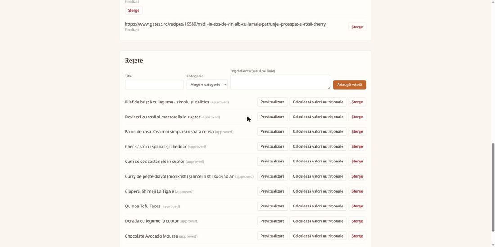

# Cookbook

A self-hosted recipe website with a public front office, an admin back office, and an automated
pipeline that scrapes, translates, and cleans up recipes from other sites using Claude before they
go live.

## Contents

- [Screenshots](#screenshots)
- [Status](#status)
- [Features](#features)
- [Architecture](#architecture)
- [Tech Stack](#tech-stack)
- [Project Structure](#project-structure)
- [Getting Started](#getting-started)
- [Core Workflows](#core-workflows)
- [Data Model](#data-model-sketch)
- [Deployment](#deployment)
- [Testing](#testing)
- [Design Decisions](#design-decisions)
- [Original Spec](#original-spec)

## Screenshots

**Front office** — public recipe browsing, filterable by category, with recipes that were
scraped and cleaned up by the import pipeline:


Recipe detail page showing the parsed title, image, description, ingredients (each annotated with
an estimated gram weight), and numbered steps:


Nutrition panel at the bottom of the recipe page — calories/protein/carbs/sugars/fat per serving,
plus the estimated serving count, computed live from the ingredient database rather than stored
on the recipe (see [Design Decisions](#design-decisions), "Ingredient nutrition"):


**Back office** — JWT-gated admin area, split into two pages (**Recipes** / **Setări**) behind a
small sub-nav — see [Design Decisions](#design-decisions):


Recipes page: category management and the URL import queue, which tracks each scrape job through
pending → queued → fetching → processing → done:


Further down the same page, the recipe manager — imported recipes are previewed and approved
before they go live; nutrition enrichment now happens automatically right after import, with no
button to click:



Settings page: the admin-editable subset of config (languages, credentials including the
CalorieNinjas API key, and the import pipeline's rate limit/timeout/image tuning) can be
changed and applied live, and a "Reparsează toate ingredientele" ("Reparse all ingredients")
button re-fetches CalorieNinjas data for every ingredient already in the database — see
[Design Decisions](#design-decisions):


## Status

The project is being built as a vertical slice, widening outward one piece at a time rather than
building every layer fully before the next (see [Design Decisions](#design-decisions)). Current
state:

- [x] Docker Compose skeleton (Postgres + API + frontend)
- [x] API backend: categories + recipes CRUD, tested
- [x] Frontend: front office browsing + back office CRUD, tested
- [x] RabbitMQ + worker: API publishes import jobs, worker consumes them
- [x] Real scraping: robots.txt-respecting fetch with per-domain rate limiting, single-call Claude
      extraction/cleanup/translation — tested against real servers (`example.com`,
      `google.com/search`); see [Core Workflows](#core-workflows)
- [x] Image download + compression: worker downloads each extracted image, downscales/re-encodes it
      to a configurable max dimension/size, and serves it from the API at `/images/<file>` via a
      volume shared with the worker
- [x] Back office import request flow (`ImportManager`): submitting a URL + category creates a
      `pending` `import_jobs` row that is **not** sent to RabbitMQ yet; clicking **Approve** is what
      publishes it to the queue (also doubles as retry for a `failed` job), and the list polls
      every 3s while any job is `queued`/`fetching`/`processing`. A successful import now publishes
      the recipe immediately (`status=approved`, `approved_at` set) rather than landing as a
      separate `unapproved` review step — the human review already happened when the admin approved
      the import request. See [Design Decisions](#design-decisions) for why this replaced the
      original post-import moderation queue. Submitting a URL that's already been imported, or is
      already sitting anywhere in the queue, is rejected with a `409` shown inline in the form.
- [x] `RecipeManager` still exposes preview + manual `POST /recipes/{id}/approve` for any recipe an
      admin has manually set back to `unapproved` (there's no UI to do that yet, only the API) —
      useful for unpublishing/republishing a specific recipe, no longer the primary import path
- [x] Frontoffice design: Tailwind CSS (v4, CSS-first `@theme`) + React Router, mobile-first —
      category pill nav, responsive recipe grid, an AllRecipes-style recipe detail page
      (`/recipes/:id`: hero image, description, ingredients, numbered steps, tips), warm/rustic
      palette (cream background, terracotta/olive accents, serif headings)
- [x] Multi-language site: `recipes`/`recipe_translations` split (one row per language, unique on
      recipe+language), `SUPPORTED_LANGUAGES`/`DEFAULT_LANGUAGE` config shared by API and worker,
      `GET /languages`, a single Claude call now produces one translation per configured language,
      a hand-rolled frontend i18n system with one switcher controlling both UI chrome and which
      recipe translation loads — verified live: a real import produced distinct Romanian and
      English content from one Claude call, and switching languages in the browser updated both
      the UI and the recipe content instantly with no reload; migration `0004`'s data copy was also
      verified against the real (non-empty) dev database
- [x] Back office authentication: JWT login (`POST /auth/login`) against a single hard-coded
      admin account in config (`ADMIN_USERNAME`/`ADMIN_PASSWORD`/`JWT_SECRET`/`JWT_EXPIRES_MINUTES`
      env vars — no users table, no self-registration). Every mutating route (categories/recipes
      create/update/delete/approve, the entire `/imports` router) requires a valid
      `Authorization: Bearer <token>` header; all GET routes stay public since the front office
      depends on them unauthenticated. The React side gates `/backoffice` behind a `LoginForm`,
      persists the token in `localStorage`, and auto-logs-out on any 401 from a protected call.
- [x] Admin-editable settings (`SettingsManager`): languages, back office password, Anthropic API
      key, and the import pipeline's rate limit/timeout/HTML-size/image-size tuning live in a
      single-row `app_settings` Postgres table instead of `.env`, editable from the back office and
      applied live — no container restart, no Docker socket access from the app. `.env` only seeds
      that row's initial value via migration `0006`. See [Design Decisions](#design-decisions).
- [x] Ingredient nutrition: automatic, not a button — a successful import queues a nutrition job
      (own `nutrition_jobs` queue, consumed by the same worker container, right after the import
      job that created the recipe) that asks Claude to parse each ingredient line into a canonical
      food name/quantity/unit, then resolves that against the CalorieNinjas API for both the
      per-100g nutrient panel and a real per-line gram estimate (falling back to Claude's own gram
      guess when the lookup finds nothing) — see [Design Decisions](#design-decisions). The
      resulting `ingredients` + `recipe_ingredient_links` rows are the only thing stored; a
      recipe's calories/protein/carbs/sugars/fat totals are computed live by
      `GET /recipes/{id}/nutrition` (join + sum), never cached in the DB. The front office shows a
      nutrition panel (per serving, with an estimated servings count) and annotates each ingredient
      line with its estimated gram weight.
- [x] Ingredient nutrition data refresh: a global **"Reparse all ingredients"** button in the back
      office Settings page (own `ingredient_refresh_jobs` queue, same worker container) re-fetches
      CalorieNinjas data for every `Ingredient` row already in the database, by its normalized name
      (e.g. an ingredient resolved before a CalorieNinjas key was configured, left at zeroed
      placeholder values). Unlike the per-import nutrition job above, this doesn't touch Claude or
      any recipe's ingredient list — it only refreshes the shared nutrition-reference rows. See
      [Design Decisions](#design-decisions).
- [x] Backoffice split into two pages behind a small sub-nav: **Recipes** (`/backoffice` —
      categories, URL import, recipe manager) and **Settings** (`/backoffice/settings` —
      `SettingsManager` + the ingredient refresh button above), so the settings form isn't buried
      at the bottom of an ever-growing single page.
- [ ] Bulk URL lists / bookmark-file upload in the import form (single URL only for now)
- [ ] Bookmark-file import
- [ ] Reverse proxy (Caddy/Nginx) in front of frontend + API

## Features

- **Front office** — browse recipes by category (desserts, main courses, ...) and view a single
  recipe page modeled after sites like
  [AllRecipes](https://www.allrecipes.com/shredded-zucchini-casserole-recipe-11747790): hero image,
  description, ingredients, steps, tips.
- **Back office** — username/password-protected admin area (JWT login, single admin account in
  config) with full CRUD for categories and recipes, split into a **Recipes** page and a
  **Settings** page behind a small sub-nav.
- **Single-URL scraping, reviewed before scraping happens** — submit a URL + category in the back
  office; it sits as a pending request until an admin clicks Approve, which is what actually
  triggers the fetch/Claude/image pipeline.
- **Bulk scraping** — submit a list of URLs, or upload an HTML bookmarks export; the system finds
  the recipe links inside it and imports them all.
- **AI-assisted cleanup** — Claude parses bookmark HTML, strips ads/boilerplate, and keeps only
  images, description, ingredients, and tips, then translates the result into every configured site
  language in the same pass.
- **Multi-language site** — the site itself (nav, labels, buttons) and every recipe's content are
  available in Romanian (default) and English, with more languages addable via config rather than a
  schema change (see [Design Decisions](#design-decisions)).
- **Review gate on the request, not the result** — since an admin explicitly approves every URL
  before it's ever fetched, a successful import publishes immediately; there's no second
  after-the-fact review of Claude's output. Any individual recipe can still be manually
  unpublished/republished via the API today.
- **Portable deployment** — everything runs in Docker Compose, locally on a Fedora laptop and later
  on a Raspberry Pi.
- **Live-editable settings** — languages, the back office password, the Anthropic API key, and the
  import pipeline's rate limit/timeout/image tuning can all be changed from a back office Settings
  page, with each change taking effect immediately (no restart).
- **Estimated nutrition per recipe** — automatically resolved right after import (no admin action
  needed) against the CalorieNinjas API (nutrients + a real per-line gram estimate, with an
  LLM-parsed gram guess as fallback), and the front office shows calories/protein/carbs/sugars/fat
  per serving plus an estimated gram weight next to each ingredient — all clearly labelled as
  estimates, computed live rather than stored.
- **Ingredient data refresh** — a separate back office button re-fetches CalorieNinjas nutrition
  data for every ingredient already resolved in the database, without touching Claude or any
  recipe's text — useful for fixing ingredients that were resolved before a CalorieNinjas key was
  configured.

## Architecture

```
                         ┌─────────────────────┐
                         │   Web Frontend       │
                         │ (Front office + Back │
                         │  office SPA)         │
                         └──────────┬───────────┘
                                    │ REST/HTTPS
                                    ▼
                         ┌─────────────────────┐
                         │   API Backend        │◄──────┐
                         │ (auth, recipes,      │       │
                         │  categories, imports) │       │
                         └──────────┬───────────┘       │
                                    │                    │ reads/writes
                    publishes jobs  │                    │
                                    ▼                    │
                         ┌─────────────────────┐         │
                         │   RabbitMQ           │         │
                         └──────────┬───────────┘         │
                                    │ consumes jobs        │
                                    ▼                      │
                         ┌─────────────────────┐          │
                         │  Scraper Workers      │──────────┘
                         │  (Python, one/many    │
                         │   URLs or bookmark    │
                         │   HTML)                │
                         │                        │
                         │  → fetch page          │
                         │  → Claude API:         │
                         │     parse/clean/       │
                         │     translate          │
                         │  → download images     │
                         └──────────┬───────────┘
                                    │ INSERT (status=unapproved)
                                    ▼
                         ┌─────────────────────┐
                         │   PostgreSQL          │
                         └─────────────────────┘
```

Two backend services share the database: the **API backend** (synchronous, serves the SPA) and the
**scraper workers** (asynchronous, consume import jobs off RabbitMQ). This keeps a slow/flaky
scrape from ever blocking a user-facing API request.

## Tech Stack

| Layer                  | Technology                                              | Notes |
|-------------------------|----------------------------------------------------------|-------|
| Frontend                | React + TypeScript (Vite), React Router, Tailwind CSS v4  | Single SPA serving both front office and back office; `/backoffice` is route-gated by a JWT `AuthContext`, front office stays public |
| UI language              | Hand-rolled i18n (`src/i18n/`), no library                | Small static dictionary per language (`ro`, `en`); one site-wide switcher drives both UI text and which recipe translation is fetched |
| API backend             | Python + FastAPI                                         | REST API; JWT (`PyJWT`) username/password auth for the back office, single hard-coded admin account in config |
| Scraper workers         | Python + Pika (RabbitMQ client), httpx (fetch), stdlib `urllib.robotparser`, Pillow (image resize/compress) | Consume import jobs, respect robots.txt + rate limits, fetch pages, download + process images |
| AI parsing/translation  | Claude API (Anthropic), `anthropic` Python SDK, model `claude-sonnet-5` | Bookmark HTML → candidate recipe links (not built yet); raw page → cleaned recipe JSON, one translation per `SUPPORTED_LANGUAGES` entry, in a single tool-use call; a second tool-use call parses ingredient lines into structured food/quantity/unit for nutrition lookup |
| Nutrition data           | CalorieNinjas API                                         | Free tier, single natural-language query per lookup; provides both per-100g nutrient panels and a real per-line gram estimate for common ingredients — see Design Decisions ("Ingredient nutrition") |
| Message queue           | RabbitMQ                                                  | Decouples API from long-running scrape/import/nutrition jobs; three queues (`import_jobs`, `nutrition_jobs`, `ingredient_refresh_jobs`) are all consumed by the same worker container |
| Database                | PostgreSQL                                                | Recipes, categories, import status, a single-row `app_settings` table for admin-editable config, `ingredients`/`recipe_ingredient_links` for nutrition — no users table (see Design Decisions) |
| Image storage           | Docker named volume (`images_data`), mounted into both `api` and `worker`, served by the API via `StaticFiles` at `/images` | Worker downloads + writes JPEGs there; API serves them read-only; not hotlinked from source sites |
| Reverse proxy           | Caddy (or Nginx)                                          | TLS termination, routes `/` to SPA and `/api` to backend |
| Orchestration            | Docker Compose                                            | One compose stack for local dev (Fedora) and prod (Raspberry Pi, arm64 images) |

## Project Structure

```
cookbook/
├── readme.MD
├── docker-compose.yml
├── docker-compose.override.yml     # local dev overrides (hot reload, exposed ports)
├── .env.example
├── frontend/                       # React + TypeScript SPA (front office + back office)
│   ├── src/
│   │   ├── frontoffice/             # RecipeBrowser (home), RecipeDetail (/recipes/:id) + NutritionPanel
│   │   │                            #   (calories/protein/carbs/sugars/fat per serving, icon tiles),
│   │   │                            #   CategoryNav, RecipeCard — approved recipes only
│   │   ├── backoffice/              # CategoryManager, ImportManager (submit URL, approve-to-trigger,
│   │   │                            #   polls while active), RecipeManager (CRUD + preview/approve —
│   │   │                            #   nutrition enrichment is automatic on import, no button here),
│   │   │                            #   SettingsManager (view/edit app_settings, Apply = live PATCH),
│   │   │                            #   IngredientRefreshPanel ("Reparse all ingredients" button,
│   │   │                            #   polls while queued/processing), LoginForm — all gated
│   │   │                            #   behind AuthContext. App.tsx's BackofficeLayout renders
│   │   │                            #   LoginForm when unauthenticated, else a Recipes/Settings
│   │   │                            #   sub-nav + <Outlet /> across nested /backoffice routes
│   │   ├── ui/                      # buttonStyles.ts, nutritionIcons.tsx (hand-rolled inline SVGs:
│   │   │                            #   flame/drumstick/wheat/sugar-cubes/droplet/servings)
│   │   ├── auth/                    # AuthContext.tsx (useAuth: isAuthenticated/login/logout,
│   │   │                            #   token in localStorage)
│   │   ├── i18n/                    # config.ts (SUPPORTED_LANGUAGES, default "ro"), translations/
│   │   │                            #   {ro,en}.ts, LanguageContext.tsx (useLanguage/useT, localStorage)
│   │   ├── api/                     # fetch-based API client (attaches Authorization: Bearer <token>)
│   │   ├── index.css                # Tailwind v4 entry + @theme (warm/rustic palette)
│   │   └── tests/                   # Vitest + React Testing Library
│   ├── package.json
│   └── Dockerfile                  # multi-stage: dev (vite) / production (nginx)
├── api/                            # FastAPI backend
│   ├── app/
│   │   ├── routers/                # auth.py (POST /auth/login), categories.py, recipes.py
│   │   │                           #   (CRUD + /approve), imports.py (CRUD + /approve, deferred
│   │   │                           #   publish, router-level require_admin), languages.py,
│   │   │                           #   settings.py (GET/PATCH /settings, router-level require_admin),
│   │   │                           #   nutrition.py (GET /recipes/{id}/nutrition, public + live-
│   │   │                           #   computed — no POST here, the worker queues its own
│   │   │                           #   nutrition job right after a successful import),
│   │   │                           #   ingredients.py (GET/POST /ingredients/refresh, both admin —
│   │   │                           #   global "reparse all ingredients" job, not per-recipe)
│   │   ├── models/                 # SQLAlchemy models (Category, Recipe [+estimated_servings],
│   │   │                           #   RecipeTranslation, ImportJob, AppSettings — single-row
│   │   │                           #   admin-editable settings table, Ingredient — canonical
│   │   │                           #   per-100g nutrition reference, RecipeIngredientLink — the
│   │   │                           #   stored ingredient-line-to-Ingredient+grams mapping,
│   │   │                           #   NutritionJob, IngredientRefreshJob)
│   │   ├── schemas/                # Pydantic request/response schemas, incl. nutrition.py,
│   │   │                           #   ingredient_refresh.py
│   │   ├── tests/                  # pytest, FastAPI TestClient
│   │   ├── queue.py                # RabbitMQ publisher (pika) — publish_import_job,
│   │   │                           #   publish_nutrition_job, publish_ingredient_refresh_job
│   │   ├── auth.py                 # create_access_token, require_admin (FastAPI dependency)
│   │   ├── settings_service.py     # get_settings (get-or-create), update_settings (validates +
│   │   │                           #   masks secrets) — see Design Decisions
│   │   ├── main.py                 # also mounts StaticFiles at /images -> settings.images_dir
│   │   ├── database.py
│   │   └── config.py                # env-only config: database_url, rabbitmq_url, admin_username,
│   │                                 #   jwt_secret, jwt_expires_minutes — everything admin-editable
│   │                                 #   lives in app_settings/settings_service instead (see below)
│   ├── migrations/                 # Alembic (categories/recipes 0001, import_jobs 0002, category_id
│   │                                #   0003, recipe_translations split 0004, pending status 0005,
│   │                                #   app_settings table seeded from .env 0006, ingredient
│   │                                #   nutrition tables + estimated_servings + usda_api_key 0007,
│   │                                #   ingredient_refresh_jobs 0008, rename usda_api_key ->
│   │                                #   calorie_ninjas_api_key + drop usda_fdc_id 0009)
│   ├── requirements.txt
│   ├── requirements-dev.txt
│   └── Dockerfile
└── worker/                         # RabbitMQ consumer: fetch -> Claude -> download images -> insert
    ├── app/
    │   ├── consumer.py             # connects (with retry), consumes `import_jobs`,
    │   │                           #   `nutrition_jobs`, AND `ingredient_refresh_jobs` on one
    │   │                           #   connection/channel — same container, see Design Decisions
    │   │                           #   ("Ingredient nutrition")
    │   ├── handlers.py             # handle_import_job — orchestrates fetch -> extract -> process
    │   │                           #   images -> insert recipe + one translation row per language;
    │   │                           #   on success, also creates + publishes a NutritionJob for the
    │   │                           #   new recipe (auto-enrichment, no manual button — see below)
    │   ├── queue.py                # publish_nutrition_job — used by handlers.py to auto-enqueue
    │   │                           #   enrichment right after a successful import
    │   ├── nutrition_handlers.py   # handle_nutrition_job — Claude-parses ingredient lines ->
    │   │                           #   resolves each against the local Ingredient cache or
    │   │                           #   CalorieNinjas -> writes RecipeIngredientLink rows +
    │   │                           #   recipe.estimated_servings; one bad ingredient line is
    │   │                           #   skipped, not a whole-job failure
    │   ├── ingredient_refresh_handlers.py  # handle_ingredient_refresh_job — re-fetches
    │   │                           #   CalorieNinjas data for every existing Ingredient row by its
    │   │                           #   normalized name; one ingredient's failure is skipped, not a
    │   │                           #   whole-job failure
    │   ├── nutrition_api_client.py # lookup_nutrition (CalorieNinjas REST API, one call per
    │   │                           #   natural-language query), extract_nutrients_per_100g
    │   ├── scraping.py             # robots.txt check + fetch_page (httpx), ScrapeDisallowedError
    │   ├── rate_limiter.py         # DomainRateLimiter — in-memory, per-domain, process-local
    │   ├── claude_client.py        # extract_recipe — single tool-use call: extract/clean, one
    │   │                           #   translation per `SUPPORTED_LANGUAGES` entry, in the same
    │   │                           #   call; parse_ingredients_for_nutrition — second tool-use call,
    │   │                           #   ingredient lines -> structured food/quantity/unit/grams +
    │   │                           #   estimated_servings
    │   ├── images.py               # process_images — download, downscale, compress to JPEG,
    │   │                           #   save under images_dir; skips (not fails) bad images
    │   ├── models.py               # ImportJob, Recipe [+estimated_servings], RecipeTranslation,
    │   │                           #   AppSettings, Ingredient, RecipeIngredientLink, NutritionJob,
    │   │                           #   IngredientRefreshJob (mirror the API's models; see Design
    │   │                           #   Decisions)
    │   ├── settings_service.py     # get_settings — reads app_settings fresh once per job (no
    │   │                           #   cache), read-only from the worker's side
    │   ├── tests/                  # pytest, in-memory SQLite, httpx/Claude client mocked
    │   ├── main.py
    │   ├── database.py
    │   └── config.py
    ├── requirements.txt
    ├── requirements-dev.txt
    └── Dockerfile
```

## Getting Started

Requires Docker and Docker Compose. This brings up Postgres, RabbitMQ, the API, the worker, and the
frontend.

```bash
cp .env.example .env        # fill in real values, especially POSTGRES_PASSWORD/JWT_SECRET
docker compose up --build
```

- Frontend (dev, hot reload): http://localhost:5173
- API: http://localhost:8000 (health check at `/health`)
- Postgres: exposed on `localhost:5432` in dev via the override file
- RabbitMQ management UI: http://localhost:15672 (login with `RABBITMQ_USER`/`RABBITMQ_PASSWORD`
  from `.env`)
- Worker has no HTTP surface; it logs to `docker compose logs -f worker`. Editing `worker/app/`
  requires `docker compose restart worker` (no reload loop for the consumer, unlike the API/frontend)

Try the import pipeline end to end (needs a category to import into, and a real `ANTHROPIC_API_KEY`
in `.env` for the job to actually reach `done` — without one it still fetches the page respecting
robots.txt/rate limits, then fails cleanly at the Claude call):

```bash
CATEGORY_ID=$(curl -s -X POST http://localhost:8000/categories -d '{"name": "Desserts"}' \
  -H "Content-Type: application/json" | python3 -c "import sys,json;print(json.load(sys.stdin)['id'])")

curl -X POST http://localhost:8000/imports -H "Content-Type: application/json" \
  -d "{\"source\": \"https://example.com/some-recipe\", \"category_id\": $CATEGORY_ID}"
# {"id":1,"category_id":1,...,"status":"queued",...}

curl http://localhost:8000/imports/1
# with a real ANTHROPIC_API_KEY:    {"id":1,...,"status":"done","error":null,...}
# without one:                      {"id":1,...,"status":"failed","error":"unexpected error: ...auth...",...}
```

### Running tests locally (without Docker)

```bash
# API
cd api
python3 -m venv .venv && source .venv/bin/activate
pip install -r requirements-dev.txt
pytest

# Worker
cd worker
python3 -m venv .venv && source .venv/bin/activate
pip install -r requirements-dev.txt
pytest

# Frontend
cd frontend
npm install
npm test        # vitest
npm run build   # type-checks (tsc -b) and produces a production bundle
```

## Core Workflows

### 1. Manual authoring
Admin logs into the back office and creates/edits/deletes categories and recipes directly (full
CRUD, no AI involved).

### 2. Single or bulk URL import
1. Admin submits one URL, or a list of URLs, plus a category, in the back office. Each becomes an
   `import_jobs` row with `status=pending` — **not** yet sent to RabbitMQ.
2. Admin reviews the pending request and clicks **Approve**, which is what actually publishes it to
   RabbitMQ. The back office shows a per-URL status (`pending → queued → fetching → processing →
   done/failed`), polling while any job is mid-flight.
3. A scraper worker picks up each job, checks the source domain's `robots.txt`: if scraping is
   disallowed there, the worker respects it and skips/fails the job; otherwise it falls back to a
   default politeness rate limit (requests-per-domain-per-minute), configurable in the admin
   settings.
4. The worker fetches the page and sends the raw HTML to Claude in a single call that extracts,
   cleans (drops ads/boilerplate, keeps images, description, ingredients, tips), and produces one
   translation per configured site language (`SUPPORTED_LANGUAGES`) in the same pass.
5. Worker downloads referenced images to local storage, compresses them, and resizes them down to
   a default max dimension/size (configurable in the admin settings).
6. Worker inserts the recipe into PostgreSQL already `status = approved` (the human review already
   happened at step 2 — see [Design Decisions](#design-decisions)), with one `recipe_translations`
   row per language, and `added_at`/`approved_at` timestamps. Right after that commit, the worker
   automatically queues a nutrition job for the new recipe — see workflow #5 below.

**Current state:** all six steps are built end to end for single URLs (bulk lists aren't wired).
`POST /imports` creates a `pending` job and does *not* publish it. `POST /imports/{id}/approve`
publishes to RabbitMQ and moves it to `queued` (or straight to `failed` with an error if the publish
itself fails — also usable to retry an already-`failed` job). The worker checks `robots.txt`
(`urllib.robotparser`, via `httpx`), applies a per-domain rate limit (the domain's own `Crawl-delay`
if present, otherwise `DEFAULT_RATE_LIMIT_REQUESTS_PER_MINUTE`), fetches the page, and sends the
HTML to Claude in one `tool_choice`-forced call that returns structured `{images, translations:
[{language, title, description, ingredients, steps, tips}, ...]}` — one entry per
`SUPPORTED_LANGUAGES` code. Step 5 is also built: each extracted image URL is downloaded, downscaled
to `IMAGE_MAX_DIMENSION`, re-encoded as JPEG under `IMAGE_MAX_SIZE_KB` (quality stepped down until it
fits or hits a floor), and saved to the shared `images_data` volume under a random filename, served
back at `/images/<file>` by the API; a single broken image URL is skipped, not fatal to the job. On
success the worker inserts one `Recipe` (`status=approved`, `approved_at` set, `images` those
`/images/...` paths) plus one `RecipeTranslation` per language from Claude's response — visible on
the front office immediately, no further action needed; on any failure (`robots.txt` disallow, fetch
error, malformed Claude response, missing/invalid `ANTHROPIC_API_KEY`) it sets
`import_jobs.status=failed` with a specific `error` message and inserts nothing, leaving the request
visible in the back office to retry or delete.
Still missing: bulk URL lists / bookmark-file upload in the same form, and the `settings` table
(rate limit/image size/user-agent/etc. are `.env` vars for now, see
[Design Decisions](#design-decisions)).

### 3. Bookmark-file import
1. Admin uploads an exported HTML bookmarks file in the back office.
2. API backend sends the bookmark HTML to Claude to identify which links are recipe pages.
3. Each identified link becomes its own `import_jobs` row and goes through fetch → Claude
   clean/translate → download images, the same as a single-URL import — **except** it should land
   `unapproved` for a human to review, not auto-publish. Unlike single-URL import (where an admin
   hand-picked and approved that exact page), these links were *discovered* by Claude from a
   bookmarks file — nobody looked at each one individually — so the auto-publish-on-success
   shortcut from workflow #2 shouldn't apply here. See the "Approval gate" bullet in
   [Design Decisions](#design-decisions).

Not built yet.

### 4. Moderation
1. Every import goes through an approval gate before it's ever fetched — see step 2 of workflow #2
   above. A successful import publishes the resulting recipe immediately; there's no second,
   after-the-fact review of Claude's output.
2. `RecipeManager` still has a **Preview** toggle (image, description, ingredients, steps, tips —
   pulled from `GET /recipes/{id}`, which never filters by status) and an **Approve** button
   (`POST /recipes/{id}/approve`, sets `status=approved` and `approved_at`) shown for any recipe
   currently `unapproved`. That only happens today if an admin manually reverts one via
   `PUT /recipes/{id}` — there's no UI for that reversal yet — so this is now an
   unpublish/republish tool for an individual recipe, not the import path's moderation step.

**Design note:** the [original spec](#original-spec) assumed every import lands `unapproved` and
gets a second human review of Claude's cleaned-up output before publishing. That's been
superseded — see [Design Decisions](#design-decisions) for why the review moved earlier, to
approving the import *request*, instead. Still no reject action, but `/backoffice` and every
mutating API route are now gated behind the JWT admin login — see [Design
Decisions](#design-decisions).

### 5. Ingredient nutrition
1. Set a CalorieNinjas API key in Backoffice → Settings first (free signup:
   [calorieninjas.com/api](https://calorieninjas.com/api)) — without one, enrichment still runs and
   produces gram estimates, but every nutrient figure comes back 0.
2. No button to click: the moment a URL import finishes successfully (workflow #2, step 6), the
   worker automatically queues a nutrition job for the new recipe (own `nutrition_jobs` queue, same
   worker container, right after the import job that created the recipe) — see
   [Design Decisions](#design-decisions) for why this replaced the original per-recipe
   **"Enrich nutrition"** button.
3. The worker asks Claude to parse each ingredient line into a canonical food name/quantity/unit,
   resolves each against the CalorieNinjas API (reusing a cached `Ingredient` row if that food's
   already been resolved for another recipe), and writes one `recipe_ingredient_links` row per
   ingredient plus an `estimated_servings` guess on the recipe.
4. `GET /recipes/{id}/nutrition` (public, used by the front office) computes calories/protein/
   carbs/sugars/fat live from those rows on every request — nothing is precomputed or cached, so
   correcting an `Ingredient` row later instantly fixes every recipe that uses it. The recipe page
   shows a nutrition panel (per serving) and an estimated gram weight next to each ingredient line.
   It also reports the status of the recipe's latest nutrition job (`not_enriched`/`queued`/
   `processing`/`done`/`failed`), so a manually-authored recipe (workflow #1, which has no import
   job to trigger off of) simply shows `not_enriched` rather than an error.
5. Added a CalorieNinjas key *after* some ingredients were already resolved without one (so they're
   stuck at zeroed placeholder values)? Click **Reparsează toate ingredientele** ("Reparse all
   ingredients") on the Settings page — it re-fetches CalorieNinjas data for every `Ingredient` row
   in one global job (own `ingredient_refresh_jobs` queue), matched by its normalized name. It
   doesn't call Claude and doesn't touch any recipe's ingredient list — see
   [Design Decisions](#design-decisions).

## Data Model (sketch)

- *(no users table)* — back office auth is a single hard-coded admin account: username from config
  (`ADMIN_USERNAME`), password from **app_settings** below (not a users table row); see
  [Design Decisions](#design-decisions)
- **categories** — id, name, slug (a single name shown regardless of site language — not translated
  yet, see [Design Decisions](#design-decisions))
- **recipes** — id, category_id, images, source_url (nullable, set when imported), status
  (`unapproved` \| `approved`), added_at, approved_at, estimated_servings (nullable — set by the
  nutrition-enrichment job, not the original import) — language-independent fields only; text
  content lives in **recipe_translations**
- **recipe_translations** — id, recipe_id (FK → recipes.id), language (e.g. `ro`, `en` — a plain
  string validated against `SUPPORTED_LANGUAGES`, not a DB enum, so a new language never needs a
  migration), title, description, ingredients, steps, tips; unique on (recipe_id, language). A
  recipe can have anywhere from one translation (e.g. hand-authored, or Claude failed on one
  language) up to `len(SUPPORTED_LANGUAGES)`
- **import_jobs** — id, category_id (recipe lands here on success), type
  (`single` \| `bulk` \| `bookmark`), source, status
  (`pending` \| `queued` \| `fetching` \| `processing` \| `done` \| `failed`), error, created_at.
  `pending` means created but not yet approved/published to RabbitMQ; approving is what moves it to
  `queued`
- **app_settings** — a single row (id=1), not a real multi-row table: supported_languages,
  default_language, admin_password, anthropic_api_key, calorie_ninjas_api_key,
  default_rate_limit_requests_per_minute, scrape_timeout_seconds, max_html_chars,
  image_max_dimension, image_max_size_kb. Seeded once from `.env` by migration `0006`/`0007`;
  editable live from the back office Settings page from then on — see
  [Design Decisions](#design-decisions)
- **ingredients** — id, name (Claude's canonical English food name, e.g. "onion") — the only key
  used to match/reuse a row, since CalorieNinjas has no stable per-food id — and
  calories/protein/carbs/sugars/fat_per_100g (zeroed placeholders when nothing matched, rather than
  a skipped row). Resolved once and reused across every recipe that contains the same ingredient
- **recipe_ingredient_links** — id, recipe_id (FK → recipes.id), ingredient_index (position in
  recipe_translations.ingredients), ingredient_id (FK → ingredients.id), raw_text,
  estimated_grams, grams_source (`api_lookup` \| `claude_estimate`); unique on
  (recipe_id, ingredient_index). The only nutrition data actually stored — see
  [Design Decisions](#design-decisions), "Ingredient nutrition"
- **nutrition_jobs** — id, recipe_id (FK → recipes.id), status
  (`queued` \| `processing` \| `done` \| `failed`), error, created_at. Created and queued by the
  worker itself (`handlers._enqueue_nutrition_job`), automatically, right after a successful
  import — not by an API route; mirrors `import_jobs`' shape but simpler (no `pending` gate — it's
  queued immediately)
- **ingredient_refresh_jobs** — id, status (`queued` \| `processing` \| `done` \| `failed`), error,
  ingredients_updated (nullable — how many `ingredients` rows the job actually changed), created_at.
  Global, not per-recipe — created by `POST /ingredients/refresh`; `GET /ingredients/refresh`
  returns the latest one (or `{"status": "never_run"}` if none exists yet)

## Deployment

- All services (frontend, api, worker, RabbitMQ, PostgreSQL, reverse proxy) are defined in a single
  `docker-compose.yml`.
- **Local dev (Fedora laptop):** `docker-compose.override.yml` adds hot reload and exposes ports
  directly for debugging.
- **Production (Raspberry Pi):** images are built/pulled as `arm64`; only the reverse proxy port is
  exposed externally.
- Secrets (DB credentials, JWT secret, Claude API key) are supplied via `.env`, never committed.

## Testing

| Layer            | Framework                          | Status | Focus |
|-------------------|-------------------------------------|--------|-------|
| API backend        | `pytest` + FastAPI `TestClient`    | 69 tests, passing | Categories/recipes CRUD, validation (unknown category, duplicate slug), status transitions, `GET /languages`, translation language resolution/fallback, recipe approve (sets `approved_at`, 404), rejects a whole-field URL in title/description/ingredients/steps/tips (400) while allowing normal text that merely contains "http". Import jobs: create stays `pending` and doesn't publish, approve publishes and moves to `queued`, approve retries a `failed` job, approve rejects an already-`queued` job (400), approve 404, delete, duplicate-URL rejection (409, against both an existing recipe and an existing job) and resubmission after delete. Auth: login success/wrong-username/wrong-password, protected routes reject missing/malformed/wrong-secret tokens and accept a real one, public GETs stay open without a token, the entire `/imports` router is protected. Settings: `GET`/`PATCH /settings` require admin, secrets (including `calorie_ninjas_api_key`) never appear in the response body, numeric fields reject non-positive values (422), invalid/empty language codes and a `default_language` outside `supported_languages` are rejected (400), a changed `admin_password` is reflected immediately by `/auth/login`, an omitted/blank secret leaves the current value untouched, partial updates don't clobber other fields. Nutrition: `GET /recipes/{id}/nutrition` is public (no `POST` here — enrichment is triggered by the worker, not the API) and reports `not_enriched` for a fresh recipe, 404 for an unknown one, computes totals/per-serving/per-ingredient-grams correctly from `recipe_ingredient_links` × `ingredients`, and keeps showing previously-good totals even while a re-enrichment is queued/processing or after it fails. Ingredient refresh: `GET`/`POST /ingredients/refresh` both require admin, `GET` reports `never_run` before any job exists and otherwise the latest job (tie-broken by id, not just timestamp), `POST` queues and publishes |
| Worker              | `pytest`                           | 65 tests, passing | `scraping.fetch_page` (robots.txt allow/disallow/missing/unreachable, truncation, HTTP errors, current DB-backed rate limit reaches the rate limiter on every call), `rate_limiter.DomainRateLimiter` (per-domain interval, crawl-delay override, a per-call rate override taking precedence over the constructor default, deterministic via injected clock), `claude_client.extract_recipe` (multi-language tool-use response parsing, the given API key reaches the Anthropic client) and `claude_client.parse_ingredients_for_nutrition` (structured food/quantity/unit/grams + servings parsing), `images.process_images` (resize to max dimension, quality-reduction loop respects/floors on max size, skips failed downloads/non-image content without failing the batch), `handlers.handle_import_job` (success inserts an already-`approved` recipe with `approved_at` set and one translation row per language, *and* auto-enqueues + publishes a `NutritionJob` for it; a broken queue publish for that follow-up job marks the `NutritionJob` failed without touching the already-successful import job; an unexpected error inside the enqueue helper itself is swallowed the same way; each import failure mode, including an empty `translations` list, maps to a distinct `job.error` without leaving a half-inserted recipe), `consumer._on_message` (delegates and acks; marks a job `failed` with the exception message if `handle_import_job` raises *anything* unexpected, even with an unparseable body), `settings_service.get_settings` (falls back to defaults when the row is missing, reads the current row, reflects an update on the very next call — no cache). `nutrition_api_client.lookup_nutrition`/`extract_nutrients_per_100g` (returns the first matching item, sends the `X-Api-Key` header, returns `None` for an empty result, normalizes nutrients to a per-100g basis from whatever `serving_size_g` came back, defaults to zero when the serving size is missing/zero). `nutrition_handlers.handle_nutrition_job` (creates a new `Ingredient` + `RecipeIngredientLink` and sets `estimated_servings` on success, prefers a CalorieNinjas gram figure over Claude's own estimate when one matches, reuses an existing `Ingredient` by name without a redundant lookup, rounds a decimal quantity like `5.5` to `6` before querying to work around a CalorieNinjas parser bug that mangles decimals, a malformed ingredient item is skipped without failing the rest, fails cleanly with no ingredients / no parsed items / an unknown recipe / an unexpected exception, replaces (not accumulates) links from a previous run). `ingredient_refresh_handlers.handle_ingredient_refresh_job` (refreshes an ingredient via a `"100g <name>"` lookup, leaves an ingredient untouched when nothing matches, one ingredient's CalorieNinjas failure doesn't sink the others, fails cleanly with a clear message when no CalorieNinjas key is configured, ignores an unknown job id) |
| Frontend            | Vitest + React Testing Library     | 45 tests, passing | `CategoryManager`/`RecipeManager`: list/create/delete, error handling, approve button, preview toggle. `ImportManager`: submits URL+category, approve button gated to `pending`/`failed` jobs only, delete, shows a job's error, polls every 3s while any job is `queued`/`fetching`/`processing` and stops once settled. `RecipeBrowser`: filters to approved-only, cards link to `/recipes/:id`, category filter triggers a re-fetch. `RecipeDetail`: renders full content once loaded, blocks unapproved recipes with a message, surfaces fetch errors. `LanguageProvider`: defaults to Romanian, reads/persists a stored language, switching updates translations live. `AuthProvider`: starts unauthenticated, reads a stored token on mount, login success persists the token and flips state, login failure leaves it unauthenticated, logout clears both. `LoginForm`: submits entered credentials, shows the translated error message on failure. `SettingsManager`: loads and displays current settings, secret fields (including the CalorieNinjas key) stay blank with a placeholder hinting whether one is set, Apply omits a secret from the request when left blank but includes it when typed, shows a success message on save and the server error on failure. `NutritionPanel`: renders per-serving values + the servings badge when both are known, falls back to whole-recipe totals when there's no servings estimate, renders nothing when nutrition isn't enriched yet or a job is still in flight. `IngredientRefreshPanel`: shows "never run" on first load, creates a job and shows its status on click, polls while active and shows the updated count once done (and stops polling once settled), shows the job's error message on failure, disables the button while a refresh is active |
| Cross-service       | Integration tests                  | Not scaffolded yet | Full import flow (job published → worker consumes → recipe lands `unapproved` in DB) against the Docker Compose stack — manually verified several times (see below), not automated |

Notes on the current setup:
- API and worker tests both run against an in-memory **SQLite** database built from the same
  SQLAlchemy models/metadata used against Postgres in production — schema drift is still caught,
  but Postgres-specific SQL wouldn't be. Swap this for a real disposable Postgres (e.g.
  `testcontainers`) once import-job handling grows Postgres-specific behavior worth catching.
- API tests mock `app.routers.imports.publish_import_job` (via `monkeypatch`), so they don't need a
  running RabbitMQ. Worker tests mock `httpx.get` and the Claude client, so they don't need a
  running RabbitMQ, network access, or an `ANTHROPIC_API_KEY` either.
- Frontend tests mock the `api/client.ts` module with `vi.mock`, so no network/backend is needed.
- `scraping.fetch_page` was also smoke-tested against two real servers outside the automated suite:
  allowed and fetched `example.com` (no `robots.txt`), correctly raised `ScrapeDisallowedError` for
  `google.com/search` (disallowed in Google's real `robots.txt`).
- `alembic upgrade head` (including migration `0003`'s `batch_alter_table`, needed since SQLite can't
  `ALTER` a constrained column without it), `uvicorn app.main:app`, and the full `docker compose up`
  stack (db, rabbitmq, api, worker) have been run and manually verified end-to-end three times: once
  for the RabbitMQ plumbing, once for the fetch → Claude → insert pipeline (reached the Claude call
  and failed cleanly with an auth error, since this environment has no `ANTHROPIC_API_KEY`
  configured), and once for the image path specifically — wrote a JPEG from inside the `worker`
  container to the shared `images_data` volume and fetched that exact file back over HTTP from the
  `api` container's `/images/<file>` mount, confirming the volume and static route both work —
  confirmed via `rabbitmqctl list_queues` showing 0 backlog each time.
- The full pipeline has since been exercised for real, with a real `ANTHROPIC_API_KEY`, against two
  live third-party sites (`sanovita.ro`, `gatesc.ro`): both were fetched, translated
  Romanian→English, and correctly extracted (ingredients/steps/tips, cross-domain CDN images
  downloaded and compressed), landed as `unapproved`, and were approved via the new
  `RecipeManager` UI, after which they appeared on the front office. A third site
  (`allrecipes.com`) returned `403 Forbidden` — Cloudflare-style bot management, not something
  `robots.txt` compliance affects — which is what prompted switching `SCRAPE_USER_AGENT` to a
  browser-like string and lowering the default rate limit (see Design Decisions).
- Migration `0004` (the `recipes`/`recipe_translations` split) was applied against the real,
  non-empty dev Postgres database (recipes imported in earlier sessions, all pre-dating this
  feature) and correctly copied each one's existing text into a single translation row in its
  original language, verified via `GET /recipes` afterward. A new import against `sanovita.ro`
  was then run post-migration and produced both a `ro` and an `en` `RecipeTranslation` from one
  Claude call; `GET /recipes/{id}?language=ro` and `?language=en` returned distinct, correct
  content for each, and the front office's language switcher (`RO`/`EN` in the header) updated
  both the UI chrome and the displayed recipe content live, with no page reload, when clicked.
- The pending→approve→auto-publish import flow was driven end to end through the actual browser UI
  (not just curl): submitted a URL via `ImportManager`'s form (landed `pending`, not on the queue),
  clicked **Approve** (flipped to `queued` immediately), then — with no manual refresh — watched the
  list's 3s poll pick up `processing` and then `done` on its own. The resulting recipe was confirmed
  `status=approved` with `approved_at` set via the API immediately after, with no separate approval
  step needed.
- Duplicate-URL rejection was also verified live: resubmitting an already-imported URL through the
  `ImportManager` form surfaced "This URL has already been imported." inline, immediately, without
  clearing the input. That prompted a small client-side improvement (`api/client.ts`) applying to
  every form in the app, not just this one: error responses now parse FastAPI's `{"detail": ...}`
  body and show that message directly, instead of the raw `POST /path failed (409): {...}` string
  that every back office form was showing before.
- The URL-in-manual-form guard was written in direct response to two real recipes it would have
  caught (`#13`, `#14` — both created by pasting a URL into `RecipeManager`'s title/ingredients,
  same failure mode as several times earlier in this project's history). Verified live: pasting
  `https://example.com/some-recipe` as a title in the running `RecipeManager` form now surfaces
  `That looks like a URL — use "Import from URL" instead of adding a recipe manually.` inline and
  blocks submission; both pre-existing junk recipes were then deleted.
- The stuck-job incident (see the Design Decisions bullet) was fixed and confirmed against the real
  job that triggered it, not just unit tests: the worker was restarted with the enum fix and picked
  up jobs cleanly afterward (no more crash), the stuck job was manually flipped to `failed` (the
  only way to make it retriable, since it had no valid transition from `queued` with the message
  already gone from RabbitMQ), and re-approving it through the normal `POST /imports/{id}/approve`
  flow completed successfully end to end — `robots.txt` checked, page fetched, Claude called, image
  downloaded, landed as a real `approved` recipe in both languages.
- Back office auth was verified end to end through the actual browser UI: an unauthenticated visit
  to `/backoffice` shows the login form (not the managers), submitting the wrong password surfaces
  the translated "Invalid username or password" error inline without clearing the username field,
  logging in with the real admin credentials unlocks `CategoryManager`/`ImportManager`/
  `RecipeManager` and swaps the nav's "Back office" link area for a "Log out" button, the token
  survives a full page reload (`localStorage`), and clicking **Log out** immediately re-locks the
  page back to the login form. Confirmed independently via `curl` against the API directly: wrong
  password → `401`, correct password → a real JWT, a mutating route (`POST /categories`) without a
  token → `401`, and `GET /recipes` without a token → `200` (front office must stay unauthenticated).
- The Settings page was verified end to end through the actual browser UI, not just the API tests:
  migration `0006` was applied against the real dev Postgres database and correctly seeded the
  `app_settings` row from the values already in `.env` (confirmed via `GET /settings`, including
  `anthropic_api_key_is_set: true` from the real key already configured there). Changing the import
  rate limit from the Settings form and clicking **Apply** persisted immediately (`GET /settings`
  reflected it right away, and it survived a full page reload) with no container restart of any
  kind — confirming the live-apply requirement this feature was built around.
- Ingredient nutrition was verified end to end against a real, already-imported recipe: clicking
  **Calculează valori nutriționale** ("Enrich nutrition") in the browser showed
  "Valori nutriționale: se calculează…" immediately, and settled to "Valori nutriționale:
  finalizat" a few seconds later via the same 3s poll used elsewhere — confirmed in the worker
  logs that the job was consumed off the new `nutrition_jobs` queue and made a real
  `POST https://api.anthropic.com/v1/messages` call, and in Postgres that it correctly created
  nine `ingredients` rows (one per ingredient line) and nine `recipe_ingredient_links` rows.
  Since this environment has no `USDA_API_KEY` configured, every ingredient correctly fell back to
  the zeroed-placeholder path (`usda_fdc_id IS NULL`, `grams_source='claude_estimate'`) rather
  than failing the job — Claude's own gram estimates (e.g. "1 small onion" → 50g) and servings
  estimate (2) still came through correctly. The front office recipe page then showed a per-
  ingredient gram annotation on every line and the full nutrition panel (icons, per-serving
  macros, "Serves ~2" badge); the backoffice Settings page showed the new "Cheie API USDA
  FoodData Central" field, correctly marked "Nesetat" (not set).
- The backoffice split and the "Reparse all ingredients" button were also verified live: the new
  Recipes/Settings sub-nav renders and switches correctly (`/backoffice` and
  `/backoffice/settings`, both gated behind the same login), and clicking **Reparsează toate
  ingredientele** with no USDA key configured correctly queued a job, was picked up by the worker
  off the third (`ingredient_refresh_jobs`) queue, and settled to "Eșuat." with the exact message
  `handle_ingredient_refresh_job` raises for a missing key — confirmed directly in Postgres
  (`ingredient_refresh_jobs` row: `status=FAILED`, matching `error` text) as well as in the UI.
- The USDA → CalorieNinjas swap was verified live with a real API key against the real
  `api.calorieninjas.com` service, not just mocked unit tests: `PATCH /settings` with a real
  CalorieNinjas key confirmed `calorie_ninjas_api_key_is_set: true`, and enriching a real recipe
  made real `GET api.calorieninjas.com/v1/nutrition` calls (visible in the worker logs, all
  `HTTP 200`). One recipe's totals initially came back all zero — traced to stale, already-zeroed
  `Ingredient` rows left over from earlier testing before the real key existed, reused correctly by
  the by-name caching design rather than a bug — and running **"Reparse all ingredients"** fixed
  them in one global job, confirming that feature does exactly what it was built for. Separately,
  live `curl` testing against CalorieNinjas surfaced the decimal-quantity parser bug described above
  (`"5.5 medium tomato"` → `serving_size_g: 6765`, i.e. `55 × 123g`, not `5.5 × 123g ≈ 676g`,
  reproduced with a second food too); after adding the rounding workaround and restarting the
  worker, re-enriching the same recipe resolved that line to `738g` (`6 × 123g`, matching the
  rounded quantity) instead.

Conventions:
- Unit tests live next to the code they cover (`api/app/tests/test_*.py`, `worker/app/tests/test_*.py`,
  `frontend/src/tests/*.test.tsx`).
- External services (Claude API, target recipe sites, RabbitMQ, Postgres) are always mocked/stubbed
  in unit tests; only the future integration suite hits a real (test) RabbitMQ/PostgreSQL via Compose.
- CI should run unit tests on every push; the integration suite before merges to main (CI itself
  isn't set up yet).

## Design Decisions

Resolved answers to the earlier open questions, now reflected in the sections above:

- **Claude call strategy** — extraction, cleanup, and translation are done in a single Claude call
  per recipe page, not split into separate calls — expanded, not abandoned, by multi-language: the
  same call now returns one translation per configured language instead of splitting into N calls
  (one per language), keeping cost and latency roughly flat as languages are added.
- **Approval gate moved to the import request, not the imported result** — the
  [original spec](#original-spec) had imports land `unapproved` and get a second human review of
  Claude's cleaned output before publishing. That's gone for single-URL imports now: submitting a
  URL creates a `pending` `import_jobs` row that isn't published to RabbitMQ until an admin clicks
  **Approve**; a *successful* import then publishes the resulting recipe immediately
  (`status=approved`, `approved_at` set — see `worker/app/handlers.py`). The tradeoff: nothing
  independently checks what Claude actually produced before it goes live. Accepted for now because
  an admin is hand-picking every URL — they already decided "import this exact page" — so a second
  review of the same URL's output mostly adds friction without much new signal. This will likely
  need revisiting once bulk/bookmark import exists: a bookmark file's worth of AI-*discovered* URLs
  is a different trust level than one URL a human typed in by hand, and an unreviewed batch landing
  on the public site unattended is a real risk that today's one-URL-at-a-time flow doesn't carry.
- **Duplicate URL prevention** — `POST /imports` rejects (`409`) a `source` that already matches
  either an existing `Recipe.source_url` (already imported) or an existing `ImportJob.source` in any
  status (already pending/queued/processing/done/failed for that URL), shown inline in the
  `ImportManager` form the moment submission is attempted. This is exact string matching only — no
  normalization of trailing slashes, `www.` prefixes, or tracking query params — so
  `https://x.com/r/` and `https://x.com/r` (or the same page with a different `?utm_source=...`)
  would still count as different URLs and both go through. Good enough for the actual problem this
  solved (the same link pasted twice); revisit if that gap turns out to matter in practice. Deleting
  a job frees its URL up for resubmission, same as if it never existed.
- **Back office authentication** — JWT (`PyJWT`, HS256), not sessions/cookies, so the API stays
  fully stateless and the same `Authorization: Bearer <token>` pattern works identically whether the
  frontend is served from the same origin or not. Credentials are a single hard-coded admin account
  — username from config (`ADMIN_USERNAME`), password from the `app_settings` row (editable from the
  Settings page, see below) — no users table, no self-registration, no password hashing — a
  deliberate choice for a self-hosted, single-operator tool where the "users table" would otherwise
  be a table with exactly one row forever. `require_admin` is a FastAPI dependency applied per-route
  (categories/recipes: only the mutating verbs) or once at the router level (`imports`, `settings`,
  since every route on those is back-office-only); all GET routes on recipes/categories/languages
  stay open since the front office calls them unauthenticated. The token carries no role/permissions
  (there's only one account to have permissions), just `sub`/`exp`, so `require_admin` is only ever
  checking "is this a validly-signed, unexpired token," not doing any authorization logic. React
  stores the token in `localStorage` (same pattern as the language preference) and a single
  `onUnauthorized` callback registered on `api/client.ts` logs the user out automatically the moment
  any protected call comes back `401` (expired token, or `JWT_SECRET` rotated) instead of every form
  independently showing a stale error forever.
- **Admin-editable settings** — `SUPPORTED_LANGUAGES`, `DEFAULT_LANGUAGE`, `ADMIN_PASSWORD`,
  `ANTHROPIC_API_KEY`, `CALORIE_NINJAS_API_KEY`, and the import pipeline's rate limit/timeout/HTML-size/
  image-size knobs live in a single-row `app_settings` Postgres table (`id=1`), not `.env`, and are
  editable from a back office **Settings** page (`SettingsManager` → `GET`/`PATCH /settings`). Two
  other approaches were
  considered and rejected: rewriting `.env` and restarting the affected containers would need the
  API container to hold the Docker socket to restart itself/`worker` — giving a back-office web form
  host-level control over the Docker daemon, a real privilege escalation for what's meant to be a
  small self-hosted tool; rewriting `.env` without a restart wouldn't actually apply anything, since
  `pydantic-settings` reads the file once at process startup. Storing the editable subset in Postgres
  instead sidesteps both: `api` reads it fresh per request (it already opens a DB session per
  request via `Depends(get_db)`, so this is free), and `worker` reads it once per import job (not
  per HTTP call within a job) via `worker/app/settings_service.py` — no cache, no Docker socket, no
  restart, and a change reaches the very next request or job. `.env` still seeds the row's *initial*
  value, applied once by migration `0006`, so upgrading an existing deployment changes nothing until
  an admin actually edits something. Secrets (`admin_password`, `anthropic_api_key`) are
  write-only over the API — `GET /settings` returns `*_is_set: bool`, never the value — and the
  `SettingsManager` form leaves those fields blank with a "leave blank to keep the current value"
  placeholder rather than ever trying to redisplay them. `ADMIN_USERNAME`, `JWT_SECRET`,
  `JWT_EXPIRES_MINUTES`, `DATABASE_URL`, `RABBITMQ_URL`, and `VITE_API_BASE_URL` stay `.env`-only —
  either infra-level (DB/queue connection strings), security-sensitive in a way that shouldn't be
  editable from the same login it protects (`JWT_SECRET`), or, for `VITE_API_BASE_URL`, physically
  impossible to hot-apply since Vite bakes it into the frontend's JS bundle at build time, not
  something a runtime settings row could ever change.
- **Ingredient nutrition** — recipes rarely give exact weights ("1 onion," "a pinch of salt"), and
  there's no scrapeable public source for "how many grams is 1 onion." The original choice was USDA
  FoodData Central (free, official, both a nutrient panel and portion-weight data in one place), but
  its public API turned out to be effectively unreachable in practice — the signup page 502'd, and
  the API itself failed with what looked like bot protection across multiple browsers/networks — so
  it was replaced with the **CalorieNinjas API**, a free-tier nutrition API that takes a single
  natural-language query (e.g. `"1 medium onion"` or `"100g onion"`) and returns both a nutrient
  panel and a `serving_size_g` figure for that exact phrase, no separate search-then-lookup dance
  required. Claude is used only to *parse* the messy, multi-language ingredient text into structured
  `(food_name, quantity, unit)` — a text-understanding task it's good at — never to invent the
  nutrition numbers themselves, since fabricated-but-confident nutrition figures are a worse failure
  mode than an admittedly-approximate lookup. When CalorieNinjas has no match for a line, the worker
  falls back to Claude's own gram guess rather than dropping the ingredient, and records which
  source won (`grams_source: api_lookup | claude_estimate`) so that distinction isn't hidden.
  Resolution runs once per recipe, not once per language translation — ingredient lines across
  languages are assumed to stay in the same order/count (a Claude-emits-parallel-arrays assumption
  already made by recipe extraction itself), so the same `ingredient_index` values work for
  whichever translation the front office happens to be displaying.
  <br><br>
  This also simplified the design compared to the original USDA plan: instead of a
  search-for-a-food-id call followed by a separate portion-matching step (fuzzy-matching a parsed
  unit like "medium" against a list of USDA portion descriptions), it's **one CalorieNinjas call per
  lookup** — the per-100g cache call (`"100g <name>"`) and the per-line gram call (the exact
  quantity+unit+food phrase) are each a single query that returns a directly usable answer, with no
  separate matching logic to maintain. The one wrinkle: CalorieNinjas' own query parser has a
  confirmed bug where a decimal quantity like `5.5` gets its decimal point stripped and is
  misread as `55`, throwing the returned `serving_size_g` off by roughly 10x (`"5.5 medium tomato"`
  came back as if it were `"55 medium tomato"`). The worker works around this by rounding the
  quantity to the nearest whole number before building the query string
  (`nutrition_handlers._quantity_for_query`) — a small precision trade-off against an order-of-
  magnitude error.
  <br><br>
  What's stored vs. computed is the other half of this decision: the ingredient-line → canonical-
  ingredient + gram-estimate *mapping* (`recipe_ingredient_links`) is expensive to produce (a
  Claude call plus CalorieNinjas lookups) and doesn't change on its own, so it's persisted. A
  recipe's actual calories/protein/carbs/sugars/fat *totals* are cheap to produce from that mapping
  (one join + sum), so they're **never** stored — `GET /recipes/{id}/nutrition` computes them fresh
  on every request, which means editing an `Ingredient` row (e.g. correcting a bad match) instantly
  corrects every recipe that uses it, with nothing to invalidate or re-run.
  <br><br>
  The enrichment job runs in the **same worker container** as recipe import, on a second RabbitMQ
  queue (`nutrition_jobs`) consumed on the same connection — not a separate service, since it's
  the same kind of work (an async job triggered by the import pipeline) and splitting it would only
  add another container, queue, and deploy step for no real isolation benefit at this scale.
  `ingredients` rows are also reused across recipes (matched by normalized name — CalorieNinjas has
  no stable per-food id the way a USDA `fdc_id` did) so a common ingredient like "onion" only costs
  a real lookup once, not once per recipe.
  <br><br>
  Triggering was originally a **per-recipe button** in `RecipeManager` (`POST
  /recipes/{id}/nutrition`) that an admin had to remember to click after every import. That's an
  unnecessary manual step for something that should always happen — every imported recipe needs
  nutrition data, there's no case where an admin would deliberately skip it — so it was replaced
  with an automatic trigger: `handlers.handle_import_job` creates the `NutritionJob` row and
  publishes it itself, right after a successful import commits (see `_enqueue_nutrition_job` in
  `worker/app/handlers.py`), the same way the old button's `POST` endpoint used to. That endpoint
  and the button were removed rather than kept around as an unused manual-retry path — if
  enrichment fails for one recipe (e.g. a transient CalorieNinjas error), there's currently no way
  to retry just that recipe short of re-importing it; this was a deliberate simplicity trade-off,
  revisit if that turns out to matter in practice. A one-time backfill (the same
  `_enqueue_nutrition_job` helper, run manually once for every pre-existing recipe with no
  `recipe_ingredient_links` yet) caught every recipe that predated this change.
- **Ingredient data refresh is global, not per-recipe** — the natural first instinct for "the
  numbers are wrong/missing, fix them" would be to re-enrich the affected recipe, but that wouldn't
  actually help even if a per-recipe retry existed: `_get_or_create_ingredient` reuses an existing
  `Ingredient` row by name without re-querying CalorieNinjas, so reparsing a recipe never refreshes
  an ingredient it's already seen. This matters concretely for the most common case — an admin adds
  a CalorieNinjas API key *after* some recipes were already imported (and auto-enriched) without
  one, leaving their ingredients at zeroed placeholder values — re-importing those recipes wouldn't
  fix a thing, and they can't be re-imported anyway without duplicating them.
  **"Reparse all ingredients"** (`POST /ingredients/refresh`, own `ingredient_refresh_jobs` queue,
  same worker container) instead operates directly on the `ingredients` table: for each row, a
  fresh `"100g <name>"` lookup. It never touches Claude or any recipe's ingredient list — only the
  shared nutrition-reference data — and one ingredient's CalorieNinjas failure doesn't stop the
  rest, same "skip, don't fail the batch" pattern used throughout this worker.
- **Backoffice split into Recipes/Settings pages** — `SettingsManager` kept growing (languages,
  three secrets, five pipeline-tuning numbers, now the ingredient-refresh panel) at the bottom of
  the same single `/backoffice` page as categories, import, and the recipe list, pushing genuinely
  different concerns — "manage content" vs. "configure the system" — into one long scroll. Nested
  React Router routes (`/backoffice` → Recipes, `/backoffice/settings` → Settings) behind a small
  `BackofficeLayout` sub-nav split them without touching the top-level nav, auth gate, or any
  existing manager component — `CategoryManager`/`ImportManager`/`RecipeManager` moved into a
  `RecipesPage` wrapper, `SettingsManager` + the new `IngredientRefreshPanel` into a `SettingsPage`
  wrapper, neither manager itself was touched.
- **Guard against pasting a URL into the manual "Add recipe" form** — a real, repeated failure
  mode in practice: the back office has two separate forms (`ImportManager` for real URL imports,
  `RecipeManager` for hand-authoring), and a URL pasted into the latter's title or an ingredient
  line silently "succeeds" — it creates a real, `approved` recipe whose only content is that literal
  URL string, with `source_url` left `null` (so it doesn't even trip the duplicate-URL check above,
  which only looks at real imports). `POST /recipes` now rejects the whole request (`400`) if the
  title, description, or any ingredient/step/tip line is *entirely* a `http://`/`https://` URL,
  pointing the admin at "Import from URL" instead. Deliberately narrow: a URL embedded partway
  through a longer line still goes through untouched, since that's very unlikely to be this mistake.
- **Multi-language content model** — `recipes` (language-independent: category, images, status,
  timestamps) is split from `recipe_translations` (language, title, description, ingredients, steps,
  tips), one-to-many, unique on (recipe_id, language). The alternative — N language-specific columns
  directly on `recipes`, or a single JSON blob keyed by language — would need a schema change (new
  columns) or lose relational query-ability (filter/join by language) every time a language is
  added; the translations-table split needs neither. `language` is a plain string column validated
  against `SUPPORTED_LANGUAGES` at the application layer, not a Postgres/SQLAlchemy enum, so adding
  a language is a config change, never a migration.
- **Language configuration** — `SUPPORTED_LANGUAGES` (default `ro,en`) and `DEFAULT_LANGUAGE`
  (default `ro`) live in `app_settings` (see "Admin-editable settings" above), read by both `api`
  and `worker`, and exposed to the frontend via `GET /languages` so the two never drift out of sync.
  Recipe-read endpoints
  (`GET /recipes`, `GET /recipes/{id}`) accept `?language=`; if that translation doesn't exist for a
  given recipe (partial translation, or Claude failed on one language), the response falls back to
  `DEFAULT_LANGUAGE`'s translation rather than 404ing or returning empty fields, and reports which
  language it actually resolved to (`language` field) plus `available_languages`, so the frontend can
  tell a real translation from a fallback if it ever wants to show that.
- **UI language vs. content language** — one site-wide switcher controls both: it swaps the
  frontend's own UI string dictionary (`src/i18n/`, hand-rolled, no i18n library — a handful of
  static strings didn't justify one) and is passed as `?language=` on every recipe fetch, so picking
  "English" in the header changes button labels and which recipe translation loads in the same
  action. Adding a *content* language is a config change (`SUPPORTED_LANGUAGES`); adding a *UI*
  language still requires a code change (a new `src/i18n/translations/<lang>.ts` dictionary) since
  UI strings obviously can't translate themselves — the config-driven promise applies to recipe
  content, not the UI chrome.
- **Categories aren't translated (yet)** — a category's `name` is a single string shown regardless
  of site language (e.g. "Desserts" stays "Desserts" even in the Romanian UI). Out of scope for this
  slice since it wasn't asked for; would follow the same recipes/recipe_translations split pattern
  if/when it is.
- **Manual recipe authoring stays single-language for now** — the back office "Add recipe" form
  creates one `RecipeTranslation` in `DEFAULT_LANGUAGE`; there's no UI yet to add/edit a recipe's
  other-language translations by hand (only Claude imports populate every language). A translation
  can currently be missing because "the worker imports produce fewer languages than
  `SUPPORTED_LANGUAGES` (e.g. Claude errors on one)" or "the recipe was authored manually" — both
  are handled by the same fallback-to-default behavior above, so neither breaks the front office.
- **Frontoffice visual design** — Tailwind v4's CSS-first `@theme` (in `src/index.css`) defines a
  small warm/rustic palette (cream background, terracotta/olive accents, serif headings) rather
  than a component library — keeps the bundle small and every color/spacing choice explicit.
  Mobile-first throughout: single-column recipe grid up to `sm:`, horizontally scrollable category
  pills instead of a dropdown (easier to tap one-handed while cooking), and a fixed `aspect-*` on
  every recipe image so the layout doesn't jump while images load. `RecipeDetail` intentionally
  re-checks `status === "approved"` client-side even though nothing links to an unapproved recipe
  from the grid — the API itself doesn't restrict `GET /recipes/{id}` by status (see the Moderation
  workflow, where that's used as the admin preview), so a guessed/typed URL shouldn't leak
  unapproved content.
- **Scraper politeness** — if the source domain publishes a `robots.txt`, it's respected as-is
  (`can_fetch` + `Crawl-delay` if given); if none is present or it's unreachable, a default rate
  limit (`DEFAULT_RATE_LIMIT_REQUESTS_PER_MINUTE`, currently an env var, see below) is used instead.
- **User-Agent** — `SCRAPE_USER_AGENT` is a browser-like string by default, not an identifying bot
  name (e.g. not `cookbook-import-bot/...`). This is a personal-use tool importing individually
  chosen recipe pages, not a mass crawler, and `robots.txt` is still checked and honored either way
  — the browser-like UA just avoids naive bot-string blocking on sites that don't otherwise object.
  It won't get past stronger anti-bot systems (Cloudflare-style challenges, browser fingerprinting)
  — AllRecipes' `403` during testing looked like exactly that. Since there's no longer an
  identifying string for a site to rate-limit us by name, `DEFAULT_RATE_LIMIT_REQUESTS_PER_MINUTE`
  defaults lower (6/min) to stay obviously polite on cadence instead.
- **Import visibility** — the back office shows each request's status, backed by `import_jobs.status`,
  polling every 3s while any job is `queued`/`fetching`/`processing`. Built for single URLs; bulk
  lists and bookmark files would follow the same `import_jobs`-per-source pattern but aren't wired
  into the form yet.
- **Image storage** — imported images are compressed and downscaled to a default max
  dimension/size on import (`worker/app/images.py`), always re-encoded as JPEG regardless of the
  source format (simplest path to a predictable, always-compressed output — no per-format tuning).
  Downscaling only ever shrinks (`Image.thumbnail`, never upscales a smaller source image). Size
  budget is enforced by stepping JPEG quality down from 85 in increments of 10 until it fits or
  quality hits a floor of 40 — a floor exists so a genuinely high-entropy image (e.g. a busy photo)
  can't force runaway quality loss chasing an unreachable byte budget; it's saved as the best effort
  at the floor instead. A single image failing to download or not being a valid image is skipped,
  not fatal to the import — a recipe with 3 of its 4 images beats no recipe at all.
- **Image serving** — a Docker named volume (`images_data`) is mounted read/write into `worker` and
  read/write into `api` (FastAPI doesn't need write access, but the simpler compose config mounts it
  the same in both); the API serves it read-only over HTTP via `StaticFiles` at `/images`. Recipe
  rows store the relative path (`/images/<uuid>.jpg`), not a full origin — same pattern the frontend
  already uses for the API itself (`VITE_API_BASE_URL` prefix), so whichever base URL the API is
  reachable at (dev, behind the future reverse proxy) works without touching stored data.
- **Rate limit/scraping/image config, for now** — `DEFAULT_RATE_LIMIT_REQUESTS_PER_MINUTE`,
  `SCRAPE_USER_AGENT`, `SUPPORTED_LANGUAGES`, `DEFAULT_LANGUAGE`, `IMAGE_MAX_DIMENSION`,
  `IMAGE_MAX_SIZE_KB`, etc. are `.env` variables read once at worker startup, not the
  admin-configurable `settings` table described above. The rate limiter itself is also in-memory and per-process (`worker/app/rate_limiter.py`) —
  fine for the single worker replica this runs today, but wouldn't coordinate across multiple worker
  instances. Move both to the `settings` table (and a shared store, if scaled out) once there's a
  back office UI to edit them.
- **Worker/API code sharing** — the worker doesn't import from `api`; it keeps its own copy of the
  `ImportJob` model (same table, defined twice) so the two remain independently buildable/deployable
  images with no shared package to version. Revisit with a shared internal package if duplication
  grows painful as more tables/models are added. **This drifted for real once already**: adding
  `PENDING` to `api/app/models/import_job.py`'s `ImportJobStatus` didn't get mirrored into
  `worker/app/models.py`, so the worker crashed (`LookupError`) the moment it tried to load any
  `import_jobs` row it could observe as `pending` — see the incident bullet below. Each enum now
  carries a comment pointing at its counterpart; still manual, still the real risk this design
  decision accepted.
- **Incident: a stuck-forever import job, caused by two compounding bugs** — a real job
  (`https://www.e-retete.ro/tehnici/...`) got stuck at `queued` indefinitely with no error, no
  progress, and no way to retry it from the UI. Root causes, both now fixed:
  1. `POST /imports/{id}/approve` called `publish_import_job()` *before* committing the job's
     `status=queued` to Postgres. A worker fast enough to consume the RabbitMQ message before that
     commit landed would read the row's *prior* status instead — normally harmless, except:
  2. the worker's mirrored `ImportJobStatus` enum was missing `PENDING` (see above), so reading that
     prior status crashed `db.get()` with a raw `LookupError`, before `handle_import_job`'s own
     try/except block even started — so nothing caught it, no `job.error` got set, and the message
     was still acked (lost) regardless, leaving the job stuck at `queued` forever with zero trace of
     what happened. **Fixes:** the enum drift (above); reordered `approve_import_job` to commit
     `queued` *before* publishing, so a consumer can no longer possibly observe a stale status; and
     — the actual transparency fix — `worker/app/consumer.py`'s `_on_message` now wraps the entire
     call to `handle_import_job` (not just the parts it already handled) and marks the job `failed`
     with the exception message on *any* escaping error, so a bug like this can never again leave a
     job silently stuck — worst case, it now shows up as `failed` with a real error message,
     retriable via the same **Approve** button. The stuck job itself was manually marked `failed`
     and re-approved through the normal flow to confirm the fix; it completed successfully.

## Original Spec

The paragraphs below are the original project brief this README was generated from, kept verbatim
for reference:

> I want to build a recipie cookbook website.
>
> This site should contain a one page app frontoffice / backoffice in a popular javascript
> framework.
>
> The It should have a menu with categories: deserts, main courses etc, a recipie page.
> The recipie page should look smth like:
> https://www.allrecipes.com/shredded-zucchini-casserole-recipe-11747790
>
> The backoffice should have a simple user/password login. The recipies shoud be in a SQL
> database. One should be able to do CRUD for the categories, and recipies.
> One feature should be the scraping of another recipies pages. One by one or by a page list.
> When dooing in the scraping mode, the system should parse the desired page/pages one by one
> using a system with something like python workers under rabbit MQ and should fill translate the
> recipies into the site language, clean the recipie of commercials and useless information about
> anything other then usefull images, descriptions, ingredients and tips.
> Also the system should be able to parse a html conaining a bookmark list, identify the recipies
> and get them through processing.
> The part of the html bookmark parsing and also the summarising the recipie/ translation
> accomodation it should be done with Claude api
> The recipie should be inserted into the database into the site language, along with the adding
> date and the images that should be copied locally. After the import the recipie should be
> available in the administration area (backoffice page) as unapproved and wait for the admin
> approval. After the admin approval it should be visible on the website.
>
> The whole system should run in docker containers orchestrated with docker-compose. I want to run
> them locally on my fedora laptop and then on a raspberry pi.
>
> The frotent is javascript one page app has a frontoffice / backoffice
> It has a SQL database (separate container)
> It has a backend that responds to api calls
> It has a backend that imports websites
> It has a message queue
