# Cookbook

A self-hosted recipe website with a public front office, an admin back office, and an automated
pipeline that scrapes, translates, and cleans up recipes from other sites using Claude before they
go live.

## Contents

- [Screenshots](#screenshots)
- [Status](#status)
- [Features](#features)
- [Architecture](#architecture)
- [Tech Stack](#tech-stack)
- [Project Structure](#project-structure)
- [Getting Started](#getting-started)
- [Core Workflows](#core-workflows)
- [Data Model](#data-model-sketch)
- [Deployment](#deployment)
- [Debug](#debug)
- [Testing](#testing)
- [Design Decisions](#design-decisions)
- [Original Spec](#original-spec)

## Screenshots

**Accounts** — self-service signup behind a Cloudflare Turnstile CAPTCHA:

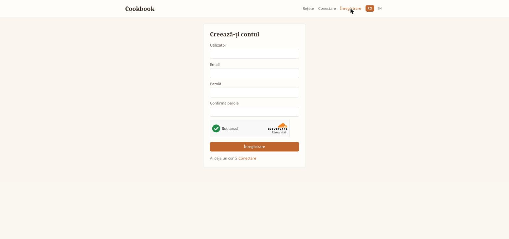

The same login form serves regular users and admins — there's no separate back-office login:

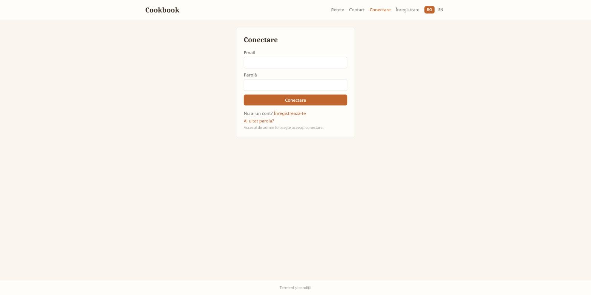

**Front office** — public recipe browsing, filterable by category, with recipes that were
scraped and cleaned up by the import pipeline:

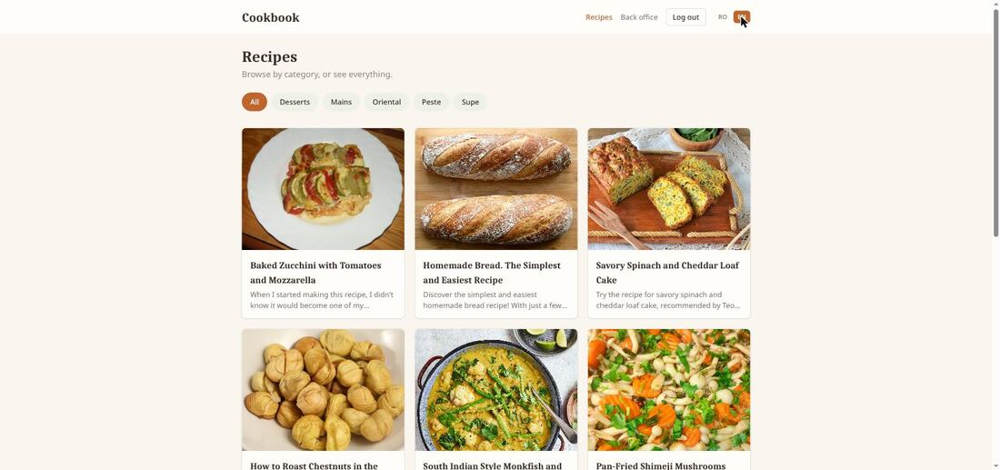

Recipe detail page showing the parsed title, image, description, ingredients (each annotated with
an estimated gram weight), and numbered steps:

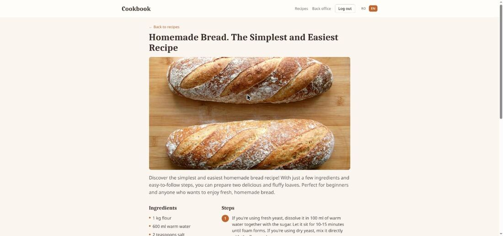

Nutrition panel at the bottom of the recipe page — calories/protein/carbs/sugars/fat per serving,
plus the estimated serving count, computed live from the ingredient database rather than stored
on the recipe (see [Design Decisions](#design-decisions), "Ingredient nutrition"):

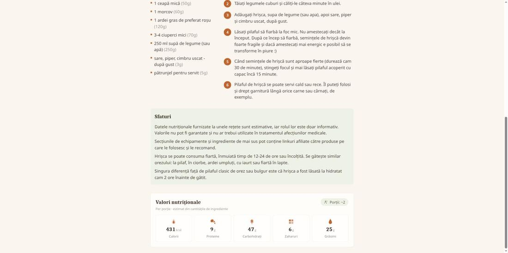

A logged-in user's own recipe page ends with a smaller "From the community" section — every
manually-added recipe here was explicitly shared by its owner and approved, from three different
users' accounts:

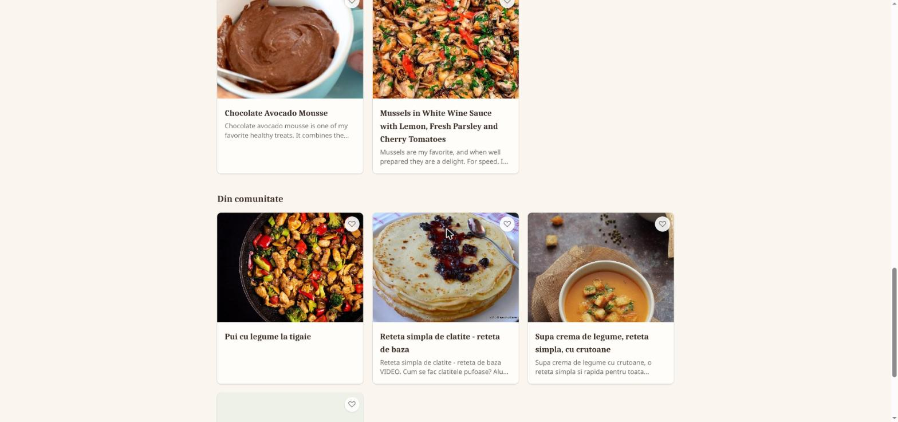

**Account page** — every signed-in user's private space: importing from a URL (including
Instagram links) is now open to everyone, not just admins, and each import stays visible only to
whoever created it:

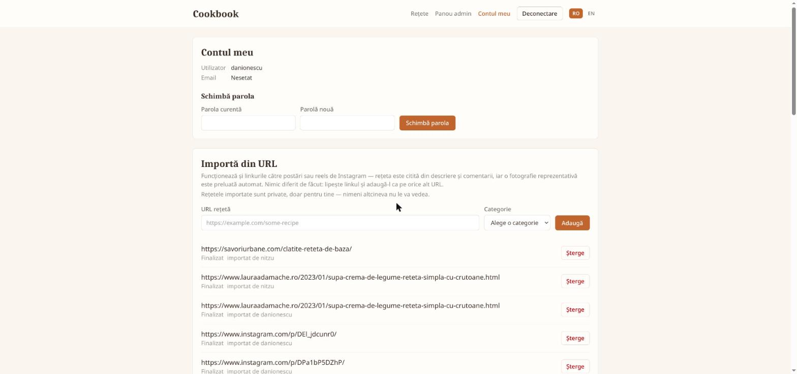

Further down, "My recipes" lists everything this account owns — imports and manually-added
recipes together — with a share/unshare toggle on anything that isn't an import:

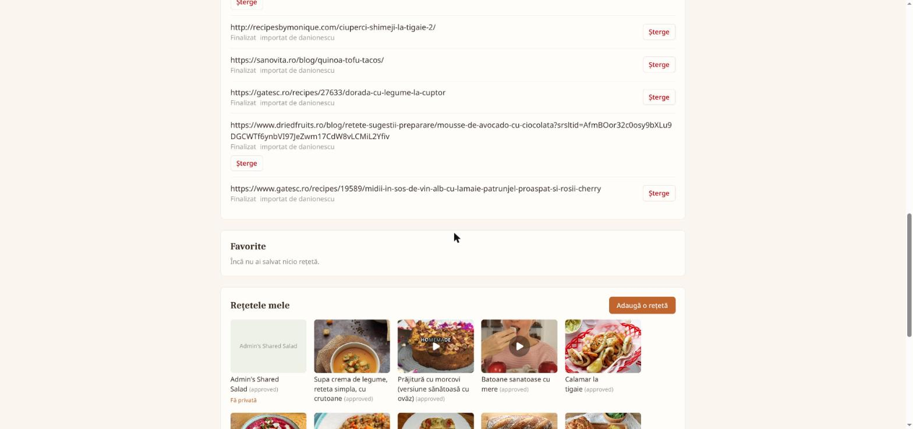

A just-finished import stays in a dismissible "Recently imported" card — with an Instagram
play-button warning where relevant, and an Edit link — until the owner clicks "OK, got it"; a
failed import shows a plain-language reason instead of a raw error, with a link to add the recipe
manually and its own "OK" to dismiss (see [Design Decisions](#design-decisions), "Post-import
review panel"):

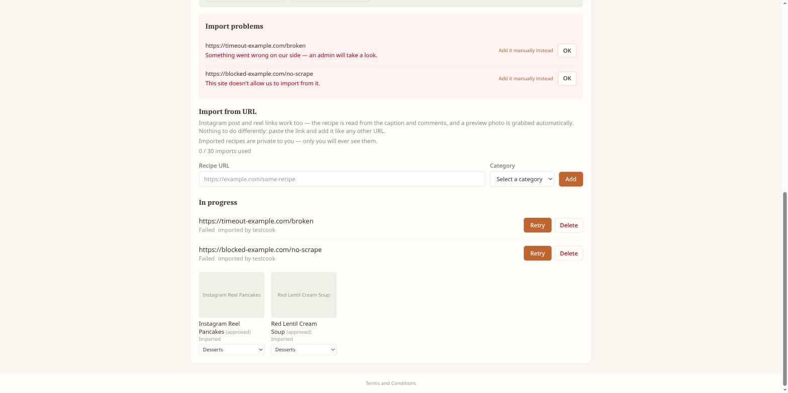

**Back office** — JWT-gated admin area, split into two pages (**Recipes** / **Setări**) behind a
small sub-nav — see [Design Decisions](#design-decisions):

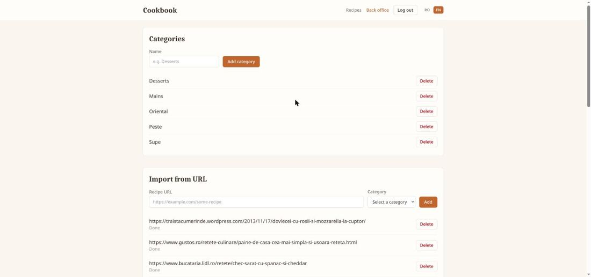

Further down the same page, the recipe manager — every row now shows who owns the recipe and
whether it's shared with the community, alongside the existing preview/approve/delete actions:

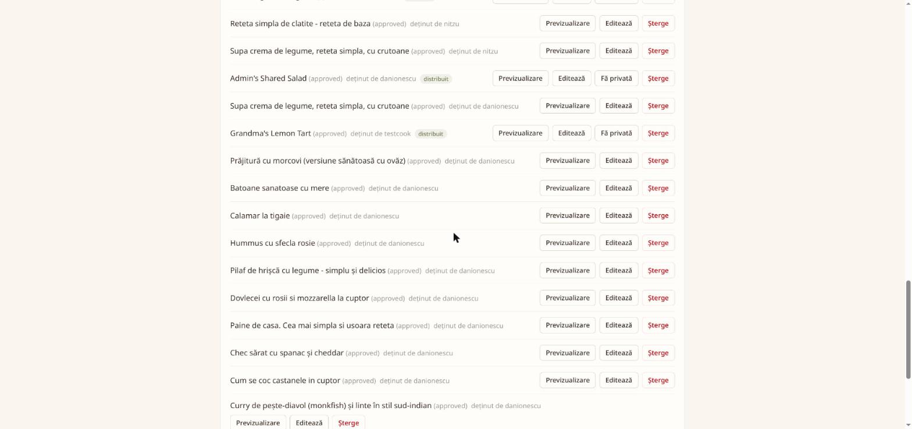

Clicking "Editează" opens full per-language editing — title, description, ingredients, steps,
tips, and image upload — for correcting anything an automated import gets wrong, not just
manually-authored recipes; saving a changed translation re-syncs every other language and
nutrition automatically (see [Core Workflows](#core-workflows), workflow #5):

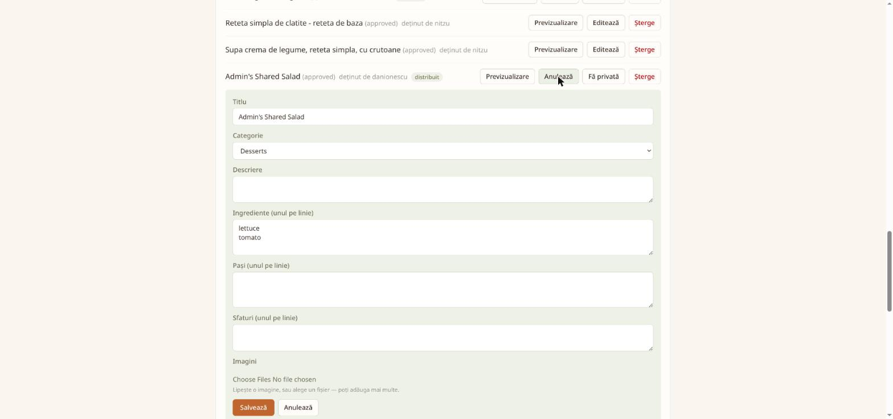

The new **Failed imports** page (admin-only, paginated) lists every failed import job across every
user, with its full raw error and an `error_kind` badge — unlike the owner's own Account page,
this never hides an entry just because its owner already dismissed it:

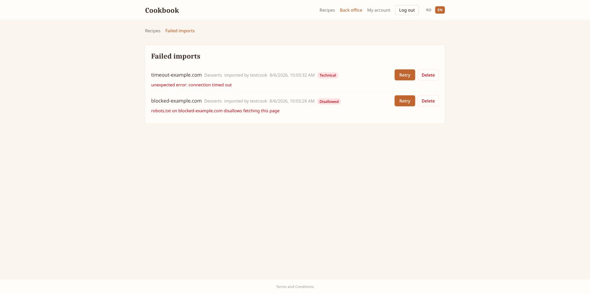

Settings page (super-admin only): the admin-editable subset of config — languages, credentials
including the CalorieNinjas/Anthropic/Turnstile keys and SMTP settings for verification emails,
and the import pipeline's rate limit/timeout/image tuning — can be changed and applied live. Shown
below is the newer SMTP/Turnstile section further down the same page (the SMTP username/from-address
fields are blurred here since this is a real deployment's mailbox, not placeholder data); the
CalorieNinjas/Anthropic keys, language config, and the "Reparsează toate ingredientele" ("Reparse
all ingredients") button live in the same form, above this section — see
[Design Decisions](#design-decisions):

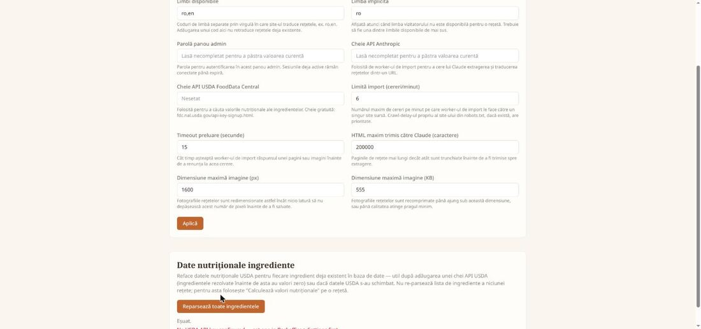

## Status

The project is being built as a vertical slice, widening outward one piece at a time rather than
building every layer fully before the next (see [Design Decisions](#design-decisions)). Current
state:

- [x] Docker Compose skeleton (Postgres + API + frontend)
- [x] API backend: categories + recipes CRUD, tested
- [x] Frontend: front office browsing + back office CRUD, tested
- [x] RabbitMQ + worker: API publishes import jobs, worker consumes them
- [x] Real scraping: robots.txt-respecting fetch with per-domain rate limiting, single-call Claude
      extraction/cleanup/translation — tested against real servers (`example.com`,
      `google.com/search`); see [Core Workflows](#core-workflows)
- [x] Image download + compression: worker downloads each extracted image, downscales/re-encodes it
      to a configurable max dimension/size, and serves it from the API at `/images/<file>` via a
      volume shared with the worker
- [x] Back office import request flow (`ImportManager`): submitting a URL + category creates a
      `pending` `import_jobs` row that is **not** sent to RabbitMQ yet; clicking **Approve** is what
      publishes it to the queue (also doubles as retry for a `failed` job), and the list polls
      every 3s while any job is `queued`/`fetching`/`processing`. A successful import now publishes
      the recipe immediately (`status=approved`, `approved_at` set) rather than landing as a
      separate `unapproved` review step — the human review already happened when the admin approved
      the import request. See [Design Decisions](#design-decisions) for why this replaced the
      original post-import moderation queue. Submitting a URL that's already been imported, or is
      already sitting anywhere in the queue, is rejected with a `409` shown inline in the form.
- [x] `RecipeManager` still exposes preview + manual `POST /recipes/{id}/approve` for any recipe an
      admin has manually set back to `unapproved` (there's no UI to do that yet, only the API) —
      useful for unpublishing/republishing a specific recipe, no longer the primary import path
- [x] Frontoffice design: Tailwind CSS (v4, CSS-first `@theme`) + React Router, mobile-first —
      category pill nav, responsive recipe grid, an AllRecipes-style recipe detail page
      (`/recipes/:id`: hero image, description, ingredients, numbered steps, tips), warm/rustic
      palette (cream background, terracotta/olive accents, serif headings)
- [x] Multi-language site: `recipes`/`recipe_translations` split (one row per language, unique on
      recipe+language), `SUPPORTED_LANGUAGES`/`DEFAULT_LANGUAGE` config shared by API and worker,
      `GET /languages`, a single Claude call now produces one translation per configured language,
      a hand-rolled frontend i18n system with one switcher controlling both UI chrome and which
      recipe translation loads — verified live: a real import produced distinct Romanian and
      English content from one Claude call, and switching languages in the browser updated both
      the UI and the recipe content instantly with no reload; migration `0004`'s data copy was also
      verified against the real (non-empty) dev database
- [x] Per-user accounts: self-service signup (`POST /auth/signup`, username/email/password behind
      a Cloudflare Turnstile CAPTCHA) gated on email verification — a signed-up account can't log
      in until it clicks the link from a verification email, sent by the worker over SMTP. The
      email is sent in the language active on the signup form (`users.language`, snapshotted at
      signup, independent of `default_language`/browsing-language changes afterward) and greets the
      user by username with a one-paragraph "what this site is" blurb, not just a bare link. A
      `POST /auth/resend-verification` endpoint (also CAPTCHA-gated) covers a lost/expired email or
      a signup blocked by broken SMTP settings, and re-signing up with an already-registered-but-
      unverified email transparently resends instead of erroring. Login (`POST /auth/login`) is now
      JWT against the `users` table (bcrypt-hashed passwords, `PyJWT` signing) — the same login form
      serves regular users and admins, there's no separate back-office login. `JWT_SECRET`/
      `JWT_EXPIRES_MINUTES` stay `.env`-only (see [Design Decisions](#design-decisions)).
- [x] Two admin tiers: `users.is_admin` (back office access — categories/recipes/imports
      moderation) and a stricter `users.is_super_admin` (the Settings subpage only, since it holds
      API keys and SMTP/Turnstile secrets). A super admin is expected to also be a regular admin,
      but they're independent flags, not a role enum.
- [x] Recipe privacy & opt-in community sharing: every recipe has an `owner_user_id` and is private
      to its owner by default — a fresh user no longer sees another user's imports (the bug that
      prompted this). A manually-added recipe can be explicitly shared with the community
      (`PATCH /recipes/{id}/share`), at which point — once approved — it shows up on the logged-out
      landing page and in a smaller "From the community" section on every logged-in user's own
      recipe page. Imported recipes can never be shared. A non-admin's shared recipe still goes
      through the existing admin-approval step before it's actually public; an admin's own goes live
      immediately. See [Design Decisions](#design-decisions).
- [x] Importing from a URL is open to every signed-in user, not just admins — each import is
      private to whoever created it, with per-user duplicate-URL checks so two different users can
      independently import the same public page. A non-admin's import is queued immediately (no
      approval step, since nothing becomes public without the separate share action); an admin's
      import still goes through the existing pending→approve step.
- [x] Instagram post/reel links, pasted into the same "Import from URL" field, are auto-detected
      by host and routed to a headless-browser fetch (Playwright, `worker/app/instagram_client.py`)
      instead of a plain HTML GET, since Instagram serves mostly client-side-rendered content to
      normal requests. The caption/comments and a preview image are read from there, then handed to
      the same Claude extraction and image pipeline as any other import.
- [x] Full recipe editing in the back office (`RecipeManager`): title/description/ingredients/
      steps/tips per language, plus image upload/replace/delete via `POST /images`
      (`api/app/routers/images.py`) — for correcting anything an automated import gets wrong, not
      just for manually-authored recipes.
- [x] Editing a recipe's translation keeps every language in sync and re-runs nutrition: `PUT
      /recipes/{id}` enqueues a `translation_sync_jobs` job whenever a translation field changes;
      the worker translates that edit into every other supported language via Claude (the same tool
      used on import), then re-triggers nutrition enrichment once everything matches again. A
      recipe's `processing_status` (`translating` \| `recalculating_nutrition` \| `null`) shows this
      as a badge in the back office recipe list, polling until it clears.
- [x] Admin-editable settings (`SettingsManager`, super-admin only): languages, the Anthropic and
      CalorieNinjas API keys, SMTP host/port/credentials for verification emails, the Turnstile
      site/secret key pair, the public site URL (used to build verification-email links), and the
      import pipeline's rate limit/timeout/HTML-size/image-size tuning live in a single-row
      `app_settings` Postgres table instead of `.env`, editable from the back office and applied
      live — no container restart, no Docker socket access from the app. `.env` only seeds that
      row's initial values via migrations `0006`/`0017`. See [Design Decisions](#design-decisions).
- [x] Ingredient nutrition: automatic, not a button — a successful import queues a nutrition job
      (own `nutrition_jobs` queue, consumed by the same worker container, right after the import
      job that created the recipe) that asks Claude to parse each ingredient line into a canonical
      food name/quantity/unit, then resolves that against the CalorieNinjas API for both the
      per-100g nutrient panel and a real per-line gram estimate (falling back to Claude's own gram
      guess when the lookup finds nothing) — see [Design Decisions](#design-decisions). The
      resulting `ingredients` + `recipe_ingredient_links` rows are the only thing stored; a
      recipe's calories/protein/carbs/sugars/fat totals are computed live by
      `GET /recipes/{id}/nutrition` (join + sum), never cached in the DB. The front office shows a
      nutrition panel (per serving, with an estimated servings count) and annotates each ingredient
      line with its estimated gram weight.
- [x] Ingredient nutrition data refresh: a global **"Reparse all ingredients"** button in the back
      office Settings page (own `ingredient_refresh_jobs` queue, same worker container) re-fetches
      CalorieNinjas data for every `Ingredient` row already in the database, by its normalized name
      (e.g. an ingredient resolved before a CalorieNinjas key was configured, left at zeroed
      placeholder values). Unlike the per-import nutrition job above, this doesn't touch Claude or
      any recipe's ingredient list — it only refreshes the shared nutrition-reference rows. See
      [Design Decisions](#design-decisions).
- [x] Backoffice split into two pages behind a small sub-nav: **Recipes** (`/backoffice` —
      categories, URL import, recipe manager) and **Settings** (`/backoffice/settings` —
      `SettingsManager` + the ingredient refresh button above), so the settings form isn't buried
      at the bottom of an ever-growing single page.
- [x] Ingredient/step sub-groups (e.g. "For the cake:" / "For the frosting:"): a recipe can mark a
      line as a sub-group label instead of a real ingredient/step by prefixing it `"### "`
      (`SECTION_HEADER_PREFIX`, `recipe_sections.py`) — no schema change, and the flat-array
      index-based nutrition linking (`RecipeIngredientLink.ingredient_index`) still works unchanged,
      since the nutrition parser skips any line matching the prefix. Extraction, translation, and
      reparse prompts all know the convention; the frontend renders a marked line as a sub-heading
      instead of a bullet/numbered item. See [Design Decisions](#design-decisions).
- [x] **Reparse** a single already-imported recipe, or **reparse all imported recipes** in bulk
      (`POST /recipes/{id}/reparse`, `POST /recipes/reparse-all-imported`, both admin-only) —
      re-scrapes the recipe's existing `source_url` and re-runs Claude extraction, updating the
      existing translations in place (slug and images untouched) without creating a duplicate
      recipe or losing its id/favorites/shares. Own `recipe_reparse_jobs` queue/table, same
      job-pipeline shape as every other async op; a recipe's `processing_status` reports
      `reparsing` while one is in flight. Useful for picking up extraction-quality fixes (like the
      sub-group convention above) on recipes imported before they existed, without re-importing.
- [x] Claude API cost reduced for every import/reparse: `fetch_page` now strips
      `<script>`/`<style>`/`<nav>`/`<footer>`/`<header>`/`<aside>`/`<form>`/`<iframe>`/`<svg>`,
      comments, and noisy attributes (`class`, `style`, `data-*`, `on*`, `aria-*`) from scraped HTML
      before truncating to `max_html_chars`, so the character budget goes to recipe content instead
      of page boilerplate; and the mechanical, forced-tool-call extraction/parsing calls
      (`extract_recipe`, `parse_recipe_from_text`, `parse_ingredients_for_nutrition`) moved from
      `claude-sonnet-5` to the cheaper `claude-haiku-4-5` (`translate_recipe` stays on Sonnet — small
      input, quality-sensitive). Verified live: the same recipe reparse that cost ~26¢ before this
      change cost ~3¢ after, with no observed quality regression across a 5-recipe spot check
      spanning four different source sites plus the Instagram text-extraction path. See
      [Design Decisions](#design-decisions).
- [x] Lifetime import limit per user (`app_settings.max_imports_per_user`, admin-configurable,
      default 30): a non-admin's account tracks a lifetime `imported_recipes_count`, incremented
      once by the worker per *successful* import and never decremented — deleting the resulting
      recipe (or its `import_jobs` row) never frees up quota, so the cap can't be gamed by
      importing-then-deleting. `POST /imports` 403s once the count reaches the limit; admins are
      exempt (this is a lever aimed at end users, not the site's own curators). The Account page's
      Import panel shows "`used` / `limit` imports used" and blurs+disables the Add button once the
      limit is hit, with a note that refilling it will be a paid upgrade in the future. See
      [Design Decisions](#design-decisions).
- [ ] Bulk URL lists / bookmark-file upload in the import form (single URL only for now)
- [ ] Bookmark-file import
- [x] Reverse proxy (Caddy) in front of frontend + API — production only, see
      [Deployment](#deployment)
- [x] Superadmin Users page (`UsersManager`, `/backoffice/users`): a table of every account —
      username, email, confirmed/unconfirmed, joined date, last login, and lifetime
      imported/currently-owned/currently-shared recipe counts (`GET /users`, one query with two
      correlated scalar subqueries for the live counts, portable across the Postgres used in
      production and the SQLite the test suite runs against). "Last login" is a new
      `users.last_login_at` column stamped once per successful `POST /auth/login` — a proxy for
      "last used," not a full activity log, since this API is stateless JWT auth with no
      per-request session to hook into. A **Show recipes** button per row expands a read-only,
      10-per-page list of that user's recipes (title, status, shared/imported badges) inline,
      reusing `GET /recipes`'s existing pagination — its `owner` query param now also accepts an
      explicit username for an admin caller (previously only `"me"`), 403ing a non-admin and 404ing
      an unknown username. See [Design Decisions](#design-decisions).
- [x] Owner-editable recipe category: `PATCH /recipes/{id}/category` lets a recipe's owner (or an
      admin, for anyone's) change its category after the fact — manually-added or imported alike.
      Surfaced as a `<select>` per card in the Account page's "My recipes" list, saving on change.
      See [Design Decisions](#design-decisions), "Owner-editable category".
- [x] Post-import review panel + owner-editable recipes + an admin failed-imports page: a finished
      import used to just quietly join the "My recipes" grid, and a failed one showed only a raw,
      admin-facing error string. The Account page now surfaces both under "My recipes" until
      dismissed — a **"Recently imported"** card per unreviewed recipe (thumbnail, an Instagram-
      specific warning that the preview photo may still have Instagram's own play-button icon baked
      into it — see `TODO.MD` for why that isn't fixed automatically — an **Edit** link, and an
      **OK, got it** button setting the new `recipes.import_reviewed_at`), and an **"Import
      problems"** card per undismissed failed job (a canned message keyed off the new
      `import_jobs.error_kind` — `disallowed` vs `technical`, never the raw `error` text for a
      non-admin — a link to add the recipe manually instead, and an **OK** button setting the new
      `import_jobs.dismissed_at`). `PUT /recipes/{id}` is now reachable by the recipe's owner (not
      just an admin) via a new `/recipes/{id}/edit` page, with a guard rejecting a non-admin's
      attempt to change `status` through it. A new admin-only, paginated **Failed imports** back
      office page (`/backoffice/failed-imports`) shows every failed job's full raw error regardless
      of whether its owner already dismissed it from their own view. See
      [Design Decisions](#design-decisions), "Post-import review panel".
- [x] Admin review tracking for failed imports, and the Account page's review panel scoped to the
      viewer's own jobs: the Failed Imports page's **"Mark as reviewed"** button sets a new
      `import_jobs.admin_reviewed_at`, hiding that job from the page's default view — completely
      independent of the owner's own `dismissed_at`, so neither actor's action can clear the
      other's. `GET /imports` gained an `admin_reviewed` filter for this. Separately, the Account
      page's "Import problems" panel (`PendingImportsPanel`) is now scoped to the logged-in
      viewer's own jobs regardless of admin status — `GET /imports` intentionally returns every
      user's jobs for an admin caller (needed for backoffice moderation), which meant an admin's
      own personal Account page was incidentally showing every other user's failures mixed in
      before this; cross-user triage now lives exclusively on the dedicated Failed Imports page.
      See [Design Decisions](#design-decisions), "Post-import review panel".

## Features

- **Front office** — browse recipes by category (desserts, main courses, ...) and view a single
  recipe page modeled after sites like
  [AllRecipes](https://www.allrecipes.com/shredded-zucchini-casserole-recipe-11747790): hero image,
  description, ingredients, steps, tips.
- **User accounts** — self-service signup behind a CAPTCHA, gated on email verification, plus a
  resend flow for a lost link or a signup blocked by broken mail settings. Every account gets a
  private recipe collection: favorites, their own imports, and anything they've added by hand.
- **Recipe privacy, with opt-in community sharing** — recipes are private to whoever owns them by
  default. A manually-added (not imported) recipe can be shared with the community, at which point
  it appears on the public landing page and everyone's own recipe page, after admin approval for a
  non-admin's recipe.
- **Back office** — username/password-protected admin area with full CRUD for categories and
  recipes, full per-language recipe editing, moderation of shared submissions, and a stricter
  super-admin tier for the Settings page, split into a **Recipes** page and a **Settings** page
  behind a small sub-nav.
- **URL and Instagram scraping, open to every user, reviewed before scraping happens** — submit a
  URL (including an Instagram post/reel link) + category from your own account; a non-admin's
  import queues immediately for their own private use, an admin's still sits as a pending request
  until they click Approve, which is what actually triggers the fetch/Claude/image pipeline.
- **Bulk scraping** — submit a list of URLs, or upload an HTML bookmarks export; the system finds
  the recipe links inside it and imports them all.
- **AI-assisted cleanup** — Claude parses bookmark HTML, strips ads/boilerplate, and keeps only
  images, description, ingredients, and tips, then translates the result into every configured site
  language in the same pass.
- **Multi-language site** — the site itself (nav, labels, buttons) and every recipe's content are
  available in Romanian (default) and English, with more languages addable via config rather than a
  schema change (see [Design Decisions](#design-decisions)).
- **Review gate on the request, not the result** — since an admin explicitly approves every URL
  before it's ever fetched, a successful import publishes immediately; there's no second
  after-the-fact review of Claude's output. Any individual recipe can still be manually
  unpublished/republished via the API today.
- **Portable deployment** — everything runs in Docker Compose, locally on a Fedora laptop and later
  on a Raspberry Pi.
- **Live-editable settings** — languages, the Anthropic/CalorieNinjas API keys, SMTP credentials,
  the Turnstile key pair, and the import pipeline's rate limit/timeout/image tuning can all be
  changed from a super-admin-only back office Settings page, with each change taking effect
  immediately (no restart).
- **Estimated nutrition per recipe** — automatically resolved right after import (no admin action
  needed) against the CalorieNinjas API (nutrients + a real per-line gram estimate, with an
  LLM-parsed gram guess as fallback), and the front office shows calories/protein/carbs/sugars/fat
  per serving plus an estimated gram weight next to each ingredient — all clearly labelled as
  estimates, computed live rather than stored.
- **Ingredient data refresh** — a separate back office button re-fetches CalorieNinjas nutrition
  data for every ingredient already resolved in the database, without touching Claude or any
  recipe's text — useful for fixing ingredients that were resolved before a CalorieNinjas key was
  configured.
- **Reparse an already-imported recipe** — re-scrapes its `source_url` and re-runs Claude
  extraction in place (single recipe, or all imported recipes in bulk), for picking up
  extraction-quality fixes without re-importing and losing the recipe's id, favorites, or shares.
- **Cost-optimized import pipeline** — scraped HTML is stripped of scripts/styles/nav/boilerplate
  before it ever reaches Claude, and the mechanical extraction/parsing calls run on Haiku instead
  of Sonnet — a single recipe reparse went from ~26¢ to ~3¢ with no observed quality loss.
- **Lifetime import limit, configurable, with a paid-refill hook for later** — a non-admin's
  account can import up to an admin-configurable number of recipes total (default 30), counting
  ones they've since deleted so the cap can't be gamed; the Account page shows current usage and
  disables the import button once it's reached. Admins aren't capped.
- **Superadmin Users page** — a table of every account (username, email, confirmed status, joined
  date, last login, imported/owned/shared recipe counts), with a per-row **Show recipes** button
  that expands a read-only, paginated (10/page) list of that user's recipes inline, without leaving
  the page.
- **Owner-editable recipe category** — any user can re-categorize a recipe they own, manually-added
  or imported, from a dropdown on their Account page, without needing an admin to fix a category
  guessed wrong at import time.
- **Post-import review, with friendly failure messages** — a finished import shows up in a
  dismissible "Recently imported" card (with an Instagram play-button warning where relevant, and
  an Edit link) until the owner clicks OK, instead of silently joining the recipe grid; a failed
  import shows a plain-language reason instead of a technical error, with a link to add the recipe
  by hand and an admin-only back office page listing every failure's full detail.

## Architecture

```
                         ┌─────────────────────┐
                         │   Web Frontend       │
                         │ (Front office + Back │
                         │  office SPA)         │
                         └──────────┬───────────┘
                                    │ REST/HTTPS
                                    ▼
                         ┌─────────────────────┐
                         │   API Backend        │◄──────┐
                         │ (auth, recipes,      │       │
                         │  categories, imports) │       │
                         └──────────┬───────────┘       │
                                    │                    │ reads/writes
                    publishes jobs  │                    │
                                    ▼                    │
                         ┌─────────────────────┐         │
                         │   RabbitMQ           │         │
                         └──────────┬───────────┘         │
                                    │ consumes jobs        │
                                    ▼                      │
                         ┌─────────────────────┐          │
                         │  Scraper Workers      │──────────┘
                         │  (Python, one/many    │
                         │   URLs or bookmark    │
                         │   HTML)                │
                         │                        │
                         │  → fetch page          │
                         │  → Claude API:         │
                         │     parse/clean/       │
                         │     translate          │
                         │  → download images     │
                         └──────────┬───────────┘
                                    │ INSERT (status=unapproved)
                                    ▼
                         ┌─────────────────────┐
                         │   PostgreSQL          │
                         └─────────────────────┘
```

Two backend services share the database: the **API backend** (synchronous, serves the SPA) and the
**scraper workers** (asynchronous, consume import jobs off RabbitMQ). This keeps a slow/flaky
scrape from ever blocking a user-facing API request.

## Tech Stack

| Layer                  | Technology                                              | Notes |
|-------------------------|----------------------------------------------------------|-------|
| Frontend                | React + TypeScript (Vite), React Router, Tailwind CSS v4  | Single SPA serving both front office and back office; `/backoffice` is route-gated by a JWT `AuthContext`, front office stays public |
| UI language              | Hand-rolled i18n (`src/i18n/`), no library                | Small static dictionary per language (`ro`, `en`); one site-wide switcher drives both UI text and which recipe translation is fetched |
| API backend             | Python + FastAPI                                         | REST API; per-user JWT (`PyJWT`) auth against the `users` table, passwords hashed with `bcrypt`; `is_admin`/`is_super_admin` gate the back office and Settings respectively |
| Scraper workers         | Python + Pika (RabbitMQ client), httpx (fetch), Playwright (headless-browser fetch for Instagram), BeautifulSoup4 (strip boilerplate before it reaches Claude), stdlib `urllib.robotparser`, Pillow (image resize/compress) | Consume import/reparse jobs, respect robots.txt + rate limits, fetch pages, clean HTML, download + process images |
| AI parsing/translation  | Claude API (Anthropic), `anthropic` Python SDK, `claude-haiku-4-5` for extraction/parsing, `claude-sonnet-5` for translation | Bookmark HTML → candidate recipe links (not built yet); raw (cleaned) page → cleaned recipe JSON, one translation per `SUPPORTED_LANGUAGES` entry, in a single tool-use call on Haiku; a second Haiku tool-use call parses ingredient lines into structured food/quantity/unit for nutrition lookup; a third tool-use call, on Sonnet, re-translates a hand-edited recipe into every other language after a back-office edit or a reparse — see Design Decisions ("Claude cost optimization") |
| Nutrition data           | CalorieNinjas API                                         | Free tier, single natural-language query per lookup; provides both per-100g nutrient panels and a real per-line gram estimate for common ingredients — see Design Decisions ("Ingredient nutrition") |
| Account security         | `bcrypt` (password hashing), Cloudflare Turnstile (CAPTCHA on signup/resend), `email-validator` | Signup/resend are CAPTCHA-gated; login is gated on email verification |
| Outbound email           | SMTP (stdlib `smtplib`), admin-configured host/port/credentials | Worker sends account-verification emails (`worker/app/email_handlers.py`), consumed off its own `email_jobs` queue |
| Message queue           | RabbitMQ                                                  | Decouples API from long-running scrape/import/nutrition/translation-sync/reparse/email jobs; queues (`import_jobs`, `nutrition_jobs`, `ingredient_refresh_jobs`, `translation_sync_jobs`, `recipe_reparse_jobs`, `email_jobs`) are all consumed by the same worker container |
| Database                | PostgreSQL                                                | Recipes (owned per-user, opt-in shared), categories, import status, `users` (incl. a lifetime `imported_recipes_count`)/email-verification/favorites, a single-row `app_settings` table for admin-editable config (incl. `max_imports_per_user`), `ingredients`/`recipe_ingredient_links` for nutrition (see Data Model) |
| Image storage           | Docker named volume (`images_data`), mounted into both `api` and `worker`, served by the API via `StaticFiles` at `/images` | Worker downloads + writes JPEGs there; API serves them read-only; not hotlinked from source sites |
| Reverse proxy           | Caddy                                                      | TLS termination (automatic Let's Encrypt), routes `/` to the SPA and `/api` to the backend — production only, see [Deployment](#deployment) |
| Orchestration            | Docker Compose                                            | One compose stack for local dev (Fedora) and prod (Raspberry Pi, arm64 images) |

## Project Structure

```
cookbook/
├── readme.MD
├── docker-compose.yml
├── docker-compose.override.yml     # local dev overrides (hot reload, exposed ports)
├── .env.example
├── frontend/                       # React + TypeScript SPA (front office + back office)
│   ├── src/
│   │   ├── frontoffice/             # LandingPage (logged-out home + "From the community" section),
│   │   │                            #   RecipeBrowser (logged-in home: My recipes / From the
│   │   │                            #   community split), RecipeDetail (/recipes/:id) +
│   │   │                            #   NutritionPanel (calories/protein/carbs/sugars/fat per
│   │   │                            #   serving, icon tiles), CategoryNav, RecipeCard,
│   │   │                            #   recipeSections.ts (isSectionHeader/stripSectionHeader —
│   │   │                            #   renders a "### "-prefixed ingredient/step line as a
│   │   │                            #   sub-heading instead of a bullet/numbered item)
│   │   ├── account/                 # AccountPage (profile, change password, favorites, "My
│   │   │                            #   recipes" with a share/unshare toggle, an Edit link, and a
│   │   │                            #   per-recipe category selector (PATCH /recipes/{id}/category,
│   │   │                            #   manual or imported alike) — renders ImportManager from
│   │   │                            #   backoffice/ too, since /imports is scoped per-caller),
│   │   │                            #   PendingImportsPanel (post-import review: an unreviewed
│   │   │                            #   import's card w/ Instagram play-button warning + Edit link
│   │   │                            #   + acknowledge button; an undismissed failed job's card w/
│   │   │                            #   canned error-kind message + dismiss button — see Design
│   │   │                            #   Decisions, "Post-import review panel"), RecipeEditPage
│   │   │                            #   (/recipes/:id/edit — owner-or-admin full per-language edit,
│   │   │                            #   the same field set as RecipeManager's inline form minus the
│   │   │                            #   admin-only actions), RecipeSubmitForm ("Add a recipe", with
│   │   │                            #   a share-with-community checkbox)
│   │   ├── backoffice/              # CategoryManager, ImportManager (submit URL/Instagram link,
│   │   │                            #   approve-to-trigger, polls while active — reused inside
│   │   │                            #   AccountPage for non-admins; shows a non-admin's lifetime
│   │   │                            #   import usage and blurs+disables Add once the limit is hit),
│   │   │                            #   RecipeManager (CRUD + full per-language editing incl. image
│   │   │                            #   upload/replace, preview/approve, owner + shared badges,
│   │   │                            #   processing-status badge, a Reparse button per imported
│   │   │                            #   recipe + a "Reparse all imported" bulk action — nutrition/
│   │   │                            #   translation sync is automatic, no button for those),
│   │   │                            #   FailedImportsManager (/backoffice/failed-imports — every
│   │   │                            #   failed import job, paginated, full raw error regardless of
│   │   │                            #   whether the owner already dismissed it, Retry/Delete),
│   │   │                            #   SettingsManager (view/edit app_settings incl. SMTP/
│   │   │                            #   Turnstile/max_imports_per_user, Apply = live PATCH,
│   │   │                            #   super-admin only), IngredientRefreshPanel ("Reparse all
│   │   │                            #   ingredients" button, polls while queued/processing),
│   │   │                            #   UsersManager (super-admin only: every account's stats
│   │   │                            #   table + a per-row expandable, paginated read-only recipe
│   │   │                            #   list, GET /users), LoginForm — all gated behind
│   │   │                            #   AuthContext. App.tsx's BackofficeLayout renders LoginForm
│   │   │                            #   when unauthenticated, else a Recipes/Failed imports/Users/
│   │   │                            #   Settings sub-nav + <Outlet /> across nested /backoffice
│   │   │                            #   routes
│   │   ├── ui/                      # buttonStyles.ts, nutritionIcons.tsx (hand-rolled inline SVGs:
│   │   │                            #   flame/drumstick/wheat/sugar-cubes/droplet/servings),
│   │   │                            #   Pagination.tsx (classic numbered pagination, shared by
│   │   │                            #   RecipeManager and UsersManager's per-user recipe list),
│   │   │                            #   hostnameOf.ts (shared by RecipeManager, RecipeDetailView,
│   │   │                            #   and UsersManager for the "imported from {domain}" link)
│   │   ├── auth/                    # AuthContext.tsx (useAuth: isAuthenticated/login/logout, token
│   │   │                            #   + role flags in localStorage), SignupForm (username/email/
│   │   │                            #   password + Turnstile), VerifyEmailPage (/verify-email?token=),
│   │   │                            #   TurnstileWidget (loads the Cloudflare script, wraps
│   │   │                            #   site-key/callback plumbing), useFavoriteIds
│   │   ├── i18n/                    # config.ts (SUPPORTED_LANGUAGES, default "ro"), translations/
│   │   │                            #   {ro,en}.ts, LanguageContext.tsx (useLanguage/useT, localStorage)
│   │   ├── api/                     # fetch-based API client (attaches Authorization: Bearer <token>)
│   │   ├── index.css                # Tailwind v4 entry + @theme (warm/rustic palette)
│   │   └── tests/                   # Vitest + React Testing Library
│   ├── package.json
│   └── Dockerfile                  # multi-stage: dev (vite) / production (nginx)
├── api/                            # FastAPI backend
│   ├── app/
│   │   ├── routers/                # auth.py (POST /auth/signup, /resend-verification,
│   │   │                           #   /verify-email, /login — the last one also stamps
│   │   │                           #   users.last_login_at), users.py (GET /users/me — incl.
│   │   │                           #   imported_recipes_count, PATCH /users/me/password, GET
│   │   │                           #   /users — super-admin only, every account + live owned/
│   │   │                           #   shared recipe counts via two correlated scalar subqueries),
│   │   │                           #   categories.py, recipes.py (CRUD + /approve + /share +
│   │   │                           #   /category + /reparse + /reparse-all-imported,
│   │   │                           #   owner/visibility-scoped — the `owner` list filter also
│   │   │                           #   accepts an explicit username for an admin caller, not just
│   │   │                           #   "me", powering the Users page's per-user recipe list;
│   │   │                           #   `PATCH .../category` is owner-or-admin, unlike the
│   │   │                           #   admin-only `PUT .../{id}` full edit — plus
│   │   │                           #   /users/me/favorites + /users/me/submissions on a second
│   │   │                           #   router in the same module), imports.py (CRUD + /approve,
│   │   │                           #   deferred publish for admins, immediate for everyone else,
│   │   │                           #   scoped to the caller unless admin, 403s a non-admin past
│   │   │                           #   their lifetime import limit), images.py (POST /images,
│   │   │                           #   any logged-in user), languages.py, settings.py (GET/PATCH
│   │   │                           #   /settings, router-level require_super_admin),
│   │   │                           #   public_settings.py (GET /settings/public — Turnstile site
│   │   │                           #   key + max_imports_per_user, for the pre-login signup page
│   │   │                           #   and the Account page respectively),
│   │   │                           #   nutrition.py (GET /recipes/{id}/nutrition, public + live-
│   │   │                           #   computed — no POST here, the worker queues its own
│   │   │                           #   nutrition job right after a successful import),
│   │   │                           #   ingredients.py (GET/POST /ingredients/refresh, both admin —
│   │   │                           #   global "reparse all ingredients" job, not per-recipe)
│   │   ├── models/                 # SQLAlchemy models (User [+is_admin/is_super_admin/is_verified/
│   │   │                           #   language — snapshotted at signup, picks the verification
│   │   │                           #   email's language/
│   │   │                           #   imported_recipes_count — lifetime, never decremented/
│   │   │                           #   last_login_at — stamped on login only, a proxy for "last
│   │   │                           #   used" rather than a full activity log],
│   │   │                           #   EmailVerificationToken, EmailJob, Category, Recipe
│   │   │                           #   [+owner_user_id, is_shared, estimated_servings],
│   │   │                           #   RecipeTranslation, RecipeFavorite, ImportJob
│   │   │                           #   [+created_by_user_id, INSTAGRAM type], TranslationSyncJob,
│   │   │                           #   RecipeReparseJob, AppSettings — single-row admin-editable
│   │   │                           #   settings table incl. SMTP/Turnstile/max_imports_per_user,
│   │   │                           #   Ingredient — canonical per-100g nutrition reference,
│   │   │                           #   RecipeIngredientLink — the stored
│   │   │                           #   ingredient-line-to-Ingredient+grams mapping, NutritionJob,
│   │   │                           #   IngredientRefreshJob)
│   │   ├── auth.py                 # create_access_token, get_current_user/get_optional_current_user,
│   │   │                           #   require_admin, require_super_admin (FastAPI dependencies)
│   │   ├── captcha.py              # verify_turnstile — server-side check against Cloudflare's
│   │   │                           #   siteverify API
│   │   ├── recipe_sections.py      # SECTION_HEADER_PREFIX ("### ") + is_section_header/
│   │   │                           #   strip_section_header — kept in sync by hand with the worker
│   │   │                           #   and frontend copies of the same convention
│   │   ├── schemas/                # Pydantic request/response schemas, incl. nutrition.py,
│   │   │                           #   ingredient_refresh.py
│   │   ├── tests/                  # pytest, FastAPI TestClient
│   │   ├── queue.py                # RabbitMQ publisher (pika) — publish_import_job,
│   │   │                           #   publish_nutrition_job, publish_ingredient_refresh_job,
│   │   │                           #   publish_translation_sync_job, publish_reparse_job,
│   │   │                           #   publish_email_job
│   │   ├── settings_service.py     # get_settings (get-or-create), update_settings (validates +
│   │   │                           #   masks secrets) — see Design Decisions
│   │   ├── main.py                 # also mounts StaticFiles at /images -> settings.images_dir
│   │   ├── database.py
│   │   └── config.py                # env-only config: database_url, rabbitmq_url, jwt_secret,
│   │                                 #   jwt_expires_minutes — everything admin-editable, including
│   │                                 #   per-user credentials, lives in the DB instead (see below)
│   ├── migrations/                 # Alembic — 0001-0009 as before (categories/recipes, import_jobs,
│   │                                #   recipe_translations split, app_settings, ingredient nutrition,
│   │                                #   CalorieNinjas rename), plus: instagram import type 0010,
│   │                                #   translation_sync_jobs 0011, users 0012, email_verification_
│   │                                #   tokens 0013, recipe_favorites 0014, email_jobs 0015, rename
│   │                                #   recipes.submitted_by 0016, app_settings SMTP/Turnstile
│   │                                #   fields 0017, seed the migration-era admin as a real users
│   │                                #   row 0018, users.is_super_admin 0019, recipe ownership +
│   │                                #   is_shared (rename submitted_by -> owner, backfill) 0020,
│   │                                #   users.terms_accepted_at/terms_version 0021, recipe_
│   │                                #   translations.slug 0022, app_settings.
│   │                                #   backoffice_recipes_page_size 0023, recipe_reparse_jobs
│   │                                #   table 0024, app_settings.max_imports_per_user +
│   │                                #   users.imported_recipes_count 0025, users.language 0026,
│   │                                #   users.last_login_at 0027
│   ├── requirements.txt
│   ├── requirements-dev.txt
│   └── Dockerfile
└── worker/                         # RabbitMQ consumer: fetch -> Claude -> download images -> insert
    ├── app/
    │   ├── consumer.py             # connects (with retry), consumes `import_jobs`, `nutrition_jobs`,
    │   │                           #   `ingredient_refresh_jobs`, `translation_sync_jobs`,
    │   │                           #   `recipe_reparse_jobs`, AND `email_jobs` on one
    │   │                           #   connection/channel — same container, see Design Decisions
    │   │                           #   ("Ingredient nutrition")
    │   ├── handlers.py             # handle_import_job — orchestrates fetch -> extract -> process
    │   │                           #   images -> insert recipe (owner_user_id from the job's
    │   │                           #   creator, is_shared always False) + one translation row per
    │   │                           #   language; on success, also increments the owner's lifetime
    │   │                           #   imported_recipes_count and creates + publishes a
    │   │                           #   NutritionJob for the new recipe
    │   ├── reparse_handlers.py     # handle_reparse_job — re-fetches the recipe's existing
    │   │                           #   source_url (or re-fetches the Instagram post), re-runs
    │   │                           #   extraction, and updates the existing RecipeTranslation rows
    │   │                           #   in place (slug/images untouched) instead of inserting a new
    │   │                           #   Recipe; also re-enqueues nutrition enrichment on success
    │   ├── recipe_sections.py      # SECTION_HEADER_PREFIX ("### ") + is_section_header/
    │   │                           #   strip_section_header — kept in sync by hand with the api and
    │   │                           #   frontend copies of the same convention
    │   ├── instagram_client.py     # fetch_instagram_post — Playwright headless-browser fetch of a
    │   │                           #   post/reel's caption, comments, and preview image, since
    │   │                           #   Instagram blocks a plain httpx GET
    │   ├── translation_sync_handlers.py  # handle_translation_sync_job — Claude re-translates an
    │   │                           #   edited recipe's content into every other configured
    │   │                           #   language, then re-enqueues nutrition enrichment
    │   ├── email_handlers.py       # handle_email_job — sends a verification email over SMTP using
    │   │                           #   the admin-configured host/port/credentials, in the user's
    │   │                           #   language (en/ro copy only, falls back to en)
    │   ├── queue.py                # publish_nutrition_job — used by handlers.py to auto-enqueue
    │   │                           #   enrichment right after a successful import
    │   ├── nutrition_handlers.py   # handle_nutrition_job — Claude-parses ingredient lines ->
    │   │                           #   resolves each against the local Ingredient cache or
    │   │                           #   CalorieNinjas -> writes RecipeIngredientLink rows, then sets
    │   │                           #   recipe.estimated_servings from total resolved grams ÷
    │   │                           #   STANDARD_PORTION_GRAMS (not a Claude guess); skips a line matching
    │   │                           #   recipe_sections' SECTION_HEADER_PREFIX defensively, even if
    │   │                           #   the extraction prompt didn't; one bad ingredient line is
    │   │                           #   skipped, not a whole-job failure
    │   ├── ingredient_refresh_handlers.py  # handle_ingredient_refresh_job — re-fetches
    │   │                           #   CalorieNinjas data for every existing Ingredient row by its
    │   │                           #   normalized name; one ingredient's failure is skipped, not a
    │   │                           #   whole-job failure
    │   ├── nutrition_api_client.py # lookup_nutrition (CalorieNinjas REST API, one call per
    │   │                           #   natural-language query), extract_nutrients_per_100g
    │   ├── scraping.py             # robots.txt check + fetch_page (httpx) — strips
    │   │                           #   <script>/<style>/<nav>/<footer>/<header>/<aside>/<form>/
    │   │                           #   <iframe>/<svg>, comments, and noisy attributes
    │   │                           #   (class/style/data-*/on*/aria-*) via BeautifulSoup *before*
    │   │                           #   truncating to max_html_chars, so the char budget goes to
    │   │                           #   recipe content, not boilerplate — see Design Decisions
    │   │                           #   ("Claude cost optimization"); ScrapeDisallowedError
    │   ├── rate_limiter.py         # DomainRateLimiter — in-memory, per-domain, process-local
    │   ├── claude_client.py        # MODEL (claude-sonnet-5, used by translate_recipe only) vs.
    │   │                           #   EXTRACTION_MODEL (claude-haiku-4-5) — mechanical,
    │   │                           #   forced-tool-call extraction/parsing is far cheaper on Haiku
    │   │                           #   with no observed quality loss; extract_recipe — single
    │   │                           #   tool-use call: extract/clean, one translation per
    │   │                           #   `SUPPORTED_LANGUAGES` entry, in the same call;
    │   │                           #   parse_ingredients_for_nutrition — second tool-use call,
    │   │                           #   ingredient lines -> structured food/quantity/unit/grams
    │   │                           #   (servings is computed afterward, not part of this call —
    │   │                           #   see Design Decisions); translate_recipe — third tool-use call,
    │   │                           #   on Sonnet, re-translates an edited recipe into every other
    │   │                           #   language
    │   ├── images.py               # process_images — download, downscale, compress to JPEG,
    │   │                           #   save under images_dir; skips (not fails) bad images
    │   ├── models.py               # User [+imported_recipes_count — lifetime, incremented here on
    │   │                           #   a successful import; the one field the worker writes on this
    │   │                           #   otherwise-read-only mirror], ImportJob, Recipe,
    │   │                           #   RecipeTranslation, RecipeReparseJob, AppSettings, Ingredient,
    │   │                           #   RecipeIngredientLink, NutritionJob, IngredientRefreshJob,
    │   │                           #   TranslationSyncJob (mirror the API's models; see Design
    │   │                           #   Decisions)
    │   ├── settings_service.py     # get_settings — reads app_settings fresh once per job (no
    │   │                           #   cache), read-only from the worker's side
    │   ├── tests/                  # pytest, in-memory SQLite, httpx/Claude/Playwright/smtplib mocked
    │   ├── main.py
    │   ├── database.py
    │   └── config.py
    ├── requirements.txt
    ├── requirements-dev.txt
    └── Dockerfile
```

## Getting Started

Requires Docker and Docker Compose. This brings up Postgres, RabbitMQ, the API, the worker, and the
frontend.

```bash
cp .env.example .env        # fill in real values, especially POSTGRES_PASSWORD/JWT_SECRET
docker compose up --build
```

- Frontend (dev, hot reload): http://localhost:5173
- API: http://localhost:8000 (health check at `/health`)
- Postgres: exposed on `localhost:5432` in dev via the override file
- RabbitMQ management UI: http://localhost:15672 (login with `RABBITMQ_USER`/`RABBITMQ_PASSWORD`
  from `.env`)
- Worker has no HTTP surface; it logs to `docker compose logs -f worker`. Editing `worker/app/`
  requires `docker compose restart worker` (no reload loop for the consumer, unlike the API/frontend)

Every mutating route now needs a real per-user account: sign up at http://localhost:5173/signup
(this needs SMTP configured — see Backoffice → Settings, super-admin only — for the verification
email to actually send; for pure local dev, flipping that account's `users.is_verified` to `true`
directly in Postgres skips needing real SMTP). Then try the import pipeline end to end from the
UI's "Import from URL" form, or from curl (needs a real `ANTHROPIC_API_KEY` set in Settings for the
job to actually reach `done` — without one it still fetches the page respecting robots.txt/rate
limits, then fails cleanly at the Claude call):

```bash
TOKEN=$(curl -s -X POST http://localhost:8000/auth/login -H "Content-Type: application/json" \
  -d '{"username": "<your username>", "password": "<your password>"}' \
  | python3 -c "import sys,json;print(json.load(sys.stdin)['access_token'])")

CATEGORY_ID=$(curl -s -X POST http://localhost:8000/categories -H "Authorization: Bearer $TOKEN" \
  -H "Content-Type: application/json" -d '{"name": "Desserts"}' \
  | python3 -c "import sys,json;print(json.load(sys.stdin)['id'])")

curl -X POST http://localhost:8000/imports -H "Authorization: Bearer $TOKEN" \
  -H "Content-Type: application/json" \
  -d "{\"source\": \"https://example.com/some-recipe\", \"category_id\": $CATEGORY_ID}"
# non-admin account: {"id":1,"category_id":1,...,"status":"queued",...}   (queues immediately)
# admin account:      {"id":1,"category_id":1,...,"status":"pending",...} (needs a separate approve)

curl http://localhost:8000/imports/1 -H "Authorization: Bearer $TOKEN"
# with a real ANTHROPIC_API_KEY:    {"id":1,...,"status":"done","error":null,...}
# without one:                      {"id":1,...,"status":"failed","error":"unexpected error: ...auth...",...}
```

### Running tests locally (without Docker)

```bash
# API
cd api
python3 -m venv .venv && source .venv/bin/activate
pip install -r requirements-dev.txt
pytest

# Worker
cd worker
python3 -m venv .venv && source .venv/bin/activate
pip install -r requirements-dev.txt
pytest

# Frontend
cd frontend
npm install
npm test        # vitest
npm run build   # type-checks (tsc -b) and produces a production bundle
```

## Core Workflows

### 0. Signup and email verification
1. A visitor signs up (username/email/password) and solves a Cloudflare Turnstile CAPTCHA
   (`POST /auth/signup`). The site key is fetched from `GET /settings/public` before the visitor
   has any account, let alone a token — it isn't secret, it's the same value embedded in the
   signup page's own HTML.
2. The account is created with `is_verified=False` and `language` set to whichever of
   `supported_languages` the signup form was showing (falling back to `default_language` if the
   submitted value is missing/unsupported), and an `email_jobs` row is queued for the worker.
   The worker sends a verification email in that language — greeting the user by username and
   explaining what the site is, not just a bare link — over the admin-configured SMTP settings,
   linking back to `public_site_url + /verify-email?token=...`. Only "en"/"ro" copy exists in
   `worker/app/email_handlers.py` regardless of how many languages `supported_languages` lists;
   anything else falls back to English.
3. `POST /auth/login` rejects an unverified account with a specific error, so the login form can
   point at the resend flow instead of just showing "invalid credentials."
4. `POST /auth/resend-verification` (also CAPTCHA-gated) issues a fresh token and re-sends the
   email — for a lost/expired link, or a first signup that silently failed to send because SMTP
   wasn't configured yet. Signing up again with the same, still-unverified email transparently
   resends instead of erroring on a duplicate.
5. `POST /auth/verify-email` marks the account verified; `POST /auth/login` then succeeds and
   returns a JWT carrying `is_admin`/`is_super_admin`.

### 1. Manual authoring
Any signed-in user creates their own recipes from their account page (no AI involved); an admin
can additionally edit/delete anyone's from the back office. A newly-created recipe is private to
its owner unless they check "share with the community," in which case a non-admin's goes to
`unapproved` for the existing moderation step (workflow #4) and an admin's goes live immediately.
Full field-level editing (title/description/ingredients/steps/tips/images) is still admin-only,
from `RecipeManager` — a non-admin's one self-service edit is its **category**: the owner (or an
admin) can change it after the fact via `PATCH /recipes/{id}/category`, for a manually-added
recipe or an imported one alike (an import's category is only ever a guess made before the page
was even fetched). See [Design Decisions](#design-decisions), "Owner-editable category".

### 2. Single, Instagram, or bulk URL import
1. Any signed-in user submits one URL — including an Instagram post/reel link — plus a category,
   from the back office (admin) or their own account page (everyone else). Each becomes an
   `import_jobs` row owned by that user (`created_by_user_id`).
   - **Admin:** lands `status=pending`, **not** yet sent to RabbitMQ — same review-before-fetch gate
     as before.
   - **Everyone else:** since the result can never become public without the separate share step
     (workflow #1), there's nothing to gate — the job is queued and published immediately, unless
     the user has already hit their lifetime import limit (`users.imported_recipes_count >=
     app_settings.max_imports_per_user`), in which case `POST /imports` 403s instead of creating a
     job at all — see [Design Decisions](#design-decisions), "Lifetime import limit". Admins are
     exempt from this check.
2. (Admin only) reviews the pending request and clicks **Approve**, which publishes it to RabbitMQ.
   The UI shows a per-URL status (`pending → queued → fetching → processing → done/failed`), polling
   while any job is mid-flight.
3. If the URL's host is `instagram.com`/`instagr.am`, the worker routes the job through a
   Playwright headless-browser fetch (`instagram_client.py`) that reads the post's caption, top
   comments, and preview image — a plain HTTP GET gets blocked, since Instagram serves mostly
   client-side-rendered content. Any other host goes through the original path: checks
   `robots.txt` (skips/fails the job if disallowed), otherwise applies a politeness rate limit
   (requests-per-domain-per-minute, configurable in the admin settings), then strips scripts,
   styles, nav/footer/header/aside/form/iframe/svg, comments, and noisy attributes from the fetched
   HTML before it's truncated to `max_html_chars` — see [Design Decisions](#design-decisions),
   "Claude cost optimization".
4. The worker sends the fetched (and, for HTML sources, cleaned) content to Claude — on
   `claude-haiku-4-5`, not Sonnet, since this is mechanical forced-tool-call extraction rather than
   open-ended reasoning — in a single call that extracts, cleans (drops any remaining boilerplate,
   keeps images, description, ingredients, tips), and produces one translation per configured site
   language (`SUPPORTED_LANGUAGES`) in the same pass. A sub-group label line (e.g. "For the
   frosting:") comes back prefixed `"### "` instead of being folded into a regular ingredient/step
   — see [Design Decisions](#design-decisions), "Ingredient/step sub-groups".
5. Worker downloads referenced images to local storage, compresses them, and resizes them down to
   a default max dimension/size (configurable in the admin settings).
6. Worker inserts the recipe into PostgreSQL already `status = approved`, `owner_user_id` set to
   whoever created the import job, `is_shared = False` (imports are never shareable — see
   [Design Decisions](#design-decisions)), and `import_reviewed_at = NULL`, with one
   `recipe_translations` row per language, and `added_at`/`approved_at` timestamps. In the same
   transaction, the worker increments the owner's lifetime `imported_recipes_count` by one — this
   is what workflow step 1's limit check reads. Right after that commit, the worker automatically
   queues a nutrition job for the new recipe — see workflow #6 below.
7. The owner's Account page surfaces the finished recipe in a "Recently imported" card (filtered
   client-side on `source_url IS NOT NULL AND import_reviewed_at IS NULL`) until they click **OK,
   got it** (`POST /recipes/{id}/acknowledge-import`, owner-or-admin, 400 on a non-import), which
   sets `import_reviewed_at`. On failure, the worker also sets `import_jobs.error_kind`
   (`disallowed` for a `robots.txt` block, `technical` for everything else) alongside the existing
   `error` text; the same card area shows a canned message keyed off `error_kind` — never the raw
   `error`, which stays admin-only — until the owner clicks **OK** (`POST /imports/{id}/dismiss`,
   400 unless the job is `failed`), which sets `import_jobs.dismissed_at`. Both flags only ever
   affect the owner's own account view: an admin's `/backoffice/failed-imports` page (paginated,
   `GET /imports?status=failed&limit=&offset=`) ignores `dismissed_at` entirely and always shows
   the full history with the raw error. See [Design Decisions](#design-decisions), "Post-import
   review panel".

A URL already imported, or already sitting anywhere in the queue **for that same user**, is
rejected with a `409` shown inline — scoped per owner, not globally, so two different users can
each import the same public page independently.

**Current state:** all six steps are built end to end for single URLs and Instagram links (bulk
lists aren't wired). The worker checks `robots.txt` (`urllib.robotparser`, via `httpx`) for
non-Instagram sources, applies a per-domain rate limit (the domain's own `Crawl-delay` if present,
otherwise `DEFAULT_RATE_LIMIT_REQUESTS_PER_MINUTE`), fetches the page, and sends the content to
Claude in one `tool_choice`-forced call that returns structured `{images, translations:
[{language, title, description, ingredients, steps, tips}, ...]}` — one entry per
`SUPPORTED_LANGUAGES` code. Each extracted image URL is downloaded, downscaled to
`IMAGE_MAX_DIMENSION`, re-encoded as JPEG under `IMAGE_MAX_SIZE_KB` (quality stepped down until it
fits or hits a floor), and saved to the shared `images_data` volume under a random filename, served
back at `/images/<file>` by the API; a single broken image URL is skipped, not fatal to the job. On
success the worker inserts one `Recipe` plus one `RecipeTranslation` per language from Claude's
response — visible to its owner immediately, no further action needed; on any failure (`robots.txt`
disallow, fetch error, malformed Claude response, missing/invalid `ANTHROPIC_API_KEY`) it sets
`import_jobs.status=failed` with a specific `error` message and inserts nothing, leaving the request
visible to retry or delete.
Still missing: bulk URL lists / bookmark-file upload in the same form, and the `settings` table
(rate limit/image size/user-agent/etc. are `.env` vars for now, see
[Design Decisions](#design-decisions)).

### 3. Bookmark-file import
1. Admin uploads an exported HTML bookmarks file in the back office.
2. API backend sends the bookmark HTML to Claude to identify which links are recipe pages.
3. Each identified link becomes its own `import_jobs` row and goes through fetch → Claude
   clean/translate → download images, the same as a single-URL import — **except** it should land
   `unapproved` for a human to review, not auto-publish. Unlike single-URL import (where an admin
   hand-picked and approved that exact page), these links were *discovered* by Claude from a
   bookmarks file — nobody looked at each one individually — so the auto-publish-on-success
   shortcut from workflow #2 shouldn't apply here. See the "Approval gate" bullet in
   [Design Decisions](#design-decisions).

Not built yet.

### 4. Moderation
1. An **admin's own** import still goes through an approval gate before it's ever fetched — see
   step 2 of workflow #2 above — and a successful import then publishes immediately; there's no
   second, after-the-fact review of Claude's output for that path.
2. A **non-admin's** content only ever needs review at the moment it could become visible to
   someone other than its owner — i.e. when they explicitly share a manually-added recipe
   (`PATCH /recipes/{id}/share`, workflow #1) or create one already checked "share." That request
   sets `status=unapproved`; it stays invisible to everyone but the owner and admins until an
   admin approves it. Their private recipes and their imports never touch this gate at all, since
   nobody else will ever see them.
3. `RecipeManager` has a **Preview** toggle (image, description, ingredients, steps, tips — pulled
   from `GET /recipes/{id}`, which shows full detail to an admin regardless of status) and an
   **Approve** button (`POST /recipes/{id}/approve`, sets `status=approved` and `approved_at`)
   shown for any recipe currently `unapproved` — this is the same control whether that recipe got
   there via an admin's own import-approval workflow, a non-admin's share request, or a manual
   revert via `PUT /recipes/{id}`.

**Design note:** the [original spec](#original-spec) assumed every import lands `unapproved` and
gets a second human review of Claude's cleaned-up output before publishing. That's been
superseded — see [Design Decisions](#design-decisions) for why the review moved earlier, to
approving the import *request* (for an admin) or the *share request* (for everyone else), instead.
Still no reject action, but `/backoffice` and every mutating API route are now gated behind
per-user JWT auth — see [Design Decisions](#design-decisions).

### 5. Editing a recipe
1. An admin edits any recipe's title/description/ingredients/steps/tips/images from the back
   office (`RecipeManager`'s inline form); a recipe's own owner edits it from their account page
   (`RecipeEditPage`, `/recipes/{id}/edit` — linked from a "My recipes" card's **Edit**, or from
   the post-import review panel for a just-finished import). Both paths call the same
   `PUT /recipes/{id}`, open to the owner or an admin (a non-admin submitting a `status` change
   through it is rejected with `400` — status changes stay admin-only, since they gate public
   visibility) — see [Design Decisions](#design-decisions), "Post-import review panel", for why
   this was opened up now rather than earlier. It applies the change to whichever language was
   being edited.
2. If any translation field changed, the API enqueues a `translation_sync_jobs` row for that
   recipe, sourced from the language just edited. The recipe's `processing_status` immediately
   reports `translating`.
3. The worker asks Claude (a third tool-use call, alongside extraction and ingredient parsing) to
   translate the edited content into every other `SUPPORTED_LANGUAGES` entry — creating a missing
   language's translation row if the recipe didn't have one yet, same as a fresh import would.
4. Once every language is back in sync, the worker re-enqueues nutrition enrichment for the recipe
   (reusing the same job type from workflow #6) — an ingredient-line edit needs its numbers
   recalculated, and this runs unconditionally rather than trying to detect which edits actually
   touched ingredients. `processing_status` reports `recalculating_nutrition` during this phase,
   then clears. The back office recipe list polls while either phase is active, so a saved edit's
   background follow-up work is visible instead of silently stale.

### 6. Ingredient nutrition
1. Set a CalorieNinjas API key in Backoffice → Settings first (free signup:
   [calorieninjas.com/api](https://calorieninjas.com/api)) — without one, enrichment still runs and
   produces gram estimates, but every nutrient figure comes back 0.
2. No button to click: the moment a URL import finishes successfully (workflow #2, step 6), the
   worker automatically queues a nutrition job for the new recipe (own `nutrition_jobs` queue, same
   worker container, right after the import job that created the recipe) — see
   [Design Decisions](#design-decisions) for why this replaced the original per-recipe
   **"Enrich nutrition"** button. Editing a recipe's translation (workflow #5) re-triggers the same
   job once the translation sync finishes, so a corrected ingredient line's numbers stay current too.
3. The worker asks Claude to parse each ingredient line into a canonical food name/quantity/unit,
   resolves each against the CalorieNinjas API (reusing a cached `Ingredient` row if that food's
   already been resolved for another recipe), and writes one `recipe_ingredient_links` row per
   ingredient. Once every line is resolved, `estimated_servings` is computed — not guessed — as
   the total resolved grams divided by a fixed reference portion weight (see
   [Design Decisions](#design-decisions), "Estimated servings: computed from total weight").
4. `GET /recipes/{id}/nutrition` (public, used by the front office) computes calories/protein/
   carbs/sugars/fat live from those rows on every request — nothing is precomputed or cached, so
   correcting an `Ingredient` row later instantly fixes every recipe that uses it. The recipe page
   shows a nutrition panel (per serving) and an estimated gram weight next to each ingredient line.
   It also reports the status of the recipe's latest nutrition job (`not_enriched`/`queued`/
   `processing`/`done`/`failed`), so a manually-authored recipe (workflow #1, which has no import
   job to trigger off of) simply shows `not_enriched` rather than an error.
5. Added a CalorieNinjas key *after* some ingredients were already resolved without one (so they're
   stuck at zeroed placeholder values)? Click **Reparsează toate ingredientele** ("Reparse all
   ingredients") on the Settings page — it re-fetches CalorieNinjas data for every `Ingredient` row
   in one global job (own `ingredient_refresh_jobs` queue), matched by its normalized name. It
   doesn't call Claude and doesn't touch any recipe's ingredient list — see
   [Design Decisions](#design-decisions).

### 7. Reparse a recipe (re-scrape + re-extract in place)

Distinct from workflow #6's "Reparse all ingredients": that one re-fetches only shared nutrition
*reference* data (never touches Claude or a recipe's text); this one re-runs the *whole* extraction
pipeline for one already-imported recipe against its original source page.

1. An admin clicks **Reparse** on an imported recipe in `RecipeManager` to queue a re-extraction for
   just that one recipe. `POST /recipes/{id}/reparse` 400s if the recipe has no `source_url` —
   there's nothing to re-scrape for a hand-authored recipe — and creates one `recipe_reparse_jobs`
   row, published to its own queue immediately (no pending/approve gate — the admin already imported
   this exact recipe once). There's also a bulk `POST /recipes/reparse-all-imported` (queues every
   recipe with a `source_url` at once, e.g. after a prompt/extraction-quality fix like the sub-group
   convention below) — its **Reparse all imported recipes** button is currently hidden in
   `RecipeManager` (not removed: handler, endpoint, and translations are all still there, just not
   rendered) because queuing every imported recipe at once re-runs Claude extraction for all of them
   in one go, and an accidental click is real money. Re-enable it deliberately, not by habit.
2. The worker re-fetches `recipe.source_url` the same way as a fresh import (HTML path: robots.txt
   + rate limit + boilerplate-stripping; Instagram path: Playwright), and re-runs the same Claude
   extraction call (Haiku, same as workflow #2).
3. On success, the worker **updates the recipe's existing `recipe_translations` rows in place** —
   title/description/ingredients/steps/tips per language — rather than inserting a new `Recipe`.
   The recipe's id, slug, images, owner, sharing status, and favorites are all left untouched, so a
   reparse can't break a link someone already bookmarked or shared. It then re-enqueues nutrition
   enrichment (same as a fresh import), since a re-extraction can change the ingredient list.
4. A recipe's `processing_status` reports `reparsing` while a job is in flight (alongside the
   existing `translating`/`recalculating_nutrition` values), so the back office list can show and
   poll it the same way it already does for the other background phases.

**Also fixed here:** every prompt that produces or preserves ingredients/steps (extraction,
translation, reparse) now knows the `"### "` sub-group convention (workflow #2, step 4) — a recipe
imported before that convention existed can pick it up via a reparse without losing its id or
being re-imported as a duplicate.

### 8. Superadmin user management
1. A super admin opens `/backoffice/users` (new **Users** tab, alongside Recipes/Settings) to see
   every account in one table: username, email, confirmed/unconfirmed, joined date, last login,
   and lifetime imported / currently-owned / currently-shared recipe counts, from a single `GET
   /users` call.
2. Clicking **Show recipes** on a row expands a read-only, 10-per-page list of that user's recipes
   (title, status, shared/imported badges) inline, without navigating away — its own independent
   pagination state per row, reusing the same `Pagination` component `RecipeManager` already had.
3. That list is powered by the existing `GET /recipes` endpoint's `owner` filter, extended to
   accept an explicit username (previously only the literal `"me"`) for an admin caller — 403s a
   non-admin, 404s an unknown username — rather than adding a second, parallel listing endpoint.
   This is deliberately **read-only**: approving/deleting/sharing a recipe still only happens
   through `RecipeManager`, so there's exactly one place that can mutate recipe state, not two.

## Data Model (sketch)

- **users** — id, username (unique), email (unique, nullable — nullable only for the
  migration-seeded original admin, which predates self-service signup; every real signup sets it),
  password_hash (bcrypt), is_admin, is_super_admin (independent flags, not a role enum — see
  [Design Decisions](#design-decisions)), is_verified, language (default `"ro"` — snapshotted from
  the signup form at signup time, used only to pick which language the verification email is sent
  in; not kept in sync with the user's browsing language afterward, since there's currently no
  other account email that would need it), imported_recipes_count (lifetime count of
  *successful* imports, default 0, incremented once by the worker per import and never
  decremented — deleting the resulting recipe or its `import_jobs` row never frees up quota; see
  [Design Decisions](#design-decisions), "Lifetime import limit"), created_at, last_login_at
  (nullable — stamped by `POST /auth/login` on every successful login, null for an account that's
  never logged in since this column existed; powers the superadmin Users page's "last login"
  column, see [Design Decisions](#design-decisions))
- **email_verification_tokens** — id, user_id (FK → users.id), token (unique, random), expires_at,
  used_at (nullable), created_at. A fresh row per signup/resend; old ones are simply left to expire
  rather than explicitly invalidated
- **email_jobs** — id, user_id (FK → users.id), kind (currently only `"verification"`), status
  (`queued` \| `processing` \| `done` \| `failed`), error, created_at. Queued by `POST /auth/signup`
  / `/resend-verification`, sent by the worker over the admin-configured SMTP settings
- **recipe_favorites** — id, user_id (FK → users.id), recipe_id (FK → recipes.id), created_at;
  unique on (user_id, recipe_id)
- **categories** — id, name, slug (a single name shown regardless of site language — not translated
  yet, see [Design Decisions](#design-decisions))
- **recipes** — id, category_id (owner-or-admin editable via `PATCH /recipes/{id}/category` — see
  [Design Decisions](#design-decisions), "Owner-editable category"), images, source_url (nullable,
  set when imported), owner_user_id (FK → users.id, not nullable — every recipe belongs to exactly
  one user), is_shared (bool, default false — only ever meaningful when source_url is null; imports
  never set it), status (`unapproved` \| `approved`), added_at, approved_at, estimated_servings
  (nullable — set by the nutrition-enrichment job, not the original import), import_reviewed_at
  (nullable — null means the owner hasn't acknowledged this import yet on their Account page; only
  ever set for an import, source_url not null; see [Design Decisions](#design-decisions),
  "Post-import review panel") — language-independent fields only; text content lives in
  **recipe_translations**. Visibility (see [Design Decisions](#design-decisions)): an admin sees
  everything; the owner always sees their own (any status); anyone else sees it only if
  `status=approved AND is_shared=true`. `PUT /recipes/{id}` (full edit) is owner-or-admin; a
  non-admin changing `status` through it is rejected
- **recipe_translations** — id, recipe_id (FK → recipes.id), language (e.g. `ro`, `en` — a plain
  string validated against `SUPPORTED_LANGUAGES`, not a DB enum, so a new language never needs a
  migration), title, description, ingredients, steps, tips; unique on (recipe_id, language). A
  recipe can have anywhere from one translation (e.g. hand-authored, or Claude failed on one
  language) up to `len(SUPPORTED_LANGUAGES)`. An `ingredients`/`steps` line prefixed `"### "`
  (`SECTION_HEADER_PREFIX`) is a sub-group label (e.g. "For the frosting:"), not a real
  ingredient/step — no separate column for this, since the flat-array `ingredient_index` linking
  to `recipe_ingredient_links` still works as long as the nutrition parser skips those lines too;
  see [Design Decisions](#design-decisions), "Ingredient/step sub-groups"
- **import_jobs** — id, category_id (recipe lands here on success), created_by_user_id (FK →
  users.id — who created the request; the recipe it produces inherits this as `owner_user_id`),
  type (`single` \| `instagram` \| `bulk` \| `bookmark`), source, status
  (`pending` \| `queued` \| `fetching` \| `processing` \| `done` \| `failed`), error, error_kind
  (nullable — `disallowed` \| `technical`, set alongside `error` on failure; a non-admin caller
  only ever receives this categorized kind, never the raw `error` text), created_at,
  dismissed_at (nullable — set by `POST /imports/{id}/dismiss`, owner-or-admin, when the owner
  clears a failed job from their Account page; ignored entirely by the admin failed-imports page,
  so an owner's dismissal never erases the record — see [Design Decisions](#design-decisions),
  "Post-import review panel"), admin_reviewed_at (nullable — set by `POST
  /imports/{id}/mark-reviewed`, admin-only, when an admin marks a failure as handled on the Failed
  Imports page; entirely independent of dismissed_at above — neither actor's action touches the
  other's column). For an admin, `pending` means created but not yet approved/published to
  RabbitMQ; for everyone else it's queued immediately (see [Core Workflows](#core-workflows),
  workflow #2)
- **translation_sync_jobs** — id, recipe_id (FK → recipes.id), source_language (which language was
  hand-edited — translated *from* this into every other supported language), status
  (`queued` \| `processing` \| `done` \| `failed`), error, created_at. Created by `PUT
  /recipes/{id}` whenever a translation field changes; on completion the worker re-enqueues a
  `nutrition_jobs` row for the same recipe
- **recipe_reparse_jobs** — id, recipe_id (FK → recipes.id, `ON DELETE CASCADE`), status
  (`queued` \| `processing` \| `done` \| `failed`), error, created_at. Created by
  `POST /recipes/{id}/reparse` (or the bulk `/reparse-all-imported` variant), both admin-only; the
  worker re-fetches `recipe.source_url`, re-runs extraction, and updates the existing
  `recipe_translations` rows in place (slug and `recipe.images` untouched) rather than inserting a
  new `Recipe` — see [Design Decisions](#design-decisions), "Reparse"
- **app_settings** — a single row (id=1), not a real multi-row table: supported_languages,
  default_language, anthropic_api_key, calorie_ninjas_api_key,
  default_rate_limit_requests_per_minute, scrape_timeout_seconds, max_html_chars,
  image_max_dimension, image_max_size_kb, smtp_host, smtp_port, smtp_username, smtp_password,
  smtp_from_address, smtp_use_tls, turnstile_site_key, turnstile_secret_key, public_site_url,
  backoffice_recipes_page_size, max_imports_per_user (default 30 — the lifetime import cap; not
  secret, so it's readable via `GET /settings/public` alongside `backoffice_recipes_page_size`).
  Seeded once from `.env` by migration `0006`/`0007`/`0017`; editable live from the back office
  Settings page (super-admin only) from then on — see [Design Decisions](#design-decisions). Secrets
  are stored in plaintext, matching this project's single-operator security posture — per-user
  login credentials live in `users.password_hash` (hashed) instead
- **ingredients** — id, name (Claude's canonical English food name, e.g. "onion") — the only key
  used to match/reuse a row, since CalorieNinjas has no stable per-food id — and
  calories/protein/carbs/sugars/fat_per_100g (zeroed placeholders when nothing matched, rather than
  a skipped row). Resolved once and reused across every recipe that contains the same ingredient
- **recipe_ingredient_links** — id, recipe_id (FK → recipes.id), ingredient_index (position in
  recipe_translations.ingredients), ingredient_id (FK → ingredients.id), raw_text,
  estimated_grams, grams_source (`api_lookup` \| `claude_estimate`); unique on
  (recipe_id, ingredient_index). The only nutrition data actually stored — see
  [Design Decisions](#design-decisions), "Ingredient nutrition"
- **nutrition_jobs** — id, recipe_id (FK → recipes.id), status
  (`queued` \| `processing` \| `done` \| `failed`), error, created_at. Created and queued by the
  worker itself, automatically, right after a successful import or a completed translation sync —
  not by an API route; mirrors `import_jobs`' shape but simpler (no `pending` gate — it's queued
  immediately)
- **ingredient_refresh_jobs** — id, status (`queued` \| `processing` \| `done` \| `failed`), error,
  ingredients_updated (nullable — how many `ingredients` rows the job actually changed), created_at.
  Global, not per-recipe — created by `POST /ingredients/refresh`; `GET /ingredients/refresh`
  returns the latest one (or `{"status": "never_run"}` if none exists yet)

## Deployment

- Core services (db, rabbitmq, api, worker, frontend) are defined in `docker-compose.yml`. Two
  overlays layer on top of it depending on environment — never both at once:
  - **Local dev:** `docker-compose.override.yml` is loaded automatically by plain `docker compose
    up` — hot reload (frontend on Vite, API on `uvicorn --reload`) and host ports exposed directly
    for debugging (`5173`, `8000`, `5432`, `5672`, `15672`).
  - **Production:** `docker-compose.prod.yml`, loaded explicitly via
    `docker compose -f docker-compose.yml -f docker-compose.prod.yml up -d --build` (explicit `-f`
    flags stop Compose from also auto-loading `docker-compose.override.yml`). Adds a `caddy`
    service that terminates TLS (automatic Let's Encrypt via the `DOMAIN` env var, see
    `Caddyfile`) and reverse-proxies `/api/*` to the `api` container and everything else to
    `frontend` — it's the only service publishing ports (80/443) to the host; none of db,
    rabbitmq, api, worker, or frontend publish anything directly in production, so there's nothing
    for a firewall misconfiguration (or Docker's well-known habit of bypassing `ufw` for published
    ports) to accidentally expose.
- Infra-level secrets (DB credentials, RabbitMQ credentials, JWT signing secret, the domain Caddy
  requests a cert for) are supplied via `.env`, never committed. Everything else editable at
  runtime (Anthropic/CalorieNinjas API keys, SMTP credentials, Turnstile keys) lives in the
  admin-editable `app_settings` table instead — see [Data Model](#data-model-sketch) and
  [Design Decisions](#design-decisions).
- The production `frontend` image's `nginx.conf` includes an SPA fallback
  (`try_files $uri $uri/ /index.html;`) — required for React Router's client-side routes
  (`/account`, `/backoffice`, `/en/recipes/26-...`, ...) to survive a direct navigation or a
  browser refresh in production; see [Design Decisions](#design-decisions), "SPA fallback for
  direct navigation/refresh in production".

## Debug

Operational/troubleshooting procedures for a running deployment — the "how", as opposed to
[Design Decisions](#design-decisions), which is the "why".

- **Watching logs.** Same `docker compose` command as everywhere else, just with both prod `-f`
  flags (see [Deployment](#deployment)) run from the project directory on the VPS. No log
  rotation/size limit is configured anywhere (`docker-compose.yml` uses Docker's default
  `json-file` driver, unbounded) — logs grow on disk indefinitely, worth revisiting if that ever
  becomes a problem.
  ```bash
  # tail everything, live
  docker compose -f docker-compose.yml -f docker-compose.prod.yml logs -f

  # just one or two services (most often api + worker, since that's where imports/jobs run)
  docker compose -f docker-compose.yml -f docker-compose.prod.yml logs -f api worker

  # last N lines instead of following
  docker compose -f docker-compose.yml -f docker-compose.prod.yml logs --tail=200 api
  ```
- **Securely accessing the prod database from a local GUI client.** In dev, `db` already publishes
  `5432` straight to the host (`docker-compose.override.yml`), so any local Postgres client
  (DBeaver, TablePlus, Beekeeper Studio, ...) can just connect to `localhost:5432`. Prod
  deliberately does the opposite: `docker-compose.prod.yml` binds `db`'s port to
  `127.0.0.1:5432:5432` — loopback only, so it's never reachable from outside the VPS no matter
  what the firewall allows. The only way in is an SSH tunnel, riding on the SSH key access that's
  already trusted for the VPS instead of adding any new credential or open port:
  ```bash
  ssh -L 5433:127.0.0.1:5432 <ssh-user>@<vps-host> -N
  ```
  Then point a GUI client at `localhost:5433` with the prod `POSTGRES_USER`/`POSTGRES_PASSWORD`/
  `POSTGRES_DB` from the VPS's `.env`. The two sides of `-L` are independent —
  `-L <local-port>:127.0.0.1:<remote-port>` — so `5433` here is just a local choice to avoid
  clashing with a dev stack's own `5432` running at the same time; the remote side must stay
  `5432` (that's the actual port Postgres binds to on the VPS). Leave the `ssh` command running
  (or add `-f` to background it) for as long as the GUI client needs the connection open.
- **Manual hack: promoting an imported recipe to public.** There is deliberately no UI or API path
  for this (imports can never be shared, permanently, by design — see
  [Design Decisions](#design-decisions), "Recipe privacy, with opt-in community sharing"), but the
  need still comes up in practice — e.g. wanting one specific imported recipe to be publicly
  visible. The only way is to reclassify it as if it had been manually added, by clearing
  `source_url` (the column the app actually uses to decide "is this an import") and setting the
  sharing/approval flags directly:
  ```bash
  docker compose exec -T db psql -U cookbook -d cookbook -c "SELECT id, source_url, status, is_shared FROM recipes WHERE id = <ID>; UPDATE recipes SET source_url = NULL, is_shared = true, status = 'APPROVED' WHERE id = <ID>; SELECT id, source_url, status, is_shared FROM recipes WHERE id = <ID>;"
  ```
  Two permanent side effects, since this changes how the app classifies the recipe, not just a
  flag: it can no longer be re-scraped via **Reparse** (`POST /recipes/{id}/reparse` requires
  `source_url`, 400s without one), and re-importing the same URL later for the same owner is no
  longer blocked as a duplicate (that check is keyed on `Recipe.source_url`). `status` must be set
  to the exact uppercase enum value (`'APPROVED'`) — a hand-typed lowercase `'approved'` is a real
  incident this documents: an ad hoc `UPDATE` once left a recipe with `is_shared=true` and a
  lowercase `status` neither the API nor the ORM would ever produce, which is exactly the
  fingerprint to grep for if a recipe's flags ever look right in the DB but behave wrong in the
  app — `SELECT id FROM recipes WHERE status != upper(status);` finds any row like that.
- **A prod signup confirmation email linked to `localhost`.** The verification link
  (`worker/app/email_handlers.py`) is built from `app_settings.public_site_url` — an
  admin-editable setting (Backoffice → Settings → "Public site URL"), not anything hardcoded or
  read from `.env`. If it was ever set to a local dev value (or never set at all) and that carried
  into prod, every verification/reset email built afterward embeds that same wrong URL. Fix is
  purely operational: log in as a super-admin and set it to the real prod domain
  (`https://easy2cook.app`) via Settings — no restart needed, `settings_service.get_settings`
  reads the current row on every call. The same setting also feeds the sitemap
  (`api/app/routers/sitemap.py`), so a wrong value silently breaks that too.
- **Manual hack: deleting a user and everything they own.** There is deliberately no UI for this
  either (self-service account deletion doesn't exist yet). A plain `DELETE FROM users` fails
  rather than corrupts anything — but not the way the foreign keys suggest it should. Checked the
  live schema directly (`information_schema`) instead of assuming: `recipes.owner_user_id` is
  `NOT NULL` but its FK is `ON DELETE SET NULL` — a real inconsistency — so deleting a user who
  owns any recipe hits a not-null-constraint error, not a clean cascade. `import_jobs.created_by_
  user_id` is nullable but `ON DELETE NO ACTION`, so it blocks a delete too unless cleared first.
  Everything else referencing `users.id` (`email_jobs`, `email_verification_tokens`,
  `recipe_favorites`) already cascades on its own. The order that actually works:
  ```bash
  docker compose exec -T db psql -U cookbook -d cookbook -c "SELECT id, username, (SELECT count(*) FROM recipes WHERE owner_user_id = users.id) AS owned_recipes, (SELECT count(*) FROM import_jobs WHERE created_by_user_id = users.id) AS created_imports FROM users WHERE id = <ID>; DELETE FROM recipes WHERE owner_user_id = <ID>; UPDATE import_jobs SET created_by_user_id = NULL WHERE created_by_user_id = <ID>; DELETE FROM users WHERE id = <ID>; SELECT id FROM users WHERE id = <ID>;"
  ```
  The first `SELECT` shows what's about to be affected; `DELETE FROM recipes` removes the user's
  own recipes first (cascades cleanly to `recipe_translations`, `recipe_ingredient_links`,
  `nutrition_jobs`, `recipe_reparse_jobs`, `translation_sync_jobs`, and favorites of those
  recipes — verified via the same `information_schema` query against `recipes.id`, all `CASCADE`);
  the `UPDATE` anonymizes rather than deletes their import job history, since losing that felt like
  more collateral damage than necessary; the final `DELETE`/`SELECT` remove the account and confirm
  it's gone. **This is genuinely irreversible** — it deletes the user's recipes too, including
  anything they'd shared with the community, not just their account — back up first
  (`pg_dump`) if this is prod. Reassigning `owner_user_id` to another user instead of deleting
  their recipes is the alternative, for when the goal is removing an account without losing its
  content.

## Testing

| Layer            | Framework                          | Status | Focus |
|-------------------|-------------------------------------|--------|-------|
| API backend        | `pytest` + FastAPI `TestClient`    | 231 tests, passing | Categories/recipes CRUD, validation (unknown category, duplicate slug), status transitions, `GET /languages`, translation language resolution/fallback, recipe approve (sets `approved_at`, 404), rejects a whole-field URL in title/description/ingredients/steps/tips (400) while allowing normal text that merely contains "http". `test_recipe_visibility.py`: an anonymous/other user only sees a recipe if `approved` + `is_shared`, the owner always sees their own regardless of status, an admin sees everything, `GET /recipes/{id}` 404s (not 403s) on an invisible recipe, `PATCH /recipes/{id}/share` succeeds for the owner or an admin, 403s for anyone else, 400s on an imported recipe, and re-sets `status=unapproved` when a non-admin turns sharing on. Import jobs (`test_imports.py`): create stays `pending` for an admin and doesn't publish, queues and publishes immediately for a non-admin, approve publishes and moves to `queued`, approve retries a `failed` job, approve rejects an already-`queued` job (400), duplicate-URL rejection is scoped per creator (409, two different users can import the same URL independently), a non-admin only sees/modifies their own jobs while an admin sees everyone's, `created_by_username` is populated. `test_auth.py`/`test_users.py`: signup requires a valid Turnstile token, rejects a taken username/verified email, resends instead of erroring on a duplicate unverified email, records the submitted `language` on the new user and falls back to `default_language` when it's missing or not in `supported_languages`, login rejects an unverified account with a specific message, `/verify-email` accepts a valid token once and rejects an expired/reused/unknown one, `/resend-verification` re-sends and is itself CAPTCHA-gated, `GET /users/me` and `PATCH /users/me/password` require a valid current password. Settings: `GET`/`PATCH /settings` require **super**-admin (a plain admin is rejected), secrets (including `calorie_ninjas_api_key`, `smtp_password`, `turnstile_secret_key`) never appear in the response body, numeric fields reject non-positive values (422), invalid/empty language codes and a `default_language` outside `supported_languages` are rejected (400), an omitted/blank secret leaves the current value untouched, partial updates don't clobber other fields; `GET /settings/public` returns only the Turnstile site key, unauthenticated. Nutrition: `GET /recipes/{id}/nutrition` is public (no `POST` here — enrichment is triggered by the worker, not the API) and reports `not_enriched` for a fresh recipe, 404 for an unknown one, computes totals/per-serving/per-ingredient-grams/`total_grams` correctly from `recipe_ingredient_links` × `ingredients`, and keeps showing previously-good totals even while a re-enrichment is queued/processing or after it fails. Recipe editing: `PUT /recipes/{id}` enqueues a `translation_sync_jobs` row only when a translation field actually changed, `processing_status` reflects whichever of nutrition/translation-sync is currently active for a recipe. Ingredient refresh: `GET`/`POST /ingredients/refresh` both require admin, `GET` reports `never_run` before any job exists and otherwise the latest job (tie-broken by id, not just timestamp), `POST` queues and publishes. Import limit (`test_imports.py`): `POST /imports` 403s a non-admin at/over `max_imports_per_user` with the current/limit counts in the message, allows the request one under the limit, exempts admins even far over it, and the counter is untouched by an admin deleting the resulting recipe; `GET /users/me` exposes `imported_recipes_count`. Reparse (`test_recipes.py`): `POST /recipes/{id}/reparse` and `/reparse-all-imported` both require admin and 400 on a recipe with no `source_url`. Users page (`test_users.py`): `GET /users` requires super-admin (401 unauthenticated, 403 a plain admin), reports correct owned/shared/imported counts including a user with zero recipes, `POST /auth/login` stamps `last_login_at`. `GET /recipes`'s admin-only `owner` lookup (`test_recipe_visibility.py`): returns the target user's recipes in any status, 403s a non-admin or anonymous caller, 404s an unknown username. Owner-editable category (`test_recipe_visibility.py`): `PATCH /recipes/{id}/category` succeeds for the owner (manually-added or imported recipe alike) or an admin, 403s a non-owner non-admin, 401s an anonymous caller, 400s an unknown category id. Post-import review panel (`test_recipe_visibility.py`'s `TestUpdateEndpoint`/`TestAcknowledgeImportEndpoint`, `test_imports.py`): `PUT /recipes/{id}` now succeeds for the owner, 403s a non-owner non-admin, 400s a non-admin's `status` change, still 401s unauthenticated; `POST /recipes/{id}/acknowledge-import` succeeds for the owner or an admin, 403s a non-owner non-admin, 400s a non-imported recipe; `POST /imports/{id}/dismiss` succeeds for the owner or an admin and sets `dismissed_at`, 400s a non-`failed` job, 404s a non-owner non-admin; `GET /imports` with `limit`/`offset` paginates and sets `X-Total-Count`, filters by `status`, and omitting `limit` keeps returning the full unheadered list; a non-admin caller never receives the raw `error` text (only `error_kind`) even for their own job, while an admin sees both. Admin review tracking (`test_imports.py`): `POST /imports/{id}/mark-reviewed` requires admin (403 otherwise), sets `admin_reviewed_at` without touching `dismissed_at`, 400s a job that hasn't failed; the owner's own `/dismiss` afterward leaves `admin_reviewed_at` untouched (and vice versa); `GET /imports`'s `admin_reviewed` filter excludes/includes reviewed jobs correctly |
| Worker              | `pytest`                           | 138 tests, passing | `scraping.fetch_page` (robots.txt allow/disallow/missing/unreachable, truncation *after* HTML cleaning not before, strips script/style/nav/footer/header/aside/form/iframe/svg/comments and noisy attributes while preserving `` and real content, promotes `data-src`/`data-lazy-src`/`data-original`/`data-srcset` into a real `src` for lazy-loaded images without clobbering an already-real one, keeps a `<noscript>` image fallback intact, HTTP errors, current DB-backed rate limit reaches the rate limiter on every call), `rate_limiter.DomainRateLimiter` (per-domain interval, crawl-delay override, a per-call rate override taking precedence over the constructor default, deterministic via injected clock), `claude_client.extract_recipe` (multi-language tool-use response parsing, the given API key reaches the Anthropic client, runs on `EXTRACTION_MODEL`/Haiku, requests a high enough `max_tokens` for a long recipe in multiple languages), `claude_client.parse_ingredients_for_nutrition` (structured food/quantity/unit/grams parsing, also Haiku), `claude_client.parse_recipe_from_text` (Haiku, same `max_tokens` floor), and `claude_client.translate_recipe` (re-translates edited content into every other configured language, creating a missing language's translation the same way a fresh import would, stays on `MODEL`/Sonnet, same `max_tokens` floor), `images.process_images` (resize to max dimension, quality-reduction loop respects/floors on max size, skips failed downloads/non-image content without failing the batch), `test_instagram_client.py` (Playwright drives a headless page load and extracts caption/comments/preview image; a failed/blocked load is handled without crashing the job), `handlers.handle_import_job` (success inserts an already-`approved` recipe owned by the import job's creator with `approved_at` set and one translation row per language, *and* auto-enqueues + publishes a `NutritionJob` for it, *and* increments the owner's `imported_recipes_count` by exactly one; a broken queue publish for that follow-up job marks the `NutritionJob` failed without touching the already-successful import job; each import failure mode, including an empty `translations` list, maps to a distinct `job.error` *and* the correct `error_kind` (`disallowed` only for a `robots.txt` block, `technical` for everything else, Instagram included) without leaving a half-inserted recipe, and does *not* increment the count), `reparse_handlers.handle_reparse_job` (updates existing `recipe_translations` rows in place rather than inserting a new `Recipe`, leaves slug/images/owner untouched, re-enqueues nutrition on success, fails cleanly on a scrape/extraction error), `translation_sync_handlers.handle_translation_sync_job` (translates the edited language into every other one, re-enqueues a `NutritionJob` on success, fails cleanly on an unknown recipe/job or an unexpected exception, still succeeds even if the nutrition re-enqueue itself raises), `email_handlers.handle_email_job` (sends a real SMTP message using the admin-configured host/port/credentials/TLS setting, builds the verification link from `public_site_url`, sends the user's own `language` copy — including the username in the greeting — and falls back to English for an unrecognized language, fails cleanly with no SMTP host configured), `consumer._on_message` (delegates and acks; marks a job `failed` with the exception message if a handler raises *anything* unexpected, even with an unparseable body), `settings_service.get_settings` (falls back to defaults when the row is missing, reads the current row, reflects an update on the very next call — no cache). `nutrition_api_client.lookup_nutrition`/`extract_nutrients_per_100g` (returns the first matching item, sends the `X-Api-Key` header, returns `None` for an empty result, normalizes nutrients to a per-100g basis from whatever `serving_size_g` came back, defaults to zero when the serving size is missing/zero). `nutrition_handlers.handle_nutrition_job` (creates a new `Ingredient` + `RecipeIngredientLink` on success, computes `estimated_servings` from total resolved grams ÷ `STANDARD_PORTION_GRAMS` floored at 1 (not a separate Claude guess), prefers a CalorieNinjas gram figure over Claude's own estimate when one matches *and* the unit isn't a confirmed-unreliable one, skips the CalorieNinjas refinement call entirely for `ml`/`gr`/`l`/`liter(s)`/`litre(s)` and trusts Claude's estimate directly, reuses an existing `Ingredient` by name without a redundant lookup, rounds a decimal quantity like `5.5` to `6` before querying to work around a CalorieNinjas parser bug that mangles decimals, a malformed ingredient item is skipped without failing the rest, fails cleanly with no ingredients / no parsed items / an unknown recipe / an unexpected exception, replaces (not accumulates) links from a previous run). `ingredient_refresh_handlers.handle_ingredient_refresh_job` (refreshes an ingredient via a `"100g <name>"` lookup, leaves an ingredient untouched when nothing matches, one ingredient's CalorieNinjas failure doesn't sink the others, fails cleanly with a clear message when no CalorieNinjas key is configured, ignores an unknown job id) |
| Frontend            | Vitest + React Testing Library     | 140 tests, passing | `CategoryManager`/`RecipeManager`: list/create/delete, error handling, approve button, preview toggle, full per-language edit form incl. image upload. `ImportManager`: submits URL+category, approve button gated to `pending`/`failed` jobs only, delete, shows a job's error, shows who created a job (`imported by {username}`), explains that imports are private to the importer, polls every 3s while any job is `queued`/`fetching`/`processing` and stops once settled, calls `onJobCreated` after a successful create and after a successful approve; lifetime import limit: an admin never fetches or shows usage, a non-admin sees "`used` / `limit` imports used", the Add button is blurred+disabled once the limit is reached (and `handleSubmit` itself also guards on it, not just the `disabled` attribute, verified via a direct form-submit event). `RecipeBrowser`: filters to approved-only, cards link to `/recipes/:id`, category filter triggers a re-fetch. `RecipeDetail`: renders full content once loaded, blocks unapproved recipes with a message, surfaces fetch errors. `LanguageProvider`: defaults to Romanian, reads/persists a stored language, switching updates translations live. `AuthProvider`: starts unauthenticated, reads a stored token (and role flags) on mount, login success persists the token and flips state, login failure leaves it unauthenticated, logout clears both. `LoginForm`: submits entered credentials, shows the translated error message on failure, including the "not verified yet" case with a resend option. `SignupForm`: submits the current UI language alongside the form fields once terms are accepted. `SettingsManager`: loads and displays current settings including SMTP/Turnstile/`max_imports_per_user` fields, secret fields stay blank with a placeholder hinting whether one is set, Apply omits a secret from the request when left blank but includes it when typed, saves a changed `max_imports_per_user`, shows a success message on save and the server error on failure. `NutritionPanel`: renders per-serving values + the servings badge when both are known, shows the total weight badge in grams under 1kg and kilograms above it, hides that badge when `total_grams` is unknown, falls back to whole-recipe totals when there's no servings estimate, renders nothing when nutrition isn't enriched yet or a job is still in flight. `IngredientRefreshPanel`: shows "never run" on first load, creates a job and shows its status on click, polls while active and shows the updated count once done (and stops polling once settled), shows the job's error message on failure, disables the button while a refresh is active. `UsersManager`: lists every user with their stats, shows an error when the list fails to load, expands/collapses a user's recipe list on toggle, paginates it 10-per-page independently per row, shows a message for a user with no recipes. `AccountPage`: shows a category selector on an owned recipe preselected to its current category, changing it calls the API and updates the selection, shows an error on failure, links an owned recipe to its edit page, submitting a fresh import via the embedded `ImportManager` form makes the resulting recipe appear once created, with no navigation/reload (the full `ImportManager` → `AccountPage` → `PendingImportsPanel` hand-off, not a single component in isolation). `PendingImportsPanel`: renders nothing with nothing pending, shows a just-finished import's card with a working Edit link, shows the Instagram play-button warning only for an Instagram `source_url`, acknowledging calls the API and removes the card via the parent callback, shows the right canned message per `error_kind` (including the `technical`/unset fallback), dismissing a failed job calls the API and removes its card, ignores an already-dismissed job, calls the parent's `onImportsPolled` on every poll tick while a job is still active so a just-finished import's recipe shows up without a page reload, reloads immediately (jobs *and* submissions) when an external `reloadTrigger` bump signals a job was just created or approved elsewhere on the page, and never shows another user's failed job even when the viewer is an admin. `RecipeEditPage`: preloads a recipe's current fields, denies access to a non-owner non-admin, allows an admin editing someone else's recipe, saves and navigates back to the account page, shows an error on a failed save. `FailedImportsManager`: lists a failed job with its full raw error and `error_kind` badge, shows an empty state, Retry/Delete both call the right endpoint (Delete behind the shared confirm dialog), marking as reviewed calls the API and reloads, paginates via the shared `Pagination` component |
| Cross-service       | Integration tests                  | Not scaffolded yet | Full import flow (job published → worker consumes → recipe lands `unapproved` in DB) against the Docker Compose stack — manually verified several times (see below), not automated |

Notes on the current setup:
- API and worker tests both run against an in-memory **SQLite** database built from the same
  SQLAlchemy models/metadata used against Postgres in production — schema drift is still caught,
  but Postgres-specific SQL wouldn't be. Swap this for a real disposable Postgres (e.g.
  `testcontainers`) once import-job handling grows Postgres-specific behavior worth catching.
- API tests mock `app.routers.imports.publish_import_job` (via `monkeypatch`), so they don't need a
  running RabbitMQ. Worker tests mock `httpx.get` and the Claude client, so they don't need a
  running RabbitMQ, network access, or an `ANTHROPIC_API_KEY` either.
- Frontend tests mock the `api/client.ts` module with `vi.mock`, so no network/backend is needed.
- `scraping.fetch_page` was also smoke-tested against two real servers outside the automated suite:
  allowed and fetched `example.com` (no `robots.txt`), correctly raised `ScrapeDisallowedError` for
  `google.com/search` (disallowed in Google's real `robots.txt`).
- `alembic upgrade head` (including migration `0003`'s `batch_alter_table`, needed since SQLite can't
  `ALTER` a constrained column without it), `uvicorn app.main:app`, and the full `docker compose up`
  stack (db, rabbitmq, api, worker) have been run and manually verified end-to-end three times: once
  for the RabbitMQ plumbing, once for the fetch → Claude → insert pipeline (reached the Claude call
  and failed cleanly with an auth error, since this environment has no `ANTHROPIC_API_KEY`
  configured), and once for the image path specifically — wrote a JPEG from inside the `worker`
  container to the shared `images_data` volume and fetched that exact file back over HTTP from the
  `api` container's `/images/<file>` mount, confirming the volume and static route both work —
  confirmed via `rabbitmqctl list_queues` showing 0 backlog each time.
- The full pipeline has since been exercised for real, with a real `ANTHROPIC_API_KEY`, against two
  live third-party sites (`sanovita.ro`, `gatesc.ro`): both were fetched, translated
  Romanian→English, and correctly extracted (ingredients/steps/tips, cross-domain CDN images
  downloaded and compressed), landed as `unapproved`, and were approved via the new
  `RecipeManager` UI, after which they appeared on the front office. A third site
  (`allrecipes.com`) returned `403 Forbidden` — Cloudflare-style bot management, not something
  `robots.txt` compliance affects — which is what prompted switching `SCRAPE_USER_AGENT` to a
  browser-like string and lowering the default rate limit (see Design Decisions).
- Migration `0004` (the `recipes`/`recipe_translations` split) was applied against the real,
  non-empty dev Postgres database (recipes imported in earlier sessions, all pre-dating this
  feature) and correctly copied each one's existing text into a single translation row in its
  original language, verified via `GET /recipes` afterward. A new import against `sanovita.ro`
  was then run post-migration and produced both a `ro` and an `en` `RecipeTranslation` from one
  Claude call; `GET /recipes/{id}?language=ro` and `?language=en` returned distinct, correct
  content for each, and the front office's language switcher (`RO`/`EN` in the header) updated
  both the UI chrome and the displayed recipe content live, with no page reload, when clicked.
- The pending→approve→auto-publish import flow was driven end to end through the actual browser UI
  (not just curl): submitted a URL via `ImportManager`'s form (landed `pending`, not on the queue),
  clicked **Approve** (flipped to `queued` immediately), then — with no manual refresh — watched the
  list's 3s poll pick up `processing` and then `done` on its own. The resulting recipe was confirmed
  `status=approved` with `approved_at` set via the API immediately after, with no separate approval
  step needed.
- Duplicate-URL rejection was also verified live: resubmitting an already-imported URL through the
  `ImportManager` form surfaced "This URL has already been imported." inline, immediately, without
  clearing the input. That prompted a small client-side improvement (`api/client.ts`) applying to
  every form in the app, not just this one: error responses now parse FastAPI's `{"detail": ...}`
  body and show that message directly, instead of the raw `POST /path failed (409): {...}` string
  that every back office form was showing before.
- The URL-in-manual-form guard was written in direct response to two real recipes it would have
  caught (`#13`, `#14` — both created by pasting a URL into `RecipeManager`'s title/ingredients,
  same failure mode as several times earlier in this project's history). Verified live: pasting
  `https://example.com/some-recipe` as a title in the running `RecipeManager` form now surfaces
  `That looks like a URL — use "Import from URL" instead of adding a recipe manually.` inline and
  blocks submission; both pre-existing junk recipes were then deleted.
- The stuck-job incident (see the Design Decisions bullet) was fixed and confirmed against the real
  job that triggered it, not just unit tests: the worker was restarted with the enum fix and picked
  up jobs cleanly afterward (no more crash), the stuck job was manually flipped to `failed` (the
  only way to make it retriable, since it had no valid transition from `queued` with the message
  already gone from RabbitMQ), and re-approving it through the normal `POST /imports/{id}/approve`
  flow completed successfully end to end — `robots.txt` checked, page fetched, Claude called, image
  downloaded, landed as a real `approved` recipe in both languages.
- Back office auth was verified end to end through the actual browser UI: an unauthenticated visit
  to `/backoffice` shows the login form (not the managers), submitting the wrong password surfaces
  the translated "Invalid username or password" error inline without clearing the username field,
  logging in with the real admin credentials unlocks `CategoryManager`/`ImportManager`/
  `RecipeManager` and swaps the nav's "Back office" link area for a "Log out" button, the token
  survives a full page reload (`localStorage`), and clicking **Log out** immediately re-locks the
  page back to the login form. Confirmed independently via `curl` against the API directly: wrong
  password → `401`, correct password → a real JWT, a mutating route (`POST /categories`) without a
  token → `401`, and `GET /recipes` without a token → `200` (front office must stay unauthenticated).
- The Settings page was verified end to end through the actual browser UI, not just the API tests:
  migration `0006` was applied against the real dev Postgres database and correctly seeded the
  `app_settings` row from the values already in `.env` (confirmed via `GET /settings`, including
  `anthropic_api_key_is_set: true` from the real key already configured there). Changing the import
  rate limit from the Settings form and clicking **Apply** persisted immediately (`GET /settings`
  reflected it right away, and it survived a full page reload) with no container restart of any
  kind — confirming the live-apply requirement this feature was built around.
- Ingredient nutrition was verified end to end against a real, already-imported recipe: clicking
  **Calculează valori nutriționale** ("Enrich nutrition") in the browser showed
  "Valori nutriționale: se calculează…" immediately, and settled to "Valori nutriționale:
  finalizat" a few seconds later via the same 3s poll used elsewhere — confirmed in the worker
  logs that the job was consumed off the new `nutrition_jobs` queue and made a real
  `POST https://api.anthropic.com/v1/messages` call, and in Postgres that it correctly created
  nine `ingredients` rows (one per ingredient line) and nine `recipe_ingredient_links` rows.
  Since this environment has no `USDA_API_KEY` configured, every ingredient correctly fell back to
  the zeroed-placeholder path (`usda_fdc_id IS NULL`, `grams_source='claude_estimate'`) rather
  than failing the job — Claude's own gram estimates (e.g. "1 small onion" → 50g) and servings
  estimate (2) still came through correctly. The front office recipe page then showed a per-
  ingredient gram annotation on every line and the full nutrition panel (icons, per-serving
  macros, "Serves ~2" badge); the backoffice Settings page showed the new "Cheie API USDA
  FoodData Central" field, correctly marked "Nesetat" (not set).
- The backoffice split and the "Reparse all ingredients" button were also verified live: the new
  Recipes/Settings sub-nav renders and switches correctly (`/backoffice` and
  `/backoffice/settings`, both gated behind the same login), and clicking **Reparsează toate
  ingredientele** with no USDA key configured correctly queued a job, was picked up by the worker
  off the third (`ingredient_refresh_jobs`) queue, and settled to "Eșuat." with the exact message
  `handle_ingredient_refresh_job` raises for a missing key — confirmed directly in Postgres
  (`ingredient_refresh_jobs` row: `status=FAILED`, matching `error` text) as well as in the UI.
- The USDA → CalorieNinjas swap was verified live with a real API key against the real
  `api.calorieninjas.com` service, not just mocked unit tests: `PATCH /settings` with a real
  CalorieNinjas key confirmed `calorie_ninjas_api_key_is_set: true`, and enriching a real recipe
  made real `GET api.calorieninjas.com/v1/nutrition` calls (visible in the worker logs, all
  `HTTP 200`). One recipe's totals initially came back all zero — traced to stale, already-zeroed
  `Ingredient` rows left over from earlier testing before the real key existed, reused correctly by
  the by-name caching design rather than a bug — and running **"Reparse all ingredients"** fixed
  them in one global job, confirming that feature does exactly what it was built for. Separately,
  live `curl` testing against CalorieNinjas surfaced the decimal-quantity parser bug described above
  (`"5.5 medium tomato"` → `serving_size_g: 6765`, i.e. `55 × 123g`, not `5.5 × 123g ≈ 676g`,
  reproduced with a second food too); after adding the rounding workaround and restarting the
  worker, re-enriching the same recipe resolved that line to `738g` (`6 × 123g`, matching the
  rounded quantity) instead.
- The HTML-cleaning + Haiku cost optimization was verified against a real recipe, not just unit
  tests: reparsing the same live recipe before and after the change dropped its Claude billing cost
  from ~26¢ to ~3¢ (visible in the Claude console). Extraction quality was then spot-checked across
  5 recipes — the original one plus 4 more spanning 4 different source sites and the Instagram
  text-extraction path — confirming correct ingredient/step counts, EN/RO translations, image
  downloads, and (for a recipe with sub-groups) correct `"### "` markers in both the extracted
  translations and the nutrition parser's skip logic, with no observed quality regression.
- The import limit was verified end to end against the real dev stack: `alembic upgrade head`
  applied migration `0025` cleanly against the real Postgres database (confirmed via `\d
  app_settings`/`\d users` and `SELECT max_imports_per_user FROM app_settings` returning the
  seeded default `30`, with every pre-existing user backfilled to `imported_recipes_count = 0` —
  the counter starts fresh from this feature's release, it doesn't retroactively count imports
  from before it existed), and `curl http://localhost:8000/settings/public` returned
  `max_imports_per_user` alongside the existing fields, unauthenticated, after the `api`/`worker`
  containers were rebuilt and restarted with the new code.
- Migration `0026` (`users.language`) was applied via `alembic upgrade head` against the real dev
  Postgres database and confirmed with `\d users` — `character varying(5) not null default 'ro'`,
  correctly backfilling every pre-existing row rather than leaving it null.
- The superadmin Users page was verified end to end against the real dev stack: migration `0027`
  (`users.last_login_at`) applied cleanly (`\d users` showing the new nullable
  `timestamp with time zone` column), then logging in as the real `danionescu` account through the
  actual browser UI immediately showed today's date in that row's "Last login" column on
  `/backoffice/users` — confirming the login endpoint's stamp reaches the page, not just the unit
  test. The table itself showed the three real accounts in this dev database with correct
  owned/shared/imported counts. Clicking **Show recipes** on the account with 17 owned recipes
  correctly showed pagination controls (`1`, `2`) and 10 recipes with correct status/shared/
  imported-from badges; clicking page 2 fetched and displayed the remaining 7, confirming the
  `owner`-by-username extension to `GET /recipes` and the reused `Pagination` component both work
  against real data, not just mocked ones.
- Owner-editable category was verified against a real recipe in the dev database: logged in as
  `danionescu` in the actual browser, found recipe id 34 ("Pâine cu Banane") on the Account page
  pre-selected to its real category ("Desserts"), changed it to "Peste" via the dropdown, confirmed
  `PATCH /recipes/34/category` returned `200` and Postgres actually showed `category_id = 3`
  afterward (`SELECT category_id FROM recipes WHERE id = 34`), then changed it back to restore the
  original value.
- The post-import review panel was verified end to end against the real dev stack: migration
  `0028` applied cleanly (`\d recipes`/`\d import_jobs` showing the three new nullable columns),
  and its backfill correctly marked all 20 pre-existing imports as already-reviewed
  (`import_reviewed_at = added_at`, confirmed via `SELECT count(*) FILTER (WHERE
  import_reviewed_at IS NOT NULL)`) so the panel didn't flood on first load. Two seed recipes
  (one Instagram-sourced, one not) and two seed failed jobs (one `disallowed`, one `technical`)
  were inserted directly for a real non-admin account, then driven through the actual browser UI:
  the "Recently imported" panel showed both cards, the play-button warning appeared only on the
  Instagram one, **Edit** opened `/recipes/{id}/edit` pre-filled with the recipe's real content and
  a save round-tripped through `PUT /recipes/{id}` and reflected immediately back on the account
  page, **OK, got it** removed a card without a full page refetch, and the "Import problems" cards
  showed the correct canned copy per `error_kind` with **OK** removing just that one. Logging in as
  an admin and opening `/backoffice/failed-imports` then showed **both** failed jobs — including
  the one already dismissed from the non-admin's own account view — with their full raw error text,
  confirming `dismissed_at` is correctly ignored there. (Caught and fixed along the way: raw `psql`
  inserts for `ImportJobType`/`ImportJobStatus`/`ImportErrorKind` need the enum member's *name*,
  e.g. `SINGLE`/`FAILED`/`DISALLOWED`, not its lowercase value — SQLAlchemy's `Enum(..., 
  native_enum=False)` stores by name unless `values_callable` overrides it, a mismatch that first
  surfaced as a `503` with a `LookupError` in the API logs before being traced to the seed data.)
- **Real bug reported live, right after shipping the panel above: a finished import needed a
  manual page refresh to appear.** A real Instagram/URL import
  (`gustoase.net/rulada-de-dovlecei-cu-crema-de-branza`) completed successfully, but its card
  never showed up in "Recently imported" until the page was manually reloaded. Root cause:
  `PendingImportsPanel` derives its "unreviewed import" list entirely from the `submissions` prop
  passed down by `AccountPage`, which only ever fetched `listMySubmissions()` once, on mount — the
  panel's own 3s poll only ever refetched *import jobs*, never recipes, so a job settling from
  `queued`/`processing` to `done` had nothing telling the parent a new recipe now existed. Fixed
  by adding an `onImportsPolled` callback, invoked on every poll tick while a job is still active
  (`frontend/src/account/PendingImportsPanel.tsx`), wired to a `reloadSubmissions` function in
  `AccountPage` — so a finished import now appears within one poll interval (≤3s) instead of
  needing a reload. Covered by a new fake-timer test asserting the callback fires on the tick where
  polling would occur, and confirmed live against the same real recipe (already imported, so no
  second paid import was triggered just to re-verify) — it appeared correctly in "Importate
  recent" in Romanian with its real photo.
- **Same symptom, reported again immediately after the fix above — this time from a genuinely new
  import, exposing a second, deeper gap in the same mechanism.** A real import of
  `gustoase.net/reteta-delicioasa-de-post-pate-de-ciuperci-si-caju` still needed a manual refresh.
  Root cause: the previous fix only ever refreshes submissions *while `PendingImportsPanel`'s own
  poll is already running* — and that poll only starts once its own `jobs` state already contains
  an active job. `PendingImportsPanel` fetches that state completely independently of
  `ImportManager` (the sibling component that actually owns the URL-submission form), so a job
  created *after* the account page had already loaded with nothing in flight left the panel with
  no active job to poll for, and therefore no poll, ever — not even after a delay; the only case
  the previous fix actually covered was an import that was already active by the time the panel
  first mounted. Fixed by adding an `onJobCreated` callback to `ImportManager`, fired right after
  `createImportJob`/`approveImportJob` succeed, and a `reloadTrigger` prop on
  `PendingImportsPanel` that both components are wired through in `AccountPage` — the instant a job
  is created (or an admin's own pending job is approved), the panel now force-refetches its own
  jobs list *and* submissions immediately, rather than waiting to notice on its own. Verified live,
  for real this time: logged in as the actual non-admin owner with a fresh token (the first
  verification attempt was accidentally run against a stale admin-flagged JWT left over from
  testing the failed-imports page, which surfaced its own tell — the job landed `pending` instead
  of auto-queuing, the admin-only behavior — and was itself a useful confirmation that JWT claims,
  not the DB, are what a request is actually authorized against), submitted a real new URL
  (`gustoase.net/chec-pufos-cu-suc-de-portocale`) via the account page's own form, and watched
  its card appear in "Importate recent" entirely on its own within a few seconds, no reload at any
  point. New coverage: `ImportManager.test.tsx` asserts `onJobCreated` fires after a successful
  create and after a successful approve; `AccountPage.test.tsx` drives the actual form submission
  end to end and asserts the new recipe renders, exercising the full `ImportManager` →
  `AccountPage` → `PendingImportsPanel` hand-off rather than any single component in isolation.
- Two follow-up gaps in the review panel above, both reported live by an actual admin using it —
  see the "Post-import review panel, part 2" Design Decisions entry for the full diagnosis: (1)
  the "Import problems" card was mixing every user's failures into whichever admin happened to be
  looking at their own Account page, confirmed by logging in as `danionescu` and seeing
  `testcook`'s failed job appear there — fixed, and reconfirmed live afterward that it no longer
  does; (2) there was no real way for an admin to mark a failure as handled — the only visible
  control (the Account page's "OK" button) actually set the *owner's* `dismissed_at`, which the
  dedicated Failed Imports page deliberately ignores, so it achieved nothing from the admin's own
  point of view. Verified the fix end to end with a real row: inserted a failed job for `testcook`,
  confirmed it showed on `testcook`'s own Account page but not on `danionescu`'s (logged in as
  each in turn), clicked **Marchează ca verificat** on the Failed Imports page and watched it
  disappear from that list's default view, then confirmed directly in Postgres that
  `admin_reviewed_at` was set while `dismissed_at` stayed `NULL` — the two columns really are
  independent, not just in the code.
- The `estimated_servings`/CalorieNinjas-unit fix was diagnosed and verified entirely against real
  data, not mocks: reproduced `extract_recipe` and `parse_ingredients_for_nutrition` directly
  against the real page HTML (`docker compose exec worker python`) to confirm Claude's own water
  estimate was already correct (`2.65 liters` → `2650g`) before touching any code, then reproduced
  `_resolve_grams`'s exact CalorieNinjas call to see the `711g` bug firsthand. After the fix, ran
  the real `handle_nutrition_job` against the real recipe (a fresh `nutrition_jobs` row, not a
  fixture), confirmed via `psql` that the water link now stores `2650g`/`claude_estimate` and
  `estimated_servings` became `8`, and loaded the actual recipe page in the browser to see "~8"
  portions at 128 kcal/serving where it previously read "4" at 256 kcal/serving.

Conventions:
- Unit tests live next to the code they cover (`api/app/tests/test_*.py`, `worker/app/tests/test_*.py`,
  `frontend/src/tests/*.test.tsx`).
- External services (Claude API, target recipe sites, RabbitMQ, Postgres) are always mocked/stubbed
  in unit tests; only the future integration suite hits a real (test) RabbitMQ/PostgreSQL via Compose.
- CI should run unit tests on every push; the integration suite before merges to main (CI itself
  isn't set up yet).

## Design Decisions

Resolved answers to the earlier open questions, now reflected in the sections above:

- **Claude call strategy** — extraction, cleanup, and translation are done in a single Claude call
  per recipe page, not split into separate calls — expanded, not abandoned, by multi-language: the
  same call now returns one translation per configured language instead of splitting into N calls
  (one per language), keeping cost and latency roughly flat as languages are added.
- **Approval gate moved to the import request, not the imported result** — the
  [original spec](#original-spec) had imports land `unapproved` and get a second human review of
  Claude's cleaned output before publishing. That's gone for single-URL imports now: submitting a
  URL creates a `pending` `import_jobs` row that isn't published to RabbitMQ until an admin clicks
  **Approve**; a *successful* import then publishes the resulting recipe immediately
  (`status=approved`, `approved_at` set — see `worker/app/handlers.py`). The tradeoff: nothing
  independently checks what Claude actually produced before it goes live. Accepted for now because
  an admin is hand-picking every URL — they already decided "import this exact page" — so a second
  review of the same URL's output mostly adds friction without much new signal. This will likely
  need revisiting once bulk/bookmark import exists: a bookmark file's worth of AI-*discovered* URLs
  is a different trust level than one URL a human typed in by hand, and an unreviewed batch landing
  on the public site unattended is a real risk that today's one-URL-at-a-time flow doesn't carry.
- **Duplicate URL prevention, scoped per owner** — `POST /imports` rejects (`409`) a `source` that
  already matches either an existing `Recipe.source_url` or an existing `ImportJob.source` in any
  status, **owned by the same user making the request** — shown inline in the `ImportManager` form
  the moment submission is attempted. Scoping by owner (not globally) was a deliberate consequence
  of making imports private-per-user (see "Per-user accounts and recipe privacy" below): a global
  check would mean the second user to ever import a popular public recipe gets a confusing "already
  imported" error for a recipe they can't even see. This is still exact string matching only — no
  normalization of trailing slashes, `www.` prefixes, or tracking query params — so
  `https://x.com/r/` and `https://x.com/r` (or the same page with a different `?utm_source=...`)
  would still count as different URLs and both go through, for the same user. Good enough for the
  actual problem this solved (the same link pasted twice); revisit if that gap turns out to matter
  in practice. Deleting a job frees its URL up for resubmission for that user, same as if it never
  existed.
- **Per-user accounts and recipe privacy** — the app was originally built around a single
  hard-coded admin account (see the old design below); real growth broke that immediately, since
  every recipe was one shared public catalog with no owner. A second real user logging in saw
  every recipe the first user had ever imported, with no way to keep any of it private. The fix:
  every `recipes` row now has an `owner_user_id`, and the default visibility rule is private —
  an admin sees everything (needed for moderation), the owner always sees their own regardless of
  status, and anyone else only sees it if `status=approved AND is_shared=true`
  (`routers/recipes.py`'s `_is_visible`/`_visibility_clause`). A manually-added recipe can opt into
  `is_shared`; an imported one (`source_url` set) never can — `PATCH /recipes/{id}/share` 400s if
  it's an import, and no UI offers the toggle for one either. Turning sharing on as a non-admin
  re-sets `status=unapproved`, reusing the exact moderation gate imports already had, so a
  non-admin's content never reaches the public landing page or another user's "from the community"
  section without a look first; an admin's own sharing (like their own imports) is immediate. This
  is enforced at the query level everywhere a recipe list is returned (`GET /recipes`, favorites,
  the landing page), not just at the single-recipe read, and `GET /recipes/{id}` 404s (not 403s) a
  recipe that's invisible to the caller, so a guessed ID can't even confirm a private recipe exists.
- **Back office authentication is per-user, not a single shared account** — JWT (`PyJWT`, HS256),
  not sessions/cookies, so the API stays fully stateless and the same
  `Authorization: Bearer <token>` pattern works identically whether the frontend is served from the
  same origin or not — that part is unchanged from the original design. What changed: credentials
  are now real per-user rows in a `users` table (bcrypt-hashed passwords) instead of one hard-coded
  admin account, since recipe ownership/privacy above needed a real identity to attach to, not just
  a yes/no "is this the admin." The token now carries `user_id`/`is_admin`/`is_super_admin` (still
  no fine-grained permissions, just these three checks) so `require_admin`/`require_super_admin`
  can authorize without a DB round-trip on every request. `get_optional_current_user` swallows an
  invalid/missing token instead of raising, for the routes (recipe browsing) that must stay
  reachable by anonymous visitors but still need to know who's asking, if anyone, to apply the
  right visibility rule. React stores the token (plus the role flags, for gating UI) in
  `localStorage` (same pattern as the language preference) and a single `onUnauthorized` callback
  registered on `api/client.ts` logs the user out automatically the moment any protected call comes
  back `401` (expired token, or `JWT_SECRET` rotated) instead of every form independently showing a
  stale error forever.
- **A stricter super-admin tier, separate from is_admin** — the back office Settings page holds
  live API keys (Anthropic, CalorieNinjas), SMTP credentials, and the Turnstile secret — a
  materially bigger blast radius than approving a recipe or moderating an import queue. Rather than
  a single `is_admin` flag covering both, `users.is_super_admin` gates just that page
  (`routers/settings.py`'s router-level `require_super_admin`), so an operator can grant recipe-
  moderation trust without also handing out every credential the app holds. The two flags are
  independent columns, not an enum/hierarchy, so granting or revoking either doesn't require
  migrating the other — though in practice every super admin is also a regular admin.
- **Email verification, gated by CAPTCHA** — self-service signup meant the app was suddenly
  reachable by anyone, not just an operator typing a psql command, so it needed both spam
  resistance and proof the signer-upper controls the email they gave. Cloudflare Turnstile
  (`captcha.py`'s `verify_turnstile`) gates `POST /auth/signup` and `/resend-verification`; a
  freshly created account starts `is_verified=False` and can't log in until it follows the link
  from a real email, sent by the worker over admin-configured SMTP. The resend flow exists because
  the two things most likely to go wrong (a lost email, or SMTP not configured yet at signup time)
  both leave a real person stuck with an account they can't get into and no obvious next step —
  confirmed by an actual signup during development that hit exactly this. Re-signing up with an
  already-registered-but-unverified email resends rather than erroring, for the same reason;
  proving you can solve a CAPTCHA a second time isn't proof you own the mailbox, so the original
  password is left untouched, only a fresh verification email goes out.
- **Instagram import via a headless browser, not `httpx`** — every other import source is a plain
  HTML `GET`, but Instagram serves mostly client-side-rendered content and blocks non-browser
  requests outright, so that path doesn't work for it. `_detect_job_type` in `routers/imports.py`
  recognizes an `instagram.com`/`instagr.am` host by string match (no separate form field — the
  same "Import from URL" input routes automatically) and tags the job `ImportJobType.INSTAGRAM`;
  the worker's `instagram_client.py` drives Playwright to load the real page and read the post's
  caption, top comments, and preview image, then feeds that into the same Claude extraction and
  image pipeline every other import already uses. Feasibility (a real public post rendering and
  being readable this way) was verified live before any of this was built, given how brittle
  scraping a platform that actively tries to block it can be.
- **Editing keeps translations and nutrition in sync, always** — found via a live bug report
  (a recipe's calories not changing after an ingredient-quantity edit): `PUT /recipes/{id}`
  originally touched only the language being edited, silently leaving every other language's
  translation stale, and never recomputed nutrition at all. Rather than trying to detect exactly
  which edits matter (a title fix doesn't need retranslation of ingredients, but where's the line?),
  any translation-field change triggers the full pipeline: a `translation_sync_jobs` row propagates
  the edited language into every other `SUPPORTED_LANGUAGES` entry via a new Claude tool call
  (mirroring how a fresh import already produces all languages from one call), and completion
  re-enqueues the existing nutrition job — reusing that pipeline rather than building a second one.
  A recipe's `processing_status` (`translating` \| `recalculating_nutrition` \| `null`) is computed
  from whichever job is currently active, not stored, so the back office can show a badge and poll
  until it clears without a separate "last edited, not yet reprocessed" flag to keep in sync itself.
- **Admin-editable settings** — `SUPPORTED_LANGUAGES`, `DEFAULT_LANGUAGE`, `ANTHROPIC_API_KEY`,
  `CALORIE_NINJAS_API_KEY`, SMTP host/port/credentials, the Turnstile site/secret key pair, the
  public site URL, and the import pipeline's rate limit/timeout/HTML-size/image-size knobs live in
  a single-row `app_settings` Postgres table (`id=1`), not `.env`, and are editable from a back
  office **Settings** page gated to `is_super_admin` (`SettingsManager` → `GET`/`PATCH /settings`).
  `admin_password` — the one field that used to live here — was removed once auth became per-user;
  a login password is now `users.password_hash`, changed via `PATCH /users/me/password`, not a
  site-wide setting. Two other approaches to live-editable config were considered and rejected:
  rewriting `.env` and restarting the affected containers would need the API container to hold the
  Docker socket to restart itself/`worker` — giving a back-office web form host-level control over
  the Docker daemon, a real privilege escalation for what's meant to be a small self-hosted tool;
  rewriting `.env` without a restart wouldn't actually apply anything, since `pydantic-settings`
  reads the file once at process startup. Storing the editable subset in Postgres instead sidesteps
  both: `api` reads it fresh per request (it already opens a DB session per request via
  `Depends(get_db)`, so this is free), and `worker` reads it once per job (not per HTTP call within
  a job) via `worker/app/settings_service.py` — no cache, no Docker socket, no restart, and a change
  reaches the very next request or job. `.env` still seeds the row's *initial* values, applied once
  by migrations `0006`/`0007`/`0017`, so upgrading an existing deployment changes nothing until an
  admin actually edits something. Secrets (`anthropic_api_key`, `smtp_password`,
  `turnstile_secret_key`, ...) are write-only over the API — `GET /settings` returns `*_is_set:
  bool`, never the value — and the `SettingsManager` form leaves those fields blank with a "leave
  blank to keep the current value" placeholder rather than ever trying to redisplay them.
  `JWT_SECRET`, `JWT_EXPIRES_MINUTES`, `DATABASE_URL`, `RABBITMQ_URL`, and `VITE_API_BASE_URL` stay
  `.env`-only — either infra-level (DB/queue connection strings), security-sensitive in a way that
  shouldn't be editable from the same login it protects (`JWT_SECRET`), or, for
  `VITE_API_BASE_URL`, physically impossible to hot-apply since Vite bakes it into the frontend's
  JS bundle at build time, not something a runtime settings row could ever change.
- **Ingredient nutrition** — recipes rarely give exact weights ("1 onion," "a pinch of salt"), and
  there's no scrapeable public source for "how many grams is 1 onion." The original choice was USDA
  FoodData Central (free, official, both a nutrient panel and portion-weight data in one place), but
  its public API turned out to be effectively unreachable in practice — the signup page 502'd, and
  the API itself failed with what looked like bot protection across multiple browsers/networks — so
  it was replaced with the **CalorieNinjas API**, a free-tier nutrition API that takes a single
  natural-language query (e.g. `"1 medium onion"` or `"100g onion"`) and returns both a nutrient
  panel and a `serving_size_g` figure for that exact phrase, no separate search-then-lookup dance
  required. Claude is used only to *parse* the messy, multi-language ingredient text into structured
  `(food_name, quantity, unit)` — a text-understanding task it's good at — never to invent the
  nutrition numbers themselves, since fabricated-but-confident nutrition figures are a worse failure
  mode than an admittedly-approximate lookup. When CalorieNinjas has no match for a line, the worker
  falls back to Claude's own gram guess rather than dropping the ingredient, and records which
  source won (`grams_source: api_lookup | claude_estimate`) so that distinction isn't hidden.
  Resolution runs once per recipe, not once per language translation — ingredient lines across
  languages are assumed to stay in the same order/count (a Claude-emits-parallel-arrays assumption
  already made by recipe extraction itself), so the same `ingredient_index` values work for
  whichever translation the front office happens to be displaying.
  <br><br>
  This also simplified the design compared to the original USDA plan: instead of a
  search-for-a-food-id call followed by a separate portion-matching step (fuzzy-matching a parsed
  unit like "medium" against a list of USDA portion descriptions), it's **one CalorieNinjas call per
  lookup** — the per-100g cache call (`"100g <name>"`) and the per-line gram call (the exact
  quantity+unit+food phrase) are each a single query that returns a directly usable answer, with no
  separate matching logic to maintain. The one wrinkle: CalorieNinjas' own query parser has a
  confirmed bug where a decimal quantity like `5.5` gets its decimal point stripped and is
  misread as `55`, throwing the returned `serving_size_g` off by roughly 10x (`"5.5 medium tomato"`
  came back as if it were `"55 medium tomato"`). The worker works around this by rounding the
  quantity to the nearest whole number before building the query string
  (`nutrition_handlers._quantity_for_query`) — a small precision trade-off against an order-of-
  magnitude error.
  <br><br>
  What's stored vs. computed is the other half of this decision: the ingredient-line → canonical-
  ingredient + gram-estimate *mapping* (`recipe_ingredient_links`) is expensive to produce (a
  Claude call plus CalorieNinjas lookups) and doesn't change on its own, so it's persisted. A
  recipe's actual calories/protein/carbs/sugars/fat *totals* are cheap to produce from that mapping
  (one join + sum), so they're **never** stored — `GET /recipes/{id}/nutrition` computes them fresh
  on every request, which means editing an `Ingredient` row (e.g. correcting a bad match) instantly
  corrects every recipe that uses it, with nothing to invalidate or re-run.
  <br><br>
  The enrichment job runs in the **same worker container** as recipe import, on a second RabbitMQ
  queue (`nutrition_jobs`) consumed on the same connection — not a separate service, since it's
  the same kind of work (an async job triggered by the import pipeline) and splitting it would only
  add another container, queue, and deploy step for no real isolation benefit at this scale.
  `ingredients` rows are also reused across recipes (matched by normalized name — CalorieNinjas has
  no stable per-food id the way a USDA `fdc_id` did) so a common ingredient like "onion" only costs
  a real lookup once, not once per recipe.
  <br><br>
  Triggering was originally a **per-recipe button** in `RecipeManager` (`POST
  /recipes/{id}/nutrition`) that an admin had to remember to click after every import. That's an
  unnecessary manual step for something that should always happen — every imported recipe needs
  nutrition data, there's no case where an admin would deliberately skip it — so it was replaced
  with an automatic trigger: `handlers.handle_import_job` creates the `NutritionJob` row and
  publishes it itself, right after a successful import commits (see `_enqueue_nutrition_job` in
  `worker/app/handlers.py`), the same way the old button's `POST` endpoint used to. That endpoint
  and the button were removed rather than kept around as an unused manual-retry path — if
  enrichment fails for one recipe (e.g. a transient CalorieNinjas error), there's currently no way
  to retry just that recipe short of re-importing it; this was a deliberate simplicity trade-off,
  revisit if that turns out to matter in practice — though a hand-edit that changes ingredients now
  gets a second, indirect trigger: a completed `translation_sync_jobs` run re-enqueues nutrition
  automatically, so correcting a bad ingredient line is possible without a full re-import (see
  "Editing keeps translations and nutrition in sync, always," above). A one-time backfill (the same
  `_enqueue_nutrition_job` helper, run manually once for every pre-existing recipe with no
  `recipe_ingredient_links` yet) caught every recipe that predated this change.
- **Estimated servings: computed from total weight, not a separate Claude guess — found by a user
  questioning a real number.** A user debugging recipe 45 (a *ciorbă* using 2.5–2.8 liters of
  water) noticed its 4-portion estimate implied an implausible ~1kg bowl per person. Tracing it
  down: `estimated_servings` used to be its own field in the `parse_ingredients_for_nutrition`
  tool call, a servings guess Claude made from reading the ingredient text — **entirely
  disconnected from the actual resolved gram weights** computed a moment later in the same job.
  For a recipe whose bulk comes overwhelmingly from a large, precisely-stated liquid volume,
  Claude's guess didn't track it. Replaced with a real computation: sum every ingredient's
  resolved `estimated_grams` (the same numbers already driving the calorie/macro totals) and
  divide by a single reference portion weight, `STANDARD_PORTION_GRAMS = 475` in
  `nutrition_handlers.py` — the midpoint of the ~400–550g a full one-adult main-course portion
  weighs per real portion-size guidance, cross-checked against a second source's ~450–900g (1–2 lb)
  whole-meal figure (both cited at the constant's definition). Deliberately **one constant for
  every recipe**, not a per-category table (e.g. the FDA's specific 245g soup RACC, which would
  have fit this exact recipe better): this app's categories are free-text strings an admin can
  create at will (`CategoryManager`), not a fixed enum that could be reliably mapped to a
  food-labeling category — a per-category table would either silently misfire on a category name
  it doesn't recognize, or need constant upkeep as new categories get added. `estimated_servings`
  is now set once, after the per-ingredient loop in `handle_nutrition_job`, floored at 1 so a
  minimal recipe (e.g. a single spice blend) never divides by zero servings.
  <br><br>
  The same investigation also surfaced a real, independent bug: the water line's `estimated_grams`
  was `711` instead of the correct `~2650`. Claude's own parse was right (`2.65 liters` → `2650g`,
  confirmed by calling `extract_recipe`/`parse_ingredients_for_nutrition` directly against the real
  page); the bug was CalorieNinjas silently mis-scoring the refinement query `"3 liters water"` as
  `711g` — it doesn't recognize `"liters"` as a unit and substitutes its default per-"cup" serving
  instead of erroring (`711 ÷ 3 ≈ 237g`, almost exactly one cup) — the same failure class already
  known for `"ml"`/`"gr"`, just not yet on the denylist. It wasn't caught by the existing
  `_IMPLAUSIBLE_GRAMS_RATIO` safety net because the resulting divergence (~3.7x) fell under that
  net's 8x threshold, which was calibrated to catch the larger `"ml"`/`"gr"` divergences, not this
  smaller one. Fixed by adding `"l"`/`"liter(s)"`/`"litre(s)"` to `_UNRELIABLE_UNITS` (alongside
  `"ml"`/`"gr"`, now made explicit as a real denylist rather than relying solely on the ratio
  check) — for a confirmed-bad unit, the CalorieNinjas refinement call is skipped entirely and
  Claude's own estimate is trusted directly, rather than hoping the ratio check happens to catch
  every future divergence. Verified live end to end: re-ran nutrition enrichment for the actual
  recipe (`docker compose exec worker python`, not a script against fake data) and confirmed water
  resolved to `2650g`/`claude_estimate`, `estimated_servings` became `8`, and the front office
  recipe page showed "~8" portions at 128 kcal/serving instead of the original "4" at 256 kcal.
  <br><br>
  Once `estimated_servings` was computed from a real total weight rather than guessed, that total
  became worth showing directly rather than leaving it implicit — a reader can now see *both*
  numbers (`GET /recipes/{id}/nutrition`'s new `total_grams`, next to the existing
  `estimated_servings` badge on the recipe page) and sanity-check the servings estimate against the
  dish's actual weight themselves, the same way debugging recipe 45 was actually done. Displayed as
  grams under 1kg and kilograms above it (`NutritionPanel.formatWeight`) — the same threshold a
  kitchen scale's own display switches at — rather than always showing grams, which stops being
  readable at a multi-kilogram pot of soup.
- **Ingredient data refresh is global, not per-recipe** — the natural first instinct for "the
  numbers are wrong/missing, fix them" would be to re-enrich the affected recipe, but that wouldn't
  actually help even if a per-recipe retry existed: `_get_or_create_ingredient` reuses an existing
  `Ingredient` row by name without re-querying CalorieNinjas, so reparsing a recipe never refreshes
  an ingredient it's already seen. This matters concretely for the most common case — an admin adds
  a CalorieNinjas API key *after* some recipes were already imported (and auto-enriched) without
  one, leaving their ingredients at zeroed placeholder values — re-importing those recipes wouldn't
  fix a thing, and they can't be re-imported anyway without duplicating them.
  **"Reparse all ingredients"** (`POST /ingredients/refresh`, own `ingredient_refresh_jobs` queue,
  same worker container) instead operates directly on the `ingredients` table: for each row, a
  fresh `"100g <name>"` lookup. It never touches Claude or any recipe's ingredient list — only the
  shared nutrition-reference data — and one ingredient's CalorieNinjas failure doesn't stop the
  rest, same "skip, don't fail the batch" pattern used throughout this worker.
- **Backoffice split into Recipes/Settings pages** — `SettingsManager` kept growing (languages,
  three secrets, five pipeline-tuning numbers, now the ingredient-refresh panel) at the bottom of
  the same single `/backoffice` page as categories, import, and the recipe list, pushing genuinely
  different concerns — "manage content" vs. "configure the system" — into one long scroll. Nested
  React Router routes (`/backoffice` → Recipes, `/backoffice/settings` → Settings) behind a small
  `BackofficeLayout` sub-nav split them without touching the top-level nav, auth gate, or any
  existing manager component — `CategoryManager`/`ImportManager`/`RecipeManager` moved into a
  `RecipesPage` wrapper, `SettingsManager` + the new `IngredientRefreshPanel` into a `SettingsPage`
  wrapper, neither manager itself was touched.
- **Guard against pasting a URL into the manual "Add recipe" form** — a real, repeated failure
  mode in practice: the back office has two separate forms (`ImportManager` for real URL imports,
  `RecipeManager` for hand-authoring), and a URL pasted into the latter's title or an ingredient
  line silently "succeeds" — it creates a real, `approved` recipe whose only content is that literal
  URL string, with `source_url` left `null` (so it doesn't even trip the duplicate-URL check above,
  which only looks at real imports). `POST /recipes` now rejects the whole request (`400`) if the
  title, description, or any ingredient/step/tip line is *entirely* a `http://`/`https://` URL,
  pointing the admin at "Import from URL" instead. Deliberately narrow: a URL embedded partway
  through a longer line still goes through untouched, since that's very unlikely to be this mistake.
- **Multi-language content model** — `recipes` (language-independent: category, images, status,
  timestamps) is split from `recipe_translations` (language, title, description, ingredients, steps,
  tips), one-to-many, unique on (recipe_id, language). The alternative — N language-specific columns
  directly on `recipes`, or a single JSON blob keyed by language — would need a schema change (new
  columns) or lose relational query-ability (filter/join by language) every time a language is
  added; the translations-table split needs neither. `language` is a plain string column validated
  against `SUPPORTED_LANGUAGES` at the application layer, not a Postgres/SQLAlchemy enum, so adding
  a language is a config change, never a migration.
- **Language configuration** — `SUPPORTED_LANGUAGES` (default `ro,en`) and `DEFAULT_LANGUAGE`
  (default `ro`) live in `app_settings` (see "Admin-editable settings" above), read by both `api`
  and `worker`, and exposed to the frontend via `GET /languages` so the two never drift out of sync.
  Recipe-read endpoints
  (`GET /recipes`, `GET /recipes/{id}`) accept `?language=`; if that translation doesn't exist for a
  given recipe (partial translation, or Claude failed on one language), the response falls back to
  `DEFAULT_LANGUAGE`'s translation rather than 404ing or returning empty fields, and reports which
  language it actually resolved to (`language` field) plus `available_languages`, so the frontend can
  tell a real translation from a fallback if it ever wants to show that.
- **UI language vs. content language** — one site-wide switcher controls both: it swaps the
  frontend's own UI string dictionary (`src/i18n/`, hand-rolled, no i18n library — a handful of
  static strings didn't justify one) and is passed as `?language=` on every recipe fetch, so picking
  "English" in the header changes button labels and which recipe translation loads in the same
  action. Adding a *content* language is a config change (`SUPPORTED_LANGUAGES`); adding a *UI*
  language still requires a code change (a new `src/i18n/translations/<lang>.ts` dictionary) since
  UI strings obviously can't translate themselves — the config-driven promise applies to recipe
  content, not the UI chrome.
- **Categories aren't translated (yet)** — a category's `name` is a single string shown regardless
  of site language (e.g. "Desserts" stays "Desserts" even in the Romanian UI). Out of scope for this
  slice since it wasn't asked for; would follow the same recipes/recipe_translations split pattern
  if/when it is.
- **Manual recipe authoring stays single-language for now** — the back office "Add recipe" form
  creates one `RecipeTranslation` in `DEFAULT_LANGUAGE`; there's no UI yet to add/edit a recipe's
  other-language translations by hand (only Claude imports populate every language). A translation
  can currently be missing because "the worker imports produce fewer languages than
  `SUPPORTED_LANGUAGES` (e.g. Claude errors on one)" or "the recipe was authored manually" — both
  are handled by the same fallback-to-default behavior above, so neither breaks the front office.
- **Frontoffice visual design** — Tailwind v4's CSS-first `@theme` (in `src/index.css`) defines a
  small warm/rustic palette (cream background, terracotta/olive accents, serif headings) rather
  than a component library — keeps the bundle small and every color/spacing choice explicit.
  Mobile-first throughout: single-column recipe grid up to `sm:`, wrapping (not horizontally
  scrolling) category pills instead of a dropdown — an earlier version made this row
  `overflow-x-auto` so pills scrolled within their own strip, but that turned out to be a real
  mobile usability bug in practice: on a narrow phone (verified on Chrome/Android, Galaxy S23
  Ultra) the un-scrolled pills' full-row min-content width leaked out through a flexbox sizing
  quirk (`<main>`'s `mx-auto` disables cross-axis stretch, so it fell back to shrink-to-fit and
  floored at the pill row's unwrapped width) and forced the *entire page* into horizontal scroll,
  not just the pill strip — see [Design Decisions](#design-decisions), "Category pills wrap
  instead of scrolling horizontally". `CategoryNav` now just wraps (`flex flex-wrap gap-2`) onto
  as many lines as needed instead, and a fixed `aspect-*` on every recipe image so the layout
  doesn't jump while images load. `RecipeDetail` intentionally
  re-checks `status === "approved"` client-side even though nothing links to an unapproved recipe
  from the grid — the API itself doesn't restrict `GET /recipes/{id}` by status (see the Moderation
  workflow, where that's used as the admin preview), so a guessed/typed URL shouldn't leak
  unapproved content.
- **Scraper politeness** — if the source domain publishes a `robots.txt`, it's respected as-is
  (`can_fetch` + `Crawl-delay` if given); if none is present or it's unreachable, a default rate
  limit (`DEFAULT_RATE_LIMIT_REQUESTS_PER_MINUTE`, currently an env var, see below) is used instead.
- **User-Agent** — `SCRAPE_USER_AGENT` is a browser-like string by default, not an identifying bot
  name (e.g. not `cookbook-import-bot/...`). This is a personal-use tool importing individually
  chosen recipe pages, not a mass crawler, and `robots.txt` is still checked and honored either way
  — the browser-like UA just avoids naive bot-string blocking on sites that don't otherwise object.
  It won't get past stronger anti-bot systems (Cloudflare-style challenges, browser fingerprinting)
  — AllRecipes' `403` during testing looked like exactly that. Since there's no longer an
  identifying string for a site to rate-limit us by name, `DEFAULT_RATE_LIMIT_REQUESTS_PER_MINUTE`
  defaults lower (6/min) to stay obviously polite on cadence instead.
- **Import visibility** — the back office shows each request's status, backed by `import_jobs.status`,
  polling every 3s while any job is `queued`/`fetching`/`processing`. Built for single URLs; bulk
  lists and bookmark files would follow the same `import_jobs`-per-source pattern but aren't wired
  into the form yet.
- **Image storage** — imported images are compressed and downscaled to a default max
  dimension/size on import (`worker/app/images.py`), always re-encoded as JPEG regardless of the
  source format (simplest path to a predictable, always-compressed output — no per-format tuning).
  Downscaling only ever shrinks (`Image.thumbnail`, never upscales a smaller source image). Size
  budget is enforced by stepping JPEG quality down from 85 in increments of 10 until it fits or
  quality hits a floor of 40 — a floor exists so a genuinely high-entropy image (e.g. a busy photo)
  can't force runaway quality loss chasing an unreachable byte budget; it's saved as the best effort
  at the floor instead. A single image failing to download or not being a valid image is skipped,
  not fatal to the import — a recipe with 3 of its 4 images beats no recipe at all.
- **Image serving** — a Docker named volume (`images_data`) is mounted read/write into `worker` and
  read/write into `api` (FastAPI doesn't need write access, but the simpler compose config mounts it
  the same in both); the API serves it read-only over HTTP via `StaticFiles` at `/images`. Recipe
  rows store the relative path (`/images/<uuid>.jpg`), not a full origin — same pattern the frontend
  already uses for the API itself (`VITE_API_BASE_URL` prefix), so whichever base URL the API is
  reachable at (dev, behind the future reverse proxy) works without touching stored data.
- **Rate limit/scraping/image config, for now** — `DEFAULT_RATE_LIMIT_REQUESTS_PER_MINUTE`,
  `SCRAPE_USER_AGENT`, `SUPPORTED_LANGUAGES`, `DEFAULT_LANGUAGE`, `IMAGE_MAX_DIMENSION`,
  `IMAGE_MAX_SIZE_KB`, etc. are `.env` variables read once at worker startup, not the
  admin-configurable `settings` table described above. The rate limiter itself is also in-memory and per-process (`worker/app/rate_limiter.py`) —
  fine for the single worker replica this runs today, but wouldn't coordinate across multiple worker
  instances. Move both to the `settings` table (and a shared store, if scaled out) once there's a
  back office UI to edit them.
- **Worker/API code sharing** — the worker doesn't import from `api`; it keeps its own copy of the
  `ImportJob` model (same table, defined twice) so the two remain independently buildable/deployable
  images with no shared package to version. Revisit with a shared internal package if duplication
  grows painful as more tables/models are added. **This drifted for real once already**: adding
  `PENDING` to `api/app/models/import_job.py`'s `ImportJobStatus` didn't get mirrored into
  `worker/app/models.py`, so the worker crashed (`LookupError`) the moment it tried to load any
  `import_jobs` row it could observe as `pending` — see the incident bullet below. Each enum now
  carries a comment pointing at its counterpart; still manual, still the real risk this design
  decision accepted.
- **Incident: a stuck-forever import job, caused by two compounding bugs** — a real job
  (`https://www.e-retete.ro/tehnici/...`) got stuck at `queued` indefinitely with no error, no
  progress, and no way to retry it from the UI. Root causes, both now fixed:
  1. `POST /imports/{id}/approve` called `publish_import_job()` *before* committing the job's
     `status=queued` to Postgres. A worker fast enough to consume the RabbitMQ message before that
     commit landed would read the row's *prior* status instead — normally harmless, except:
  2. the worker's mirrored `ImportJobStatus` enum was missing `PENDING` (see above), so reading that
     prior status crashed `db.get()` with a raw `LookupError`, before `handle_import_job`'s own
     try/except block even started — so nothing caught it, no `job.error` got set, and the message
     was still acked (lost) regardless, leaving the job stuck at `queued` forever with zero trace of
     what happened. **Fixes:** the enum drift (above); reordered `approve_import_job` to commit
     `queued` *before* publishing, so a consumer can no longer possibly observe a stale status; and
     — the actual transparency fix — `worker/app/consumer.py`'s `_on_message` now wraps the entire
     call to `handle_import_job` (not just the parts it already handled) and marks the job `failed`
     with the exception message on *any* escaping error, so a bug like this can never again leave a
     job silently stuck — worst case, it now shows up as `failed` with a real error message,
     retriable via the same **Approve** button. The stuck job itself was manually marked `failed`
     and re-approved through the normal flow to confirm the fix; it completed successfully.
- **Ingredient/step sub-groups via a plain string prefix, not a schema change** — some recipes
  split their ingredients or steps into labeled sub-groups (e.g. "For the cake:" / "For the
  frosting:"). Modeling that properly would mean a new table (or a nested/JSON structure) for
  ingredient/step groups, which would also break the flat-array `ingredient_index` that
  `recipe_ingredient_links` relies on for nutrition linking. Instead, a sub-group label is just
  another entry in the `ingredients`/`steps` array, prefixed `"### "`
  (`SECTION_HEADER_PREFIX`, defined identically in `api/app/recipe_sections.py`,
  `worker/app/recipe_sections.py`, and `frontend/src/frontoffice/recipeSections.ts` — kept in sync
  by hand, the same cross-service duplication pattern already used for the mirrored SQLAlchemy
  models). Every prompt that produces or preserves these arrays (extraction, translation, reparse)
  is told the convention and asked to keep the label as its own array entry, never folded into a
  neighboring line. The nutrition parser (`nutrition_handlers.handle_nutrition_job`) is told to
  skip these lines too, and — since prompt compliance isn't guaranteed — also checks
  `is_section_header` defensively on every `line_index` it gets back from Claude before creating an
  `Ingredient`/`RecipeIngredientLink` for it, so a label can never accidentally get a nutrition
  estimate even if the model slips up. The frontend renders a matching line as a sub-heading
  instead of a bullet/numbered list item.
- **Reparse: update in place, don't re-import** — `RecipeManager`'s existing "Reparse all
  ingredients" button (see above) only ever refreshes shared nutrition *reference* data; it can't
  fix a recipe whose *extraction* itself was wrong or outdated (e.g. imported before the sub-group
  convention existed, or before some other prompt fix). The obvious alternative — delete and
  re-import — throws away the recipe's id, slug, images, favorites, and sharing status, which is a
  real cost for a recipe someone's already bookmarked or shared with the community. Reparse instead
  re-runs the same fetch → Claude-extract pipeline as a fresh import, but writes the result into
  the *existing* `RecipeTranslation` rows (and re-triggers nutrition enrichment) rather than
  inserting a new `Recipe` — same job-pipeline shape (own `recipe_reparse_jobs` table/queue,
  `processing_status` reports `reparsing`) as every other async operation in this app, so it slots
  into the existing polling UI for free. Slug and images are deliberately left untouched even
  though the title/content can change, since those are the two things most likely to already be
  linked/embedded elsewhere (a slug change would break any existing bookmark to the recipe's URL).
- **Claude cost optimization: clean the HTML, and use a cheaper model for extraction** — a single
  recipe reparse was measured costing ~26¢, and tracing it back showed why: `fetch_page` sent the
  *entire raw page HTML* (up to `max_html_chars`, default 200,000 characters — scripts, styles,
  nav, ads, tracking pixels, and all) to Claude for every extraction, with the model itself
  (`claude-sonnet-5`) used uniformly for every call regardless of how mechanical the task was. Two
  independent fixes, both applied together: (1) `fetch_page` now strips
  `<script>`/`<style>`/`<nav>`/`<footer>`/`<header>`/`<aside>`/`<form>`/`<iframe>`/`<svg>`, HTML
  comments, and noisy attributes (`class`, `style`, `data-*`, `on*`, `aria-*`) via BeautifulSoup
  *before* truncating to `max_html_chars` — cleaning happens first so the character budget is
  spent on recipe content instead of page chrome, and a large `<script>` block can no longer crowd
  out the actual recipe text the way it could before; `` is preserved since
  `extract_recipe` needs it for photo URLs. (2) The three mechanical, forced-tool-call extraction/
  parsing functions (`extract_recipe`, `parse_recipe_from_text`, `parse_ingredients_for_nutrition`)
  moved from Sonnet to `claude-haiku-4-5` — a much cheaper model well-suited to "extract this into
  the given schema" tasks that don't need open-ended reasoning. `translate_recipe` deliberately
  stays on Sonnet: its input is already small (structured content, not raw HTML) so cost isn't the
  driver there, and pure-translation quality was judged more sensitive to model choice than
  extraction-into-a-fixed-schema is. Verified live: the same recipe reparse that cost ~26¢ before
  this change cost ~3¢ after, and a 5-recipe spot check (4 different source sites plus the
  Instagram text-extraction path, including one recipe with sub-groups) showed no observed
  extraction-quality regression from either change.
- **Lifetime import limit is a dedicated counter, not a live count of imported recipes** — the
  requirement was specifically that deleting a recipe (or its import request) must never free up a
  user's import quota, so counting current `Recipe` rows (or even current `ImportJob` rows with
  `status=done`) wasn't good enough: both are mutable after the fact — a recipe can be deleted, and
  an `ImportJob` row can be deleted via the existing `DELETE /imports/{id}` (used today to clear a
  failed/pending request). `users.imported_recipes_count` is instead a plain counter, incremented
  exactly once by the worker (`handlers.py::_finish_import`, in the same transaction as the recipe
  insert) on every *successful* import, and never decremented anywhere in the codebase — so no
  delete path, present or future, can accidentally erode it. This is also the one field the worker
  writes on its otherwise strictly-read-only mirror of the `users` table (see "Worker/API code
  sharing" above) — a deliberate, commented exception, since only the worker knows the moment an
  import actually succeeds. The limit itself (`app_settings.max_imports_per_user`, default 30)
  follows the existing admin-editable-settings pattern, and is exposed on the unauthenticated
  `GET /settings/public` endpoint (not secret, same as `backoffice_recipes_page_size`) so the
  Account page can show usage before the visitor even has a token to call anything else with.
  Admins are exempt from the check entirely (`routers/imports.py::_ensure_import_limit_not_reached`
  returns immediately for `is_admin`) — this is meant as a lever on end users, not a constraint on
  the people actually curating the site's content, and the README's future-facing note ("refilling
  this will be a paid upgrade") only makes sense for a cap that applies to customers, not operators.
- **Fixing a real mobile horizontal-scroll bug, reported live on Chrome/Android (Galaxy S23
  Ultra)** — the whole site scrolled sideways on a phone; two independent causes, both in the
  top-level layout (`App.tsx`), so every page was affected:
  1. The header row (brand + nav links + language switcher) was a single `flex` row with no
     wrapping — once the logged-in nav (Recipes/Back office/My account/Log out) plus the language
     switcher didn't fit a phone-width screen, it overflowed past the edge instead of dropping to a
     second line. Fixed with `flex-wrap` on the header row and its nested nav/switcher group.
  2. `<main>`'s `mx-auto` turned out to silently defeat its own responsiveness: per the CSS
     Flexbox spec, auto margins on an item's cross axis opt it *out* of `align-items: stretch`, so
     `<main>` (a flex item of the page's outer `flex-col` container) fell back to shrink-to-fit
     sizing instead of filling the viewport — and shrink-to-fit is floored at the widest
     descendant's min-content width. That descendant was the category-pill nav (see the next
     bullet), whose full unwrapped-row width silently dragged `<main>`, and the entire page, wider
     than the screen. Fixed with an explicit `w-full` on `<main>`, which forces a definite width
     that isn't subject to a descendant's content size. This is a nasty bug precisely because nothing
     about it shows up at typical desktop-testing widths — the shrink-to-fit floor only bites once a
     descendant's min-content genuinely exceeds the viewport, which didn't happen until a real phone
     was used to look at the site.
  <br><br>
  Diagnosis note: the actual dev browser window in this environment wouldn't reliably narrow below
  ~500px (a remote-display constraint, not a app bug), so both issues were confirmed and re-verified
  by rendering the site inside a same-origin `<iframe>` at 320px/390px widths and measuring
  `scrollWidth` vs. the iframe's own width — a same-origin iframe's layout is governed purely by its
  own `width`, independent of the outer browser window, making it a reliable stand-in for real
  device-width testing when the browser chrome itself can't be resized.
- **Category pills wrap instead of scrolling horizontally** — reverses an earlier, deliberate
  choice (see "Frontoffice visual design" above): `CategoryNav` used to be `overflow-x-auto`
  specifically so the pill row would scroll horizontally within its own strip on a narrow screen,
  reasoned at the time to be easier to tap one-handed while cooking. In practice, on a real phone
  this read as a page-layout bug, not a feature — a lone horizontal scrollbar under the page title,
  easy to miss, and (per the bug above) its own min-content width was what dragged the *entire
  page* into unwanted horizontal scroll in the first place, not just the pill strip. Since a
  scrolling row and a page that itself shouldn't scroll horizontally turned out to conflict more
  than the original design anticipated, `CategoryNav` now simply wraps (`flex flex-wrap gap-2`)
  onto as many lines as the category list needs, and the scroll-specific classes (the `-mx-4`/`px-4`
  edge-bleed trick that gave the scrollable strip room to reach the screen edges) were removed
  along with it, since a wrapping row has no need for edge-to-edge scroll room.
- **Incident: the HTML-cleaning cost fix silently deleted lazy-loaded images** — reported live: a
  real import (`simplyrecipes.com/recipes/banana_bread/`) landed with every photo *except* the
  hero image. Root cause: the "Claude cost optimization" HTML cleaning (see above) blanket-strips
  every `data-*` attribute and drops `<noscript>` entirely as page chrome — reasonable defaults for
  cutting tracking/analytics noise, but many recipe sites (this one included) lazy-load images via
  a library like lazysizes.js, where the real photo URL lives in `data-src`/`data-srcset` (or a
  `<noscript>` fallback for when JS is disabled) while the actual `src` is empty or
  a tiny placeholder until JS runs — so cleaning was deleting the *only* copy of the URL Claude
  could ever see, silently, with no error anywhere in the pipeline (the import still "succeeded,"
  just with an incomplete `images` list). **Fix:** `_promote_lazy_image_sources` now runs before
  attribute stripping — for any `` with no real `src` (missing or a `data:` placeholder), it
  copies the first URL out of `data-src`/`data-lazy-src`/`data-original`/`data-srcset` (in that
  order) into `src`, without touching an `` that already has a working one; `<noscript>` was
  also removed from the stripped tag list as a second, independent safety net for sites that use
  that pattern instead. Caught by re-cleaning the actual downloaded page in a one-off script, which
  is how the fix was verified before it was ever tested live — not by re-importing and eyeballing
  the result.
- **Sites that 403 the VPS but not local dev: accepted as a known limitation** — same
  `simplyrecipes.com` import, tried twice from production, failed both times with an HTTP `403`
  from the target site — while fetching the identical URL, with the identical `SCRAPE_USER_AGENT`,
  from a dev machine succeeded immediately. That rules out anything about the request shape itself
  and points at the target site's bot-management scoring the *source IP* — production runs from a
  hosting-provider/datacenter IP range, which sites like this commonly flag as suspicious
  regardless of headers, the same class of block already documented above for `allrecipes.com`.
  Considered and explicitly rejected: routing blocked fetches through the existing Playwright path
  (already used for Instagram) as a real-browser fallback — it might pass a *weaker* check, but
  offers no real guarantee against IP-reputation-based blocking specifically (a headless Chromium
  process from the same datacenter IP looks just as suspicious to that layer), while adding
  meaningful latency/complexity to every import that hits it. Decided to leave this as a known,
  accepted limitation instead — some sites will just never be importable from this VPS — rather
  than chase an evasion arms race with uncertain payoff.
- **SPA fallback for direct navigation/refresh in production** — reported live:
  `https://easy2cook.app/account` 404'd on a browser refresh, and the same turned out to be true
  for every client-side route (`/backoffice`, `/login`, `/en/recipes/26-...`, ...), not just that
  one — a route only ever "worked" when reached by clicking a link *inside* the already-loaded
  app (client-side navigation via React Router), never on a direct hit. Root cause: the production
  `frontend` image's final stage is stock `nginx:1.27-alpine` with no custom config, so nginx
  looks for a literal file/directory at the requested path (e.g. `/usr/share/nginx/html/account`)
  and 404s when it isn't there — every route this app has is virtual, resolved client-side by
  React Router after `index.html` loads, so nginx needs to be told to serve `index.html` for
  anything that isn't a real static file. Local dev never showed this: Vite's dev server defaults
  to `appType: "spa"`, which already does this fallback automatically, so the gap only existed in
  the production nginx stage specifically. **Fix:** `frontend/nginx.conf`
  (`try_files $uri $uri/ /index.html;`), copied into the image at
  `/etc/nginx/conf.d/default.conf` in the Dockerfile's `production` stage. Verified by building
  just that stage and curling it directly (bypassing Caddy/Compose entirely): `/account`,
  `/backoffice/settings`, and a made-up recipe path all returned `200` serving `index.html`
  post-fix, while a real static asset (`/assets/index-*.js`) still resolved to the actual file
  with the correct content type — confirming `try_files` matches real files first and only falls
  through to `index.html` when nothing else matches.
- **Manual hack: promoting an imported recipe to public** and **securely accessing the prod
  database from a local GUI client** — both moved to [Debug](#debug), which now collects
  operational/troubleshooting procedures separately from the "why" this section is for.
- **Verification email personalized in the signup language, not live-synced afterward** — the
  original verification email was generic English boilerplate with just a link; a user reported
  receiving a working link with no indication of what the site even was or which account it was
  for. Fix: `users.language` snapshots whichever language the signup form was showing at the
  moment of signup (falling back to `default_language` if that value is missing or not in
  `supported_languages`), and the worker sends the email in that language, greeting the user by
  username with a short "what this site is" paragraph. Deliberately **not** kept in sync with the
  user's browsing language afterward (switching the site language in the header doesn't rewrite
  `users.language`) — the only email this affects today is the one-time verification email sent
  before the account can even log in, so there's no ongoing relationship between "current UI
  language" and "language of an email" worth maintaining; that would change if a second account
  email (e.g. password reset) were added later. Email copy itself only exists for `"en"`/`"ro"` in
  `worker/app/email_handlers.py`, hardcoded independently of `supported_languages` — a third
  configured language would silently fall back to English until someone adds real copy for it, the
  same tradeoff already made for `LANGUAGE_LABELS` and the frontend's own translation dictionaries.
- **Superadmin Users page: three scoped design choices, made explicitly before building it.**
  1. *"Last used" is login-stamp-only, not a full activity log.* This API is stateless JWT auth —
     there's no session row to touch on every request. Stamping `last_login_at` on every
     authenticated call would mean a DB write per request just to power one admin-facing column;
     stamping it once per `POST /auth/login` is a proxy for "last used," not a precise one, but
     costs one write at one call site. Revisit only if "last used" needs to mean "used the app
     recently," not "logged in recently."
  2. *The per-user recipe list reuses `GET /recipes`'s existing `owner` filter* (extended to accept
     an explicit username for an admin, not just `"me"`) *instead of a new endpoint.* The
     pagination/`X-Total-Count`/serialization machinery already existed and already had a working
     frontend `Pagination` component (extracted from `RecipeManager` for this, see [Project
     Structure](#project-structure)) — a parallel `GET /users/{id}/recipes` endpoint would have
     duplicated all of that for no real benefit.
  3. *The expanded list is read-only by design*, not just by omission — approve/delete/share stay
     exclusively in `RecipeManager`. Two surfaces that can both mutate recipe state would mean two
     places to keep in sync (and two places a bug could diverge). If this page later needs
     moderation actions, the honest fix is teaching `RecipeManager` an owner filter of its own, not
     duplicating action buttons here.
  Two owned/shared recipe counts per user are computed via correlated scalar subqueries rather than
  a `JOIN` + `GROUP BY` with a `FILTER`-clause aggregate — `FILTER` support depends on the SQLite
  version bundled with whatever Python runs the test suite, while `Postgres` (production) always
  supports it; scalar subqueries work identically on both without a version-dependent surprise.
- **Owner-editable category: a new narrow endpoint, not opening up the existing full edit.**
  `PUT /recipes/{id}` (title/description/ingredients/steps/tips/images/category) has been
  route-level `require_admin`-only since it was built — a non-admin owner has never been able to
  edit any field of their own recipe through it, category included, despite the
  [Core Workflows](#core-workflows) text once implying otherwise (fixed alongside this change).
  Rather than relaxing that endpoint's admin check to "owner or admin" wholesale — which would also
  hand a non-admin translation-sync-triggering title/description/ingredient edits, a materially
  bigger surface than what was asked for — a new `PATCH /recipes/{id}/category` was added instead,
  mirroring the existing `PATCH /recipes/{id}/share`'s owner-or-admin check exactly. Deliberately
  **not** restricted to imported recipes only, even though that was the motivating case (an
  import's category is picked before the page is even fetched, so it's often wrong): a
  manually-added recipe's owner already picks its category at creation time, and there was no
  found reason to let them fix an import's category but not their own hand-authored one. If a
  broader self-service edit surface is wanted later, the honest fix is auditing `PUT`'s owner case
  deliberately (a translation-sync job triggered by a non-admin edit needs the same review-on-share
  care already applied elsewhere), not quietly bolting more fields onto this endpoint.
- **Post-import review panel: two independent flags instead of one, a real user reported the
  underlying gap first.** The trigger was a plain product complaint: after a successful import the
  recipe just disappeared into the "My recipes" grid with no confirmation, and (for an Instagram
  import specifically) no chance to notice that the preview photo can still have Instagram's own
  play-button icon baked directly into the pixels — already investigated and deliberately deferred
  as a real-frame-extraction/inpainting problem in `TODO.MD`, so the fix here is a warning plus an
  Edit link, not automatic image repair. Two separate nullable timestamp columns were used rather
  than one shared "acknowledged" concept, because they track genuinely different things owned by
  different tables: `recipes.import_reviewed_at` is the owner's acknowledgment of a *result*
  (something now exists in their library), while `import_jobs.dismissed_at` is the owner's
  acknowledgment of a *problem* (nothing was created). Collapsing them would have meant inventing a
  fake recipe row for every failure just to have somewhere to hang a flag. `import_jobs.dismissed_at`
  is deliberately **never** consulted by the new admin `/backoffice/failed-imports` page — the
  requirement was explicit ("he needs to be ensured that an admin will take a look"), so an owner
  clearing their own notification must not be able to make the admin's copy of the failure vanish
  too; the two views are backed by the same rows but filtered independently.
  `import_jobs.error_kind` exists for the same reason `RecipeRead`/`ImportJobRead` already gate
  other fields by caller: the raw `error` string (`"unexpected error: <repr of some exception>"`)
  is a debugging aid written for an admin, not customer-facing copy, so a non-admin — including the
  job's own owner — now only ever receives the categorized kind and never the raw text, with the
  frontend picking one of exactly two canned messages. This closes the gap the "Owner-editable
  category" decision above deliberately left open: `PUT /recipes/{id}` is now owner-or-admin (with
  a `status`-change guard, since status is what actually gates public visibility, not something a
  private edit should touch), because it was audited deliberately this time — a non-admin's edit to
  their own already-private recipe re-triggers the same `translation_sync_jobs`/nutrition
  re-enrichment pipeline an admin's edit already does, and neither changes who can see the recipe,
  so the review-on-share concern that blocked the wholesale relax back then doesn't apply here.
  The migration backfills `import_reviewed_at = added_at` for every pre-existing import specifically
  so shipping this doesn't retroactively flood every account's review panel with years of old
  imports; `error_kind` is left `NULL` on old failed rows rather than reconstructed by
  pattern-matching their stored `error` text, since a wrong guess there is worse than an honest
  `NULL` (which the frontend already treats as the safe `technical` default).
- **Extraction `max_tokens` was too low for a long, multi-language recipe — diagnosed from a real
  `error_kind=technical` failure the new review panel above made visible for the first time.** A
  real import (`savoriurbane.com/mancare-de-vinete-cu-pui-rosii-usturoi-ardei-si-naut-reteta-turceasca`)
  failed with the generic `"Claude returned no translations"` message. Reproduced the exact call
  directly against the real Anthropic API (same cleaned HTML, same tool schema) rather than
  guessing: `response.stop_reason` was `"max_tokens"`, `usage.output_tokens` was exactly `4096` —
  the old ceiling — and the returned tool-use `input` had only an `images` key; `translations` was
  missing entirely, not just short. The schema's declared property order (`images` before
  `translations`) meant Claude finished the image list first and then ran out of output budget
  before writing a single translation, for a recipe long enough (24 images, ~26 steps once
  extracted) that both a `ro` and an `en` translation didn't fit in 4096 output tokens. Re-running
  the identical call with `max_tokens=8192` completed cleanly (`stop_reason: "tool_use"`) using
  only 4563 of that budget — real headroom, not a coincidence — so this wasn't a pathological page,
  just an underestimated ceiling. The fix applies the same higher `max_tokens` to
  `extract_recipe`, `parse_recipe_from_text`, and `translate_recipe` — the three calls that share
  this exact `translations`-array-per-language output shape — via one named constant
  (`_TRANSLATIONS_MAX_TOKENS` in `claude_client.py`) rather than three independent magic numbers;
  `parse_ingredients_for_nutrition` was deliberately left alone, since its output is bounded by
  ingredient-line count rather than full recipe prose and has a structurally different (and much
  smaller) risk profile. Retried the real failed job through the actual UI after the fix (not just
  a script) and watched it succeed and appear in the review panel on its own — no reload, per the
  hand-off fixed just above this decision.
- **Post-import review panel, part 2: an admin's own Account page was leaking every user's
  failures, and admin had no real way to mark one handled.** Both gaps were found the same way as
  everything else in this feature so far: an admin actually using the page, not a spec review.
  `GET /imports` returns every job for an admin caller by design — that's exactly what backoffice
  moderation (`ImportManager`'s "In progress" list, and the dedicated Failed Imports page) needs.
  But `PendingImportsPanel`'s failed-jobs card reuses that same unfiltered fetch on the *Account*
  page, which is a personal review widget, not a moderation surface — so an admin looking at their
  own account saw every other user's failures mixed into "Import problems," alongside their own
  private "Recently imported" cards. Fixed by deriving a `myJobs` list scoped to
  `created_by_username === user?.username` before rendering (and before deciding whether to poll)
  — cross-user visibility now only ever happens on the Failed Imports page, where it belongs. The
  second gap was subtler: an admin technically *could* already click "OK" on someone else's failed
  job from their own Account page (the dismiss endpoint has always been owner-or-admin), and it
  wouldn't error — but that sets `dismissed_at`, the *owner's* signal, and the dedicated Failed
  Imports page deliberately ignores that column so an owner's dismissal can never erase the admin's
  record (see the original decision above). So the one control an admin could reach did nothing
  useful for them, silently. Rather than repurpose `dismissed_at` for a second meaning, added a
  fully independent `admin_reviewed_at` column and a `POST /imports/{id}/mark-reviewed` endpoint
  (admin-only, 400 unless the job is `failed`) — same reasoning as keeping `import_reviewed_at` and
  `dismissed_at` separate in the original design: two different actors tracking "have I dealt with
  this" must never be able to silently clear it for each other. The Failed Imports page's default
  list now excludes reviewed jobs (`GET /imports?admin_reviewed=false`) rather than showing an
  ever-growing history with no way to file anything away.

## Original Spec

The paragraphs below are the original project brief this README was generated from, kept verbatim
for reference:

> I want to build a recipie cookbook website.
>
> This site should contain a one page app frontoffice / backoffice in a popular javascript
> framework.
>
> The It should have a menu with categories: deserts, main courses etc, a recipie page.
> The recipie page should look smth like:
> https://www.allrecipes.com/shredded-zucchini-casserole-recipe-11747790
>
> The backoffice should have a simple user/password login. The recipies shoud be in a SQL
> database. One should be able to do CRUD for the categories, and recipies.
> One feature should be the scraping of another recipies pages. One by one or by a page list.
> When dooing in the scraping mode, the system should parse the desired page/pages one by one
> using a system with something like python workers under rabbit MQ and should fill translate the
> recipies into the site language, clean the recipie of commercials and useless information about
> anything other then usefull images, descriptions, ingredients and tips.
> Also the system should be able to parse a html conaining a bookmark list, identify the recipies
> and get them through processing.
> The part of the html bookmark parsing and also the summarising the recipie/ translation
> accomodation it should be done with Claude api
> The recipie should be inserted into the database into the site language, along with the adding
> date and the images that should be copied locally. After the import the recipie should be
> available in the administration area (backoffice page) as unapproved and wait for the admin
> approval. After the admin approval it should be visible on the website.
>
> The whole system should run in docker containers orchestrated with docker-compose. I want to run
> them locally on my fedora laptop and then on a raspberry pi.
>
> The frotent is javascript one page app has a frontoffice / backoffice
> It has a SQL database (separate container)
> It has a backend that responds to api calls
> It has a backend that imports websites
> It has a message queue
